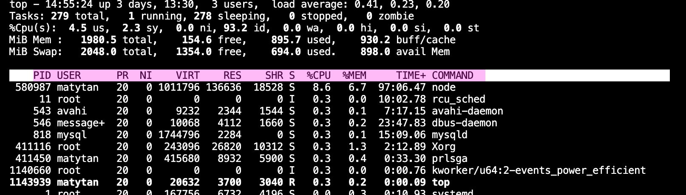
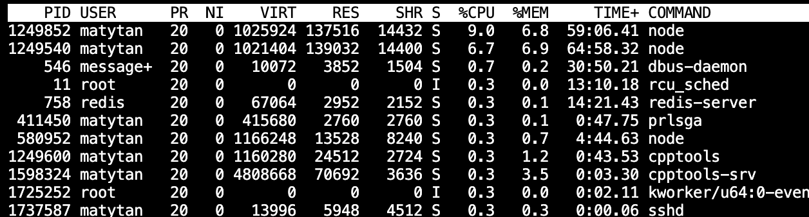

### 进程管理

## ps，top

```sh
ps 
-A 列出所有进程
-a 列出不和本终端有关的进程
-u 有效使用者相关进程
-efj
-aux 显示所有其他使用者的进程


top 动态输出
PID USER      PR  NI    VIRT    RES    SHR S  %CPU  %MEM     TIME+ COMMAND  
```

Top:




## 查询进程打开的文件lsof

lsof (list open file)列出当前系统所有已打开文件（open）的工具

```sh
lsof 访问所有文件
lsof filename 显示打开指定文件的进程
matytan@ubuntu:~$ lsof -i //显示符合条件的进程情况

COMMAND       PID    USER   FD   TYPE   DEVICE SIZE/OFF NODE NAME
node       580908 matytan   18u  IPv4 12183316      0t0  TCP localhost:45913 (LISTEN)
node       580908 matytan   20u  IPv4 17808774      0t0  TCP localhost:45913->localhost:44004

lsof -i :port

matytan@ubuntu:~$ lsof -i :45913
COMMAND     PID    USER   FD   TYPE   DEVICE SIZE/OFF NODE NAME
node     580908 matytan   18u  IPv4 12183316      0t0  TCP localhost:45913 (LISTEN)
node     580908 matytan   20u  IPv4 17808774      0t0  TCP localhost:45913->localhost:440
```

- 恢复被删除的文件（进程未退出）

  ```sh
  #假设message被删除，可以查看有没有正在使用该文件的进程
  lsof | grep message
  
  # 如果有则继续
  cat /proc/2449/fd/2 > /var/log/messages
  ```

  

## 进程优先级调整 nice，renice

优先级字段范围-20~19,数值越小优先级越高



- 最终优先级=优先级+nice优先级


