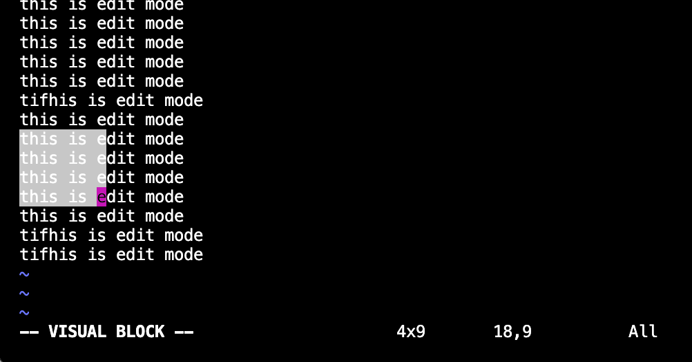

vim、vi有三种模式

- 一般模式（按i进入编辑模式）
- 编辑模式（按esc退出编辑模式，进入一般模式）
- 末行指令模式（英文冒号：）

### 一般模式

- `yy`指令：拷贝（copy）
- `pp`指令：粘贴（paste）
- `dd`指令：删除（delete）整行
- `u`撤销一次操作
- `dw`指令：删除一个词
- ：指令：进入指令模式

| ndd  |                                |
| ---- | ------------------------------ |
| dw   |                                |
| d$   | 删除光标至最后所有文本(同一行) |
| x    | 向后删除一个字符               |
| X    | 向前删除一个字符               |
| yy   |                                |
| nyy  |                                |
| i    |                                |
| [    | 光标到第一行                   |
| ]    | 光标到最后一行                 |

- 搜索关键字 / 或者 ？
- 替换关键字
  - `：1，$s/word1/word2/g`:从第一行到最后一行所有word1替换成word2
  - `:n1,n2s/word1/word2/g`:从n1行到n2行word1替换成word2
  - `:s/word1/word2/g`:本行word1替换为word2
  - `:s/word1/word2`:将本行第一次出现的word1替换成word2

### 多行编辑

1. V大写v进入visual line模式选中一行

2. crtl+v 出现visual block进入visual block模式

   

### 多文件编辑

`vim file_a file_b`

默认进入file_a

按下:n 切换进file_b

按下:N 切换回file_a

### vimtutor学习vim

hjkl分别为左下上右

