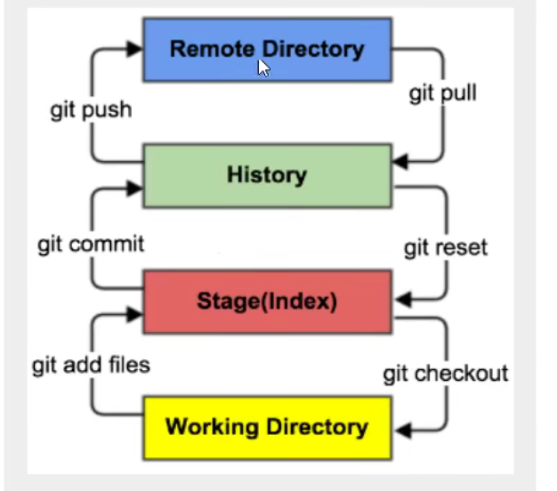

Git 两周开发 Linus开发

Git分布式版本控制系统


## 基本命令

`history`:查看之前用过的命令

`vimtutor`

> git配置

查看配置 `git config -l`

`git config --system --list`

`git config --global --list` :用户配置

用户必须要配置 (.gitconfig文件)

> 用户：
>
> `git config --global user.name "tan"`
>
> `git config --global user.email "139@qq.com"`


## git基本理论

WorkSpace：工作区，存放项目的地方

Index、Stage 暂存区，临时存放的，只是一个文件（git add .)

Repository：仓库区，本地仓库，安全存储数据的位置 (git commit)

Remote Repository：远程仓库




### 项目搭建


- 搭建：
  - `git init`(本地)，或者`git clone url`(远程)
  - `git state`
  - `git add.`
  - `git commit`
- 忽略添加到暂存区的文件：gitignore
  - ! 表示例外规则不被忽略
  - 名称最前面有一个路径分隔符(/)，要忽略的文件在此目录下，子目录下的文件不忽略
  - 名称最后面有一个路径分隔符(/)，忽略此目录下该名称的子目录，非文件


### git分支

> 查看所有分支

`git branch`

> 新建分支
>
> 切换分支
>
> 合并分支

```bash
#新建分支
`git branch branchName` 

# 切换分支
git checkout -b [branch]

# 合并分支
git merge [branch]

# 删除分支
git branch -d [branch]

# 删除远程分支
git push origin --delete [branch-name]
git brach dr [romote/branch]
```

- master分支一般用来发布新版本，一般不修改

```bash
(base) matytan@matytandeMacBook-Pro gittest % git branch
* master
(base) matytan@matytandeMacBook-Pro gittest % git branch dev
(base) matytan@matytandeMacBook-Pro gittest % git branch
  dev
* master
```


## 上传远程

```bash
//这是http
 git remote set-url --add origin https://gitee.com/账户名字/项目名字.git 
 
 //这是ssh
 git remote set-url --add origin git@gitee.com:账户名字/项目名字.git


```

