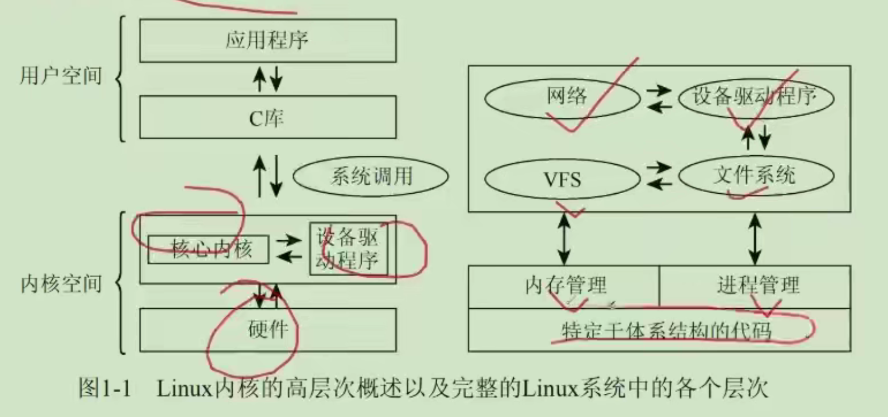
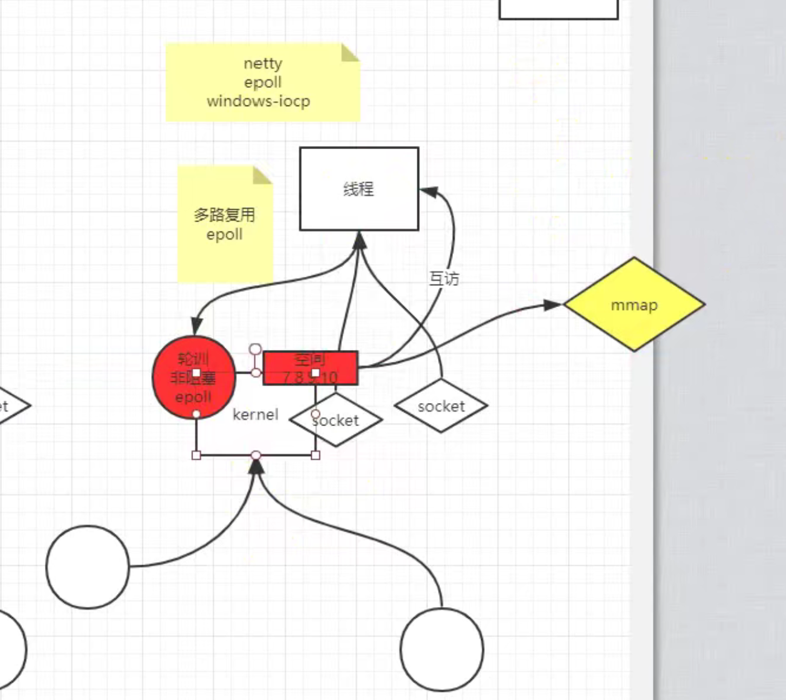

## 实现策略

- 微内核：各个模块需要IPC，陷入内核，性能差

- 宏内核：性能较高
  - eBPF内核技术：内核中开了虚拟机

#  进程管理

### 进程是什么

`strace ./a.out` 命令

## 内存管理

### 虚拟内存

- 虚拟内存是什么？

### 物理分配

伙伴系统

Slab系统

## 文件系统

## 系统调用

## 设备驱动

## 网络协议栈

 

