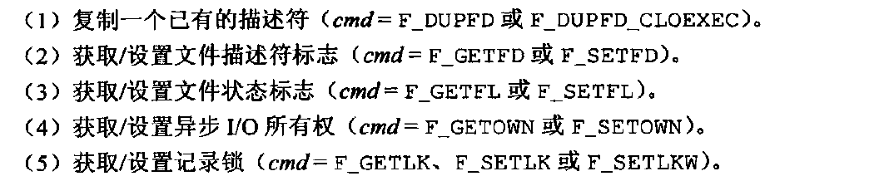

### 第一章 UNIX基本知识

- 重点基础知识
  - 内核的接口叫系统调用
  - read,write
  - 程序和进程
    - 进程控制：fork，exec，waitpid
  - 线程
  - 信号：通知进程已发生某种情况的一种技术

### 第二章 UNIX标准及实现


### 第三章 文件I/O
- 五个函数open,read, write,lseek,close
- 不带buffer的io
- 原子操作，，多进程之间共享文件

#### 3.2 文件描述符
- open或create函数会返回一个文件描述符，传给read或者write
- shell使用文件描述符0 1 2 分别与标准输入，标准输出，标准出错输出相关联

#### 3.3-3.8 open函数,creat,close,lseek write
- open函数

- lseek函数 返回当前文件偏移量
- od -c file.hole 查看文件

```cpp
#include<fcntl.h>//fcntl.h头文件 文件操作的头文件
int open(const char* pathname,int oflag,.../*mode_t mode */);
//oflage指定打开模式，只读，只写，读写。O_RDONLY,O_WRONLY,O_RDWR 必须指定其一
//可选的有O_APPEND,O_CREATE 使用符号｜ 与上面三个一起用
off_t lseek(int filedes,off_t offset,int whence);
//whence 可选 SEEK_SET,SEEK_CUR,SEEK_END
//分别为设置距文件开始处offset个字节，当前偏移量加offset，文件长度加offset
//code

ssize_t read(int fd,void *buf,size_t nbytes);//返回字节数 nbytes表示读入字节数 无符号整数
write(fd, buf1, 10)

//hole.c

char	buf1[] = "abcdefghij";
char	buf2[] = "ABCDEFGHIJ";

int main(void)
{
	int		fd; //文件标识符

	if ((fd = creat("file.hole", FILE_MODE)) < 0) //创建文件 creat只写 要先写
		err_sys("creat error");

	if (write(fd, buf1, 10) != 10)
		err_sys("buf1 write error");
	/* offset now = 10 */

	if (lseek(fd, 16384, SEEK_SET) == -1)// 从文件开始加offset
		err_sys("lseek error");
	/* offset now = 16384 */

	if (write(fd, buf2, 10) != 10) //写入
		err_sys("buf2 write error");
	/* offset now = 16394 */
	exit(0);
}

//3-3 buffersize

```

#### 3.10 文件共享
- 每一个进程都有一个自己的文件表 ，进程表中存着文件描述符fd

#### 3.11 原子操作

- 添加文件 顺序使用 lseek和write 如果是多进程 可能会出错

#### 3.12 dup和dup2函数 
- 复制文件描述符
```c
#include<unistd.h>
int dup(int fd);
int dup2(int fd,int fd2);//fd2指定新描述符的数值 先关闭fd2，然后把fd2复制给它
===
fcntl(fd,F_DUPFD,0); //dup等价于

//dup2等价于
close(fd2);
fcntl(fd,F_DUPFD,fd2);
```

#### 3.13 sync和fsync和fdatasync函数
磁盘io大部分都通过缓冲区进行，在写入文件时，通常先把数据复制到缓冲区，如果缓冲区没有满，系统不会直接将其排入输出队列！（延迟写）会等待缓冲区满了或者内核需要重用，才会将其排入输出队列，然后等到它到队首时，才会写入磁盘进行io操作
- 延迟写：减少磁盘访问次数，但是降低文件更新速度，导致意外情况，这种延迟可能导致数据丢失
- 因此有sync和fsync和fdatasync函数 保证文件系统和高速缓存区的内容一致性
```c
#include<unistd.h>
void sync(void);//将修改过的块缓冲区排入队列 不需要等待写入磁盘
int fsync(int fd);//等待写磁盘操作结束才返回成功与否，除了更新数据，还会同步更新文件属性
int fdatasync(int fd);//只影响数据部分
```

#### 3.14 fcntl函数
fcntl函数可以改变已打卡文件的性质
```c
#include<fcntl.h>
int fcntl(int fd,int cmd,/*int arg*/);

```
- cmd


- 


#### 3.14 ioctl函数
