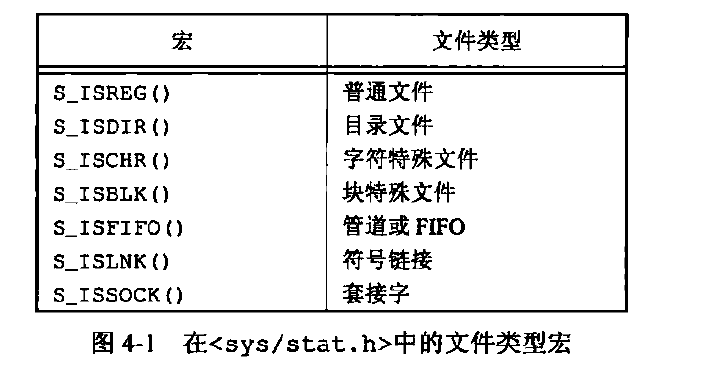
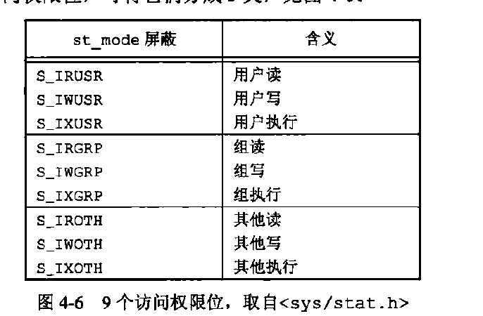

### 文件和目录


#### 4.2 stat fstat lstat 函数
```c
int stat(const char *restrict pathname,struct stat *restrict buf);
//返回命名文件有关的信息
int fstat(int fd,struct stat *buf);
int lsstatconst char *restrict pathname,struct stat *restrict buf);


struct stat {
	dev_t           st_dev;         /* [XSI] ID of device containing file */
	ino_t           st_ino;         /* [XSI] File serial number */
	mode_t          st_mode;        /* [XSI] Mode of file (see below) */
	nlink_t         st_nlink;       /* [XSI] Number of hard links */
	uid_t           st_uid;         /* [XSI] User ID of the file */
	gid_t           st_gid;         /* [XSI] Group ID of the file */
	dev_t           st_rdev;        /* [XSI] Device ID */
#if !defined(_POSIX_C_SOURCE) || defined(_DARWIN_C_SOURCE)
	struct  timespec st_atimespec;  /* time of last access */
	struct  timespec st_mtimespec;  /* time of last data modification */
	struct  timespec st_ctimespec;  /* time of last status change */
#else
	time_t          st_atime;       /* [XSI] Time of last access */
	long            st_atimensec;   /* nsec of last access */
	time_t          st_mtime;       /* [XSI] Last data modification time */
	long            st_mtimensec;   /* last data modification nsec */
	time_t          st_ctime;       /* [XSI] Time of last status change */
	long            st_ctimensec;   /* nsec of last status change */
#endif
	off_t           st_size;        /* [XSI] file size, in bytes */
	blkcnt_t        st_blocks;      /* [XSI] blocks allocated for file */
	blksize_t       st_blksize;     /* [XSI] optimal blocksize for I/O */
	__uint32_t      st_flags;       /* user defined flags for file */
	__uint32_t      st_gen;         /* file generation number */
	__int32_t       st_lspare;      /* RESERVED: DO NOT USE! */
	__int64_t       st_qspare[2];   /* RESERVED: DO NOT USE! */
};
```

#### 4.3 文件类型



#### 4.4 设置用户ID和设置组ID

#### 4.5 文件访问权限

- 权限是按位或，如`S_IRUSR|S_IWUSR|S_IRGRP|S_IWGRP|S_IROTH|S_IWOTH`
#### 4.7 access函数


- umask函数
  - umask 002 阻止其他用户写你的文件
  - 022 阻止同组人员和其他用户改写我的文件
  - 027阻止同组人员写，其他用户读，写，执行你的文件
    ```c
    #include<sys/stat.h>
    mode_t umask(mode_t cmask);//返回以前文件模式的创建屏蔽字
    //cmask是上面的9个权限位，如S_IRUSR
    ```

- 文件截短：将现有文件截短为lenth字节
    ```c
    int truncate(const char* pathname,off_t len);
    int ftruncate(int fd,off_t len);
    ```
- 文件系统
  - 磁盘可以分为多个分区，每个分区可以包含一个文件系统
  - 
  - i结点中包含大多数与文件相关信息：文件类型，访问权限位，长度，指向该文件所占用的数据块指针等。

- link unlink remove  rename函数
  - link创建一个目录项 多个目录项可以指向多个i节点
  - unlink删除目录项，计数-1 
    ```c
    #include<unistd.h>
    int link(const char* existingpath,const char* newpath);

    int unlink(const char *pathname);
    ```
- symlink readlink函数
  - symlink创建一个符号连接
  - readlink 打开连接本身，读取链接中的名字在
```c
int symlink(const char *realpathname,)
```
  <center>
      
      <br>
      <div style="color:orange; border-bottom: 1px solid #d9d9d9;
      display: inline-block;
      color: #999;
      padding: 2px;">图片描述</div>
  </center>

- 文件的时间：文件数据最后访问时间，文件修改时间，i节点状态最后更改时间
  - 目录：包含目录项（文件名和i节点编号的）的文件
  - utime函数
  - mkdir和rmdir函数 :前者建立一个新目录，rmdir删除空目录
```c
int mkdir(const char* pathname,mode_t mode);
int rmdir(const char* pathname);
```
- 读目录
```c
#include<dirent.h>
DIR *opendir(const char *pathname);
struct dirent *readdir(DIR *dp); //
```

- chdir fchdir getcwd
```c
#include<unistd.h>
//更改当前目录
int chdir(const char* pathname);
int fchdir(int fd);

char *getcwd(char *buf,size_t size);//buf是存储当前目录的地址
```

- 特殊设备文件
  - st_dev和st_rdev
  - 特殊设备文件st_rdev
  - 