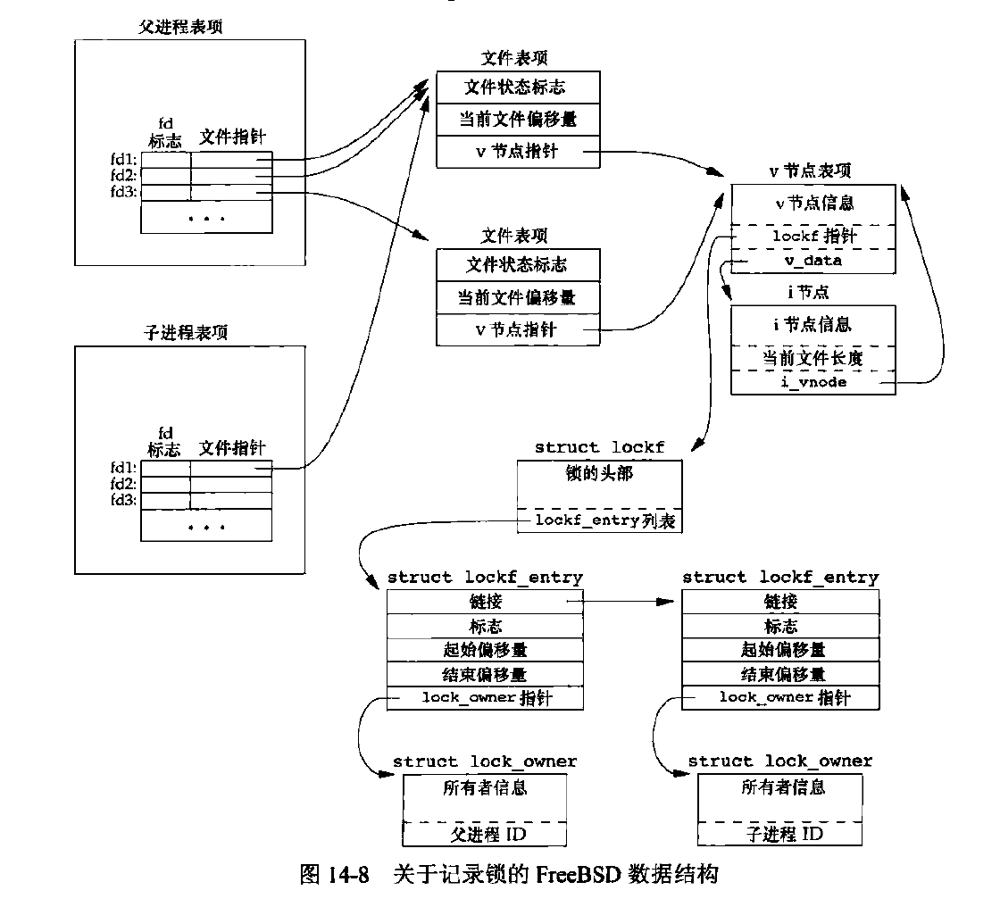

## 非阻塞IO

低速系统调用：可能使进程永久阻塞


什么是非阻塞IO？

- 如果操作不能完成，则调用立即出错返回，表示如继续执行将阻塞

什么是阻塞IO？

- 如果操作不能完成，就阻塞。例如read时缓冲区为空就阻塞等待


- 设置非阻塞 
  - open时，指定O_NONBLOCK标志
  - 利用fcntl()函数设置O_NONBLOCK文件状态标志


非阻塞的文件描述符，如读写不成功，会立即返回。然后一直循环查询（轮询），浪费CPU时间。

- 因此有了非阻塞IO多路复用
- 也可以使用多线程，避免使用非阻塞IO。可以允许单个线程阻塞，但是这种会增加线程间同步开销，可能得不偿失

## 记录锁


- 读写锁
  - 


- dup和dup2



## IO多路复用（IO多路转接）


- 分析了为什么需要io多路复用
  - 使用阻塞IO的问题
  - 直接使用非阻塞IO问题
  - 使用多进程的问题
  - 使用异步IO的问题


### select

IO多路复用，实际上是告诉内核让内核告诉我们就绪描述符

我们告诉内核：（系统调用）

- 告诉内核我们关心的描述符
- 对每个描述符设置关心的条件（可读，可写，错误）
- 愿意等待多久时间

内核返回：

- 已准备好的描述符总数量
- 对于条件的每一个，哪些描述符已经准备好？（需要我们自己线性遍历）


如何传入描述符呢？用一个数组传入，使用一个整型字节数组就行了~每一位代表一个fd，比如1024位就有1024个fd

每次阻塞到唤醒（即有事件），这时我们循环FD_SET判断哪些准备好了

需要重新加入描述符


注意

- 一个描述符是否阻塞，与select阻塞没有关系。完全由超时值来设定。

### poll

poll是什么？

poll如何实现？

pollfd结构


文件尾端和挂断(POLLHUP)的区别

- 读到尾端read返回0
- 读中连接中断，接到POLLUP通知

### System V异步IO


### BSD异步IO


### POSIX异步IO

- 异步IO并非要多线程


## 函数readv和writev

一次函数调用中读，写多个非连续缓冲区

散布读和聚集写

- readv 散布读：将读入的数据散布到各个缓冲区

```c
#include<sys/uio.h>
sszie_tt readv(int fd,const struct iovec *iov, int iovcnt);
sszie_tt writev(int fd,const struct iovec *iov, int iovcnt);
//参数是iovec的数组
struct iovec{
  void *iov_base;
  ssize_t iov_len;//缓冲区大小
}
```


### 函数readn和writev


## 存储映射IO 非匿名映射

`mmmp`函数 [mmap实现](/Users/matytan/Desktop/code/基础/操作系统/mmap实现.md)


```c
mmap, munmap - map or unmap files or devices into memory
#include <sys/mman.h>

void *mmap(void *addr, size_t length, 
           int prot, int flags,
           int fd, off_t offset);
int munmap(void *addr, size_t length);    
```

​             

(1) 匿名shared映射：fd为-1（类似/dev/zero)，可用于父子进程通信。全部填0。虚拟空间相同，映射文件相同

(2) 匿名private映射：例如malloc大块的内存（大于128k）。


(3) 非匿名shared映射：常见的用于进程通信方式。（多进程，但是不一定是父子进程）

(4) 非匿名private映射：例如程序在启动时加载so时，就是用的这种方式，相当于“写时拷贝”。

