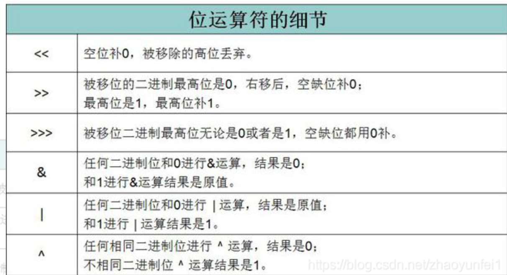
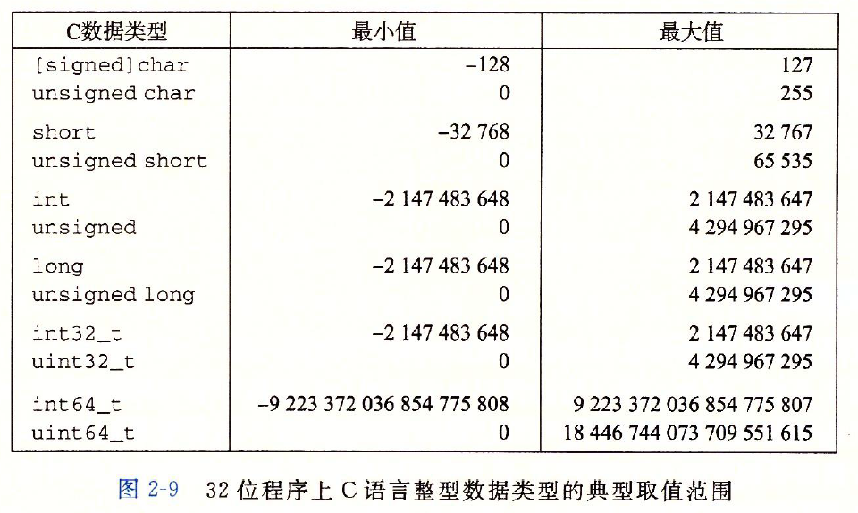

# 第一部分 程序结构与执行

#第二章  信息的表示和处理 不熟悉！！！！

1. 16进制，2进制，10进制转换
2. 大端法，小端法 如0x2321234 
   1. 大端是自然的计数 比如0x2321234 从左往右 低到高 ->低位存储高地址
   2. 小端法相反,低位存储低地址 34 12 32 02
3. int float的表示方法不一样，即使是同一个数

## 信息存储

字节大小？

程序对象是什么？

指针的实现？（第3章）

- 值
- 类型（即指向对象的类型，本质是一个宽度）


### 16进制表示法

二进制：00000000-11111111

十进制：0-9

8进制：0-7

16进制：0-F(15)

2 10 16互转怎么转？

16进制加减法怎么做---进位借位

二进制位运算？

### 字数据大小

字长

- 字长为$w$​​​位的虚拟地址范围为$0——2^w-1$​​​​​范围 最多访问$2^w$个字节

- 目前都是字长为32位和64位的机器

64位使用32位程序

`gcc -m32 prog.c`

关于类型

- char能存整数吗？当然，有符号为(-128,127)而且还有unsigned char (0-255)
- int 为4字节，long 4字节（32位） 8字节（64位）
- 指针大小（也就是地址大小 ） 4字节（32位地址空间），8字节（64位地址空间）

## 2.15 表示字符串

- ascii 字符码 如“12345”（c语言有结尾符）对应的16进制表示 31 32 33 34 35 00
- c字符串结尾需要'\0' 即00

#### 2.17 布尔代数

什么是布尔代数？ 二元集合{0,1}

- & AND 类乘法 只有1&1=1
- ^ 异或（命题逻辑） 相同则为0 ，不同为1 （类加）进位
- | or 或 都为1或者0 1则为1，都为0 则为0 类加（不进位）
- ~ 表示NOT 按位取反  类负
- & 按位与
- />>右移
- <<左移


|  ~  |    |
|----|----|
|   0 | 1   |
|    1|  0  |

|  &  |  0  |  1 |
|----|----|----|
|   0 |  0  |   0  |
|    1|  0  |   1   |


|  or  |  0  |  1 |
|----|----|----|
|   0 |  0  |   1 |
|    1|  1  |   1   |


| ^  |  0  |  1 |
|----|----|----|
|   0 |  0  |   1  |
|    1|  1  |   0   |

- 整数集合`<Z,+,x,-,0,1>`与布尔代数`<{0,1},|,&,~,0,1>` 类似
- $<Z_n,+_n,*_n,-_n,0,1>$ 定义为
  -  $Z_n=${0,1...n-1}
  -  $a+_nb=a+b  mod  n$​ 
  -  $a*_nb=a*b mod n$ 
  -  $-_na=0(a=0),n-a(a>0)$
- 位向量：固定长度为$w$的0或1的串
  - 应用之一：表示有限集合 使用$[a_{w-1},...,a_1,a_0]$来表示$A ={0,1,..w-1}$
  - 即当$a_i=1$时i属于A，如a=[01101001]表示集合A={0,3,5,6} 第0，3，5，6位为1能来表示A
  - ｜相当于求补集，而&相当于求交集
- 集合的布尔代数 对于任何结构S={&(S),U,n,-,0,S} 形成一个布尔代数（交的符号不知道怎么写，-补运算符）


### 位级运算

- C中的位级运算（整型的位运算） 位运算
  - 1. 交换元素的值(重要性质a^a=0) 异或  a^a=0
```cpp
void swap(int *a,int *b){
   *a = *a^*b;
   *b = *a^*b;
   *a = *a^*b
}
```
|  位级运算符  |  逻辑运算  |
|----|----|
|  &  |  &&  |
|  `|`  |  `||`  |
|  NOT ～  |  ！  |
- 同或实现 就是两数字相等时就返回1，否则返回0 异或取反 ！
  - ^：(a'&b)|(a&b')
  - 同或：(a&b)|(a'&b')

### 逻辑运算

即|| 和 && 和！

和位级运算的区别是什么？ 完全不同！

- 逻辑运算符只返回0或1  即true or false


### C中的移位运算

- x<<k x向左移动k位，生成一个值，丢弃k个最高位，右边补k个0
- x>>k x向右移动k位.生成一个值，丢弃k个最低位
  - 逻辑右移 高位补k个0
  - 算数右移 高位补k个最高有效位的拷贝 （有符号） 练习题2.21

## 2.2 整数表示

### 2.2.1 整数数据表示





### 2.2.2 无符号的编码

- 无符号表示 x为位向量 二进制数转无符号数 BtoUnsign
  - $B2U_w(x)=\sum^{w-1}_{i=0}x_i2^i$
  - 如1101 = $2^3+2^2+2^0=13$

  - 无符号编码的唯一性，双射 ,唯一映射

```md
原码就是将数字转换成二进制以后并考虑了符号的结果。
反码就是将原码的数值部分取反的结果。
补码就是在反码的基础上打了一个“补丁”，对反码进行了“加一”修正
```

### 补码编码

补码：最高位为负权即$-x_{w-1}2^{w-1}$

向量$x=[x_{w-1},x_{w-2},...x_0]$​​​

- $B2T_w(x)=-x_{w-1}2^{w-1}+\sum^{w-2}_{i=0}x_i2^i$​
  - 前面是负权
  - 如1101 = $-2^3+2^2+2^0=-8+5 =-3$​​
  - 如0101 = $0*-2^3+2^2+2^0=0+5 =5$​​​ 
- 发现其实如果第一位为0即和无符号数计算无区别，为1与无符号的区别即是正高位权值变为了负权。

### 2.2.3 有符号和无符号之间的转换

二进制补码到无符号数到转换  有符号的负数转成无符号将是一个很大的正数！

if x < 0  $T2U_w(x)=x + 2^w$​​​​  

if x>0 $T2U_w(x)=x$
- 例如，w = 4,x=-8， 1000（8） 即无符号为 $8=-8+2^4$​​

- 例如，w = 4,x=-6   (-8+2) 即1010（10） 即无符号 $10=-6+2^4$​​​​​

  $2^{w-1} \to 2^{w}$
  $-2^{w-1} \to 0$对应无符号的区间$2^{w-1} \to 2^{w}$

  $0 \to +2^{w-1}$对应无符号的区间$0 \to 2^{w-1}$


无符号数到二进制补码转换 ，无符号的溢出部分（最大的正数（全1），映射到最小的负数-1）,将是一个负数。---

​	if $x<2^{w-1}\:U2T_w(x)=x$   

​	if $x>2^{w-1}\:U2T_w(x)=x-2^{w}$  

- 例如 w=4， x = 10（1010）即为-8+2=-6 即 $-6=10-2^4$
无符号的区间$2^{w-1} \to 2^{w}$对应 $-2^{w-1} \to 0$
- 隐式转换：表达式左边的值 会隐式转换为右边的类型
- 无符号和有符号的转换比较危险。无符号转为有符号的正数容易溢出，变为负数
```c
# include  <stdio.h>
main()
{
    /*
  有符号短整型：有效位数为16位 ，2个字节，范围【-32768，32767】
*/
  short  int  st1=- 32770 ,   //溢出
          st2=- 32769 ,   //溢出
          st3=- 32768 ,
          st4=- 32767 ,
          st5=- 32766 ;
    //分别以有符号整型%d和无符号整型%u输出
    printf( "st1=%d=%u\n" ,st1,st1);
    printf( "st2=%d=%u\n" ,st2,st2);
    printf( "st3=%d=%u\n" ,st3,st3);
    printf( "st4=%d=%u\n" ,st4,st4);
    printf( "st5=%d=%u\n\n" ,st5,st5);
}
输出：
st1=32766=32766
st2=32767=32767
st3=-32768=4294934528
st4=-32767=4294934529
st5=-32766=4294934530

-32770溢出了，-32770=-32768-2，也即是 1..1 1000 0000 0000 0000减去2，变成

0..0 0111 1111 1111 1110，所以是正的32766，因为32766是个正数，不论是有符号输出还是无符号输出，都是32766。 -32769也是一个道理。

-32767没有溢出，有符号输出依然是-32767，但是无符号输出时候要求是正数输出，我们也已经说过，无符号%u输出要看32位，-32767(因为此时是负数，首先扩展所以前16位为1，然后计算出-32767 不是16位直接转的！)是1..1 0111 1111 1111 1111，看32位的话，这个数的结果应该是：2^31+2^30+.....2^16+32767=4294934529。
```

### 扩展位

无符号数的0扩展（有符号可千万不能在最高位扩展0 正负都变了）


补码位的符号扩展（如果是正数就扩0，负数扩1）值不改变

如 short i = -1

即i的二进制位 两字节  1111 1111  即FF FF

int ii = i; 强制扩位 即4字节  FF FF FF FF （还是-1）


如 -5

1011  -8 + 3 = -5

11011  -16 + 8 + 3 = -5

111011 -32 + 16 + 8 + 3 =  -5

发现规律了吗？ 最高位权值总是和下位抵消到上一个阶段，接着继续抵消，直到只剩一个1

### 截断数字

高的类型向低类型转换（例如int 到short）

w位 即$x_{w-1},x_{w-2}$

截断为k位（到k位）时，意味着我们要丢弃高w-k个位 

例如4个字节（32位）截断到 short (16位) 即丢弃高16位

无符号截断（很有可能改变其本身的值，如果丢弃位不为全0）


有符号截断（很有可能改变其本身的值，如果丢弃位不为全1或全0）

- 如果本身是0，截断到的位是1怎么办？(正负都变了呀) 所以不安全呀 


```c
    1 	#include <stdio.h>
    2 	
    3 	int main(int argc, char const *argv[])
    4 	{
    5 	  unsigned int a = 0xfffffff7;
    //5 	  unsigned int a = 0xffffff07;  //截断的开始的最高为若为0 前面补0，否则补1
    6 	  unsigned char i = (unsigned char)a;
    7 	
    8 	  char *b = (char *)&a;
    9 	
   10 	  printf("%08x,%08x\n", i, *b);// 高位为0 截断为有符号输出00000007
   11 	  return 0;

   12 	}

分析：在X86系列的机器中，数据的存储是“小端存储”，小端存储的意思是，对于一个跨多字节的数据，其低位存放在低地址单元，其高位存放在高地址单元。比如一个int型的数据0x12345678，假如存放在0x00000000,
小端：
低地址----->高地址
  78 56 23 01 
0x00000001,0x00000002,0x00000003这四个内存单元中，那么0x00000000中存放的是低位的0x78，

而0x00000003中存放的是高位的0x12，依此类推。


```

  - 考虑到b是char *型的，属于有符号数，0xf7最高位为1，应该是负数，负数要显示出来就要以补码的形式输出，所以高位不是补0是补1.如果我把a的值改为0xAAAAAA07,结果就都是00000007.
  - int i = 53191 = 0000 ...00001110 0011 1111 0011 
  - 截断为short i = 1110... 0011 为负数
  - 如果截断的有多的，高位为有效位的拷贝


## 2.3 整数运算

为什么两个正数相加会为负数（有符号溢出）x<y和x-y<0出现了不同的结果


### 2.3.1 无符号加法

若$0<= x,y<2^w$​​时

可能范围$0<=x+y<=2^{w+1}-2$​

$x+y>=2^{w+1}$​ 溢出

对于一个w位的x和y来说，其和可能需要5位


对于无符号溢出的值应该是：

$x + y = x+y-2^w$​

### 2.3.1 二进制补码加法

- 三种情况
  - if $2^{w-1}<=x+y,x+^t_w ,y =x+y-2^w$​  正溢出（由于加法因为低位的进位，导致符号位进位为1）
  - if $2^{w-1}<=x+y<2^{w-1},x+^t_w y =x+y$  正常
  - if $x+y<-2^{w-1},x+^t_w, y =x+y+2^w$​​  负溢出(截断会把1截掉符号位，进位为0)

### 无符号乘法

截断为w位实际上就是模$2^w$得到

$x * y= (x * y) mod 2^w$​

### 补码乘法

$x * y= U2T_w((x * y) mod 2^w)$​   即无符号乘法的结果转为有符号

无符号和补码的乘法位级等价性


### 除以2^k

无符号即逻辑右移


有符号即算术右移

x>0时，跟无符号相同即逻辑右移


补码除以2的幂：向下舍入


补码除以2的幂：向上（向0）舍入


#### 2.4 浮点 https://zhuanlan.zhihu.com/p/63897066


### 二进制小数


### 浮点数

- [浮点数](https://zhuanlan.zhihu.com/p/213062265)

- 浮点：小数点非固定的数，可表示数据范围较广，整数，小数都可表示。包含float，double；

  

- 定点：小数点固定，可表示整数，小数。int本质是小数点位于末尾的32位定点数而已；

- 小数转二进制，乘2取整 直到为1

  #### IEEE浮点数表示法

- $V=(-1)^s * 2^E * M$​​​即 ==浮点数的值==
  - 　　①、s 是符号位，为0时表示正，为1时表示负。

  -    ②、M为尾数，是一个二进制小数，它的范围是0至1-ε，或者1至2-ε（ε的值一般是2-k次方，其中设k > 0）

  - 　　③、E为阶码，可正可负，作用是给尾数加权。其中非规格化的值为E = 1 - Bias，规格化（e的位不为全0）的值为e-bias
    - k 位的阶码字段 $exp =e_{k-1}e_{k-2}...e_1e_0$ 编码阶码E
    -  $Bias = 2^{k-1}-1$


规格化值：E = e-bias
- bias = $2^{k-1}-1$
- M = 1+f (有个隐藏位1)，因此尾数是小数位+1

非规格化值 ：当阶码域为全 0 的时候，所表示的数就是非规格化形式。
- E = 1 - Bias
- M =f

舍入
- 向偶数舍入（最接近的值舍入，默认）
  - 将数字**向上或向下舍入**，使得结果的最低有效数字是偶数
  - 有效数字：
  - 什么时候选择偶数舍入：
    - 1、比如舍入一组数值，计算这些值的平均数中引入统计偏差，如果向上舍入，那么得到的平均值会比这些数本身的平均值略高；向下舍入，则会偏低。而向偶数舍入则会避免这种偏差，在50%的时间内，它向上舍入，剩下50%的时间内，它向下舍入。　　
    - 2、在我们不想舍入到整数时，我们只是简单的考虑最低有效数字是奇数还是偶数。
  - 通常情况下我们采取的舍入规则是在原来的值是舍入值的中间值时，采取向偶数舍入，在二进制中，偶数我们认为是末尾为0的数。而倘若不是这种情况的话，则一般会有选择性的使用向上和向下舍入，但总是会向最接近的值舍入。其实这正是IEEE采取的默认的舍入方式，因为这种舍入方式总是企图向最近的值的舍入。
  - 

| 方式  |  1.4  |1.6|1.5|2.5|-1.5|
|----|----|----|----|----|----|
|  向偶数舍入  |  1  | 2 ||| -2 |
|  向零舍入  |  1  | 1 ||| -1 |
|  向下舍入  |  1  | 1 ||| -2 |
|  向上舍入  |   2 | 2 ||| -1 |

浮点数运算
- 浮点数不具有结合性
- 不满足分配律与结合律

```cpp
 float f1 = 3.14f + 10000000000f - 10000000000f;//3.14被舍
 float f2 = 3.14f + (10000000000f - 10000000000f);
//输出
//f1=0 f2 = 3.14 
```
- 低精度向高精度转换安全
- int 转float 不会溢出，但可能会舍入


规格化：e的位既不全为0也不全为1的情况。

f=0011 1111 1000 1100 1100 1100 1100 1101  

对于单精度浮点数：

**(1)** **符号s 1位：**0代表整数；

**(2)** **阶码e 8位：**01111111代表0；(注意阶码的表示方式：对于e的位既不全为0也不全为1的情况，E=e-Bias，Bias为2k-1-1，对于单精度是127，双精度是1023)

**(3)** **尾数M 23位：**000 1100 1100 1100 1100 1101代表$(2^0+2^{-4}+2^{-5}+2^{-8}+...)$​​​(注意尾数的表示方式M=1+f，f=0.fn-1…f1f0)

最后值为 $+(2^0+2^{-4}+2^{-5}+2^{-8}+...)*2^{0}$

非规格化

