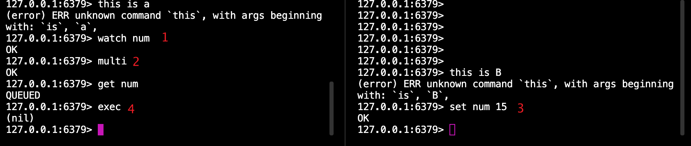
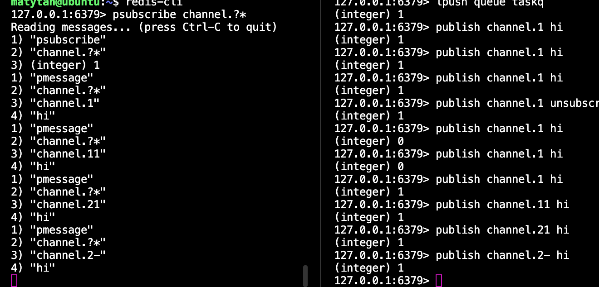

## 事务

Redis中的事务是一组命令的集合。事务是redis的最小执行单位

事务要么都执行，要么都不执行


redis事务和MySQL事务的区别？

- msyql事务


事务的使用

- multi：告诉redis下面的命令属于同一个事务，先不要执行 
- 命令排队：输入命令显示QUEUED，表示进入事务执行的事务队列中了
- exec 执行

```sh
multi开启事务
127.0.0.1:6379> multi
127.0.0.1:6379> sadd user:1:following 2
QUEUED
127.0.0.1:6379> sadd user:2:follower 1
QUEUED
127.0.0.1:6379> exec
1) (integer) 1
2) (integer) 1
exec 提交事务
```

Redis 事务的特点

- 可以发现 redis事务并没有原子性，两条命令仍然是分别执行。
- 可以保证事务内的命令依次执行且不被其他命令插入。
- 不支持回滚

### 事务错误处理

1. 语法错误

   1. 例如三个指令中间有一个指令错误，执行exec时只要有一个错误redis就会直接报错，正确的指令也不会执行（符合要么都做，要么都不做）

      ```sh
      127.0.0.1:6379> errorcommand key
      (error) ERR unknown command `errorcommand`, with args beginning with: `key`, 
      127.0.0.1:6379> set key 3
      QUEUED
      127.0.0.1:6379> exec
      (error) EXECABORT Transaction discarded because of previous errors.
      ```

      

2. 运行错误

   1. 这种错误redis运行之前无法发现，因此中间指令发生错误，后面指令仍会执行

      ```sh
      127.0.0.1:6379> multi
      OK
      127.0.0.1:6379> set numberkey 1
      QUEUED
      127.0.0.1:6379> sadd numberkey 3
      QUEUED
      127.0.0.1:6379> set numberkey 5
      QUEUED
      127.0.0.1:6379> exec
      1) OK
      2) (error) WRONGTYPE Operation against a key holding the wrong kind of value
      3) OK
      ```

3. 关于回滚
   1. redis为了简化设计，并未支持回滚
   2. 用户必须自己处理事务出错的后自己的摊子（复原数据库）
   3. 无回滚事务可以保持简洁和快速

### watch命令

为了防止其他客户端修改键值，防止静态条件可以使用watch

注意要在事务外使用watch

这就是乐观锁啊~~ (提交事务时检查事务是否有修改，有修改则事务失败)

- A watch了num 进入事务multi

- A 执行 set num

- B 在这个仍然可以改 num

- A 执行exec的时候发现num被修改了，执行失败 返回nil



```shell
127.0.0.1:6379> watch user:1:following
OK
```


结论：

- watch作用只是当被监控的值被修改后阻止之后的一个事务

- watch并不能保证数据不被其他客户端修改
- 因此exec失败后我们需要重新执行函数


取消监控：

`exec` 执行之后监控的键会全部取消

`unwatch`取消监控键


## 生存时间

生存时间是什么？

有什么作用？--节约资源

- 一些临时信息到期自动清除
- 比如验证码，缓存，优惠活动

### 命令介绍

- `expire key seconds` 给一个key设置多久的生存时间
- 查询生存时间` TTL key` 
  - 键不存在返回-2
  - 存在若设置了生存时间，则返回剩余时间
  - 键是永久生存时间则 返回-1

```sh
127.0.0.1:6379> ttl c
(integer) -1
127.0.0.1:6379> ttl dfdf
(integer) -2
```


- `persist key ` 将键恢复为永久生存时间
  - 除了persist命令之外，重新设置键值也会清空生存时间，需要重新设置
- `pexpire` 和expire的区别是 `pexpire`使用单位是毫秒
- expireat和pexpireat命令
  - `expireat key time `表示设置的是unix作为截止时间，而不是倒计时时间
  - `pexpireat` 表示毫秒


如果watch了一个有生存时间的键，到期了怎么办呢？

​	watch不会认为到期自动删除是改变

### 访问频率限制一

如何限制呢？

例如限制每个用户最多只能访问100个页面

- 使用键`rate.limiting:ip`字符串类型键
- 给这个键设置生存时间

- 每次用户访问该键值递增1

为啥要生存时间？因为如果没有生存时间，则会永久限制该用户访问~~


```sh
$isKeyExists = exists rate.limiting:$ip
# 键存在 则自加
if($isKeyExists)
{
	$times = incr rate.limiting:$ip
	if $times >=100
		print 访问频率超过限制
		exit
}
else
{
	#直接使用两句话会造成可能只有一个指令成功 引起错误。因此要加事务
	multi
	incr rate.limiting:$ip
	expire $keyname,60
	exec
}
```


### 限制访问2

上面方法有一种无法监控，用户在一分钟第1s访问一次，最后1s访问了9次，下一个一分钟又访问10次，因此2s访问了19次。显然不是我们期望的1分钟10次


- 使用列表存入当前时间

  - 不足10个直接访问
  - 超过10个则判断链表最后时间，是否已经超过一分钟
    - 如果超过一分钟，则限制访问
    - 如果没超过一分，则重新加入链表，同时删除前9个时间，重新统计

  ```sh
  $listlen = llen rate.limiting:$ip
  if $listlen<10
  	lpush rate.limiting:$ip,now()
  	
  else
  	$time = lindex rate.limiting:$ip,-1 #按下标取值
  	if now()- $time < 60
  		print 访问频率超过限制
    else
    	lpush rate.limiting:$ip,now()
    	ltrim rate.limiting:$ip 0,9
  ```

  

- 这个实现

  - 占内存
  - 有竞态条件

  


### 实现缓存

缓存键难以设定合适的生存时间

有没有方法自动淘汰不需要的缓存键呢（即设定了生存时间的键）

- 使用maxmemory-policy参数指定策略，底层实现是LRU（最近最少使用）
- 修改maxmemory参数
- 称为淘汰键

淘汰规则

- Volatile-lru
- Allkeys-lru
- Volatile-random
- Allkeys-random


## 排序

### 有序集合的集合操作

有序集合使用是大数据排序，很少会集合运算后获取整个结果，因此只实现了

zinterstore和zunionstore

实现一个zinter使用事务

```sh
multi
zinterstore tempkey...
zrange tempkey...
del tempkey
exec
```


### sort指令

sort指令可以对列表类型，集合类型和有序集合类型排序

`sort key`

注意对有序集合排序会忽略分数，只针对值排序

```sh
127.0.0.1:6379> lpush mylist 4 2 6 1 3 7
(integer) 6
127.0.0.1:6379> sort mylist
1) "1"
2) "2"
3) "3"
4) "4"
5) "6"
6) "7"
```


- 字典序：使用alpha参数

```sh
127.0.0.1:6379> lpush mylistalpha a c e d b C A
(integer) 7
127.0.0.1:6379> sort mylistalpha
(error) ERR One or more scores can't be converted into double
127.0.0.1:6379> sort mylistalpha alpha
1) "a"
2) "A"
3) "b"
4) "c"
5) "C"
6) "d"
7) "e"
```

- 排序顺序：desc降序，asc升序（默认）
- limit参数 `limit offset count`

### by参数

散列类型按属性排序，即字段

`by 参考key *->字段名`

对每个元素使用==元素的值替换第一个\*==并获取值，然后依据该元素对元素排序,即sortbylist的值替换*


字符串类型：`by 参考key*`

```sh
127.0.0.1:6379> lpush sortbylist 2 1 3
(integer) 3
127.0.0.1:6379> set itemscore:1 50
OK
127.0.0.1:6379> set itemscore:2 100
OK
127.0.0.1:6379> set itemscore:3 2100
OK
127.0.0.1:6379> set itemscore:4 -100
OK
127.0.0.1:6379> sort sortlist by itemscore:* desc
(empty list or set)
127.0.0.1:6379> sort sortbylist by itemscore:* desc
1) "3"
2) "2"
3) "1"

127.0.0.1:6379> lpush sortbylist 4 # 4对应的是-10呀
(integer) 4
127.0.0.1:6379> sort sortbylist by itemscore:* desc
1) "3"
2) "2"
3) "1"
4) "4"
```


如果没有*号呢？那么sort将没有意义，跟lrange效果一样

必须要根据第二个key的对应值排序

```sh
127.0.0.1:6379> sort sortbylist by itemscore: desc
1) "2"
2) "1"
3) "3"

```

对散列类型字段排序 hset hmset hget hmget

```sql
127.0.0.1:6379> sort sortbylist by post:*->time desc
1) "4"
2) "3"
3) "2"
4) "1"
5) "5"
```


### get参数

get的作用是是sort之后不再是直接返回本身的值了，而是可以返回get指定的键值

`sort sortbylist by post:*->time desc get post:*->title`

```sh

127.0.0.1:6379> sort sortbylist by post:*->time desc get post:*->title
1) "nice page"
2) "csapp"
3) "design program"
4) "helloword"
5) "how can run faster
```


注意 可以有多个get

` sort sortbylist by post:*->time desc get post:*->title get post:*->time`

```sh
127.0.0.1:6379> sort sortbylist by post:*->time desc get post:*->title get post:*->time
 1) "nice page"
 2) "123"
 3) "csapp"
 4) "89"
 5) "design program"
 6) "56"
 7) "helloword"
 8) "56"
 9) "how can run faster"
10) "12"
```

如果还需要list中对应的id怎么办，get# 可以返回元素本身的值 


### store保存

保存排序结果

```sh
127.0.0.1:6379> sort sortbylist by post:*->time desc get post:*->title get post:*->time get # store sort.res
127.0.0.1:6379> lrange sort.res 0 -1
 1) "nice page"
 2) "123"
 3) "4"
 4) "csapp"
 5) "89"
 6) "3"
 7) "design program"
 8) "56"
 9) "2"
10) "helloword"
11) "56"
12) "1"
13) "how can run faster"
14) "12"
15) "5"
```


保存的键为列表类型，键存在则覆盖

且经常加上expire命令 设置键的生存时间 缓存排序结果


### 性能优化

1. 减少待排元素 n
2. 减少选取元素 使用limit
3. 缓存结果


## 消息通知

### 任务队列

即生产者消费者模型

生产者将任务放入队列，消费者则在队列中读出任务信息并执行

redis实现可以使用lpush加入任务，而rpop取出任务

rpop必须设置等待时间然后 没到那个时间就去循环rpop看有没有任务，时间不好设置

有没有能够通知消费者，而不需要忙查询呢？ 

- `brpop key timeout`
  - brpop可以阻塞消费者，只有当有任务时才会唤醒消费者（或设置的超时时间到达）


即实现

```sh
loop
	$task = brpop quque 0
	execute($task[1]);
```


### 优先级队列

brpop可以接收多个键，

Brpop key key [key...] timeout

`brpop queue:1 queue:2 0`监听多个键，同时检测多个键，有一个键有元素就会弹出执行

如果都有元素，就会从左到右执行

```sh
loop
	$task = 
			brpop 
			quque:confirmation.email
			quque:notification.email
			0
	execute($task[1]);
```

如果都有排队，那么会优先发确认邮箱


### 发布订阅模式

订阅者可以订阅多个channel

`subscribe channel.1`

发布者可以像指定的channel发送消息

`publish channel.1 hi`


### 按照规则订阅

psubscribe命令指定规则 ,使用通配符

`psubscribe channel.?*`




## 管道


##  性能优化


各种数据类型的实现 见redis设计

每一个类型的redis的键值都是一个redisobject存储

```cpp
struct redisObject{
  unsigned type;
  unsigned notused;
  unsigned encoding;
  unsigned lru;
  
  int refcount;//键值的引用数量 一个键可以被多个键引用
  void *ptr;
}robj;
```


1. 字符串类型

   除了有一个redisobject还有一个sdshdr类型保存


2. 散列类型

   REDIS_ENCODEING_HT散列表

   

   REDIS_ENCODEING_ZIPLIST

   使用REDIS_ENCODEING_ZIPLIST的时机：少数据的时候，因为要遍历

   - hash_max_ziplist_entries 512 散列类型键字段个数少于512时
   - hash_max_ziplist_value 64 且字段名和字段值小于这个参数值时

   ```c
   struct ziplist
   {
     uint_32_t zlbytes;
     uint_32_t zltail;
     uint_16_t zlen;
     struct zipdata data//元素
     8bits_t zend
   }
   ```

   


元素也是一个结构体

- 前一个元素大小（类似于一个双向链表，类似于头部和尾部）,支持倒序访问


3. 列表类型

REDIS_ENCODEING_ZIPLIST：少量元素比较快，支持倒序访问 获取两端快

REDIS_ENCODEING_LINKEDLIST


4. 集合类型

REDIS_ENCODEING_HT散列表


REDIS_ENCODEING_INTSET 有序方式

- 时机


5. 有序集合类型

REDIS_ENCODEING_SKIPLIST跳表+散列表

REDIS_ENCODEING_ZIPLIST：少量元素比较快，支持倒序访问 获取两端快
