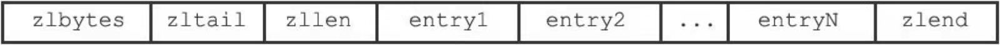
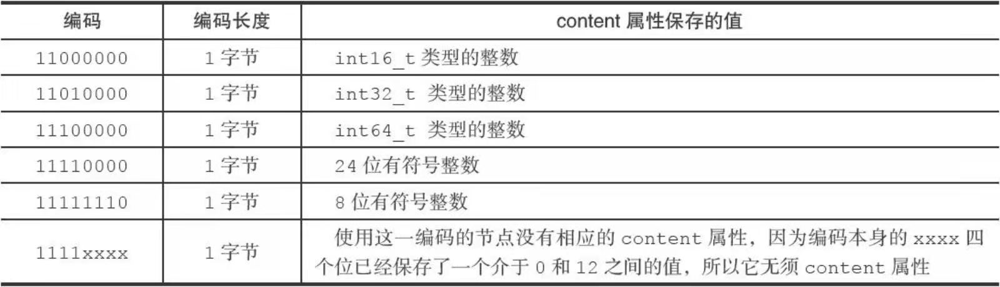

## 压缩列表

什么是压缩列表？ Ziplist 类似于csapp中内存分配的头部脚步（显式链表）

有效的节约内存

## 压缩列表构造

- `zlbytes（4字节）:`压缩列表占用的内存字节数
- `zltail`：记录压缩列表表尾结点距离压缩列表的其实地址的有多少个字节（entryN）

## 压缩列表节点构成

### previous_entry_length

记录上一个entry的大小（字节数）

**previous_entry_length**的大小

- 当前一个节点长度小于254字节，那么**previous_entry_length**属性的长度为1字节（8位即可以表示到2 55)
- 若前一个节点长度大于等于254字节，那么**previous_entry_length**就为5字节
  - 第一个字节使用0xFE表示254，后面四个字节表示前面字节的长度
  - 为啥跨度这么大？

### encoding

用来表示content的类型和长度

- encoding大小可能为1，2，5个字节，最高位00，01，10表示字节数组，字节数组长度是除了最高两位后，剩余记录

- encoding大小为1字节，11开头表示content保存的是整数值，后面的位数表示content使用的整数类型。

### content

- 字节数组或者一个整数值（根据encoding的内容决定）

## 连锁更新

什么是连锁更新？

为什么会出现连锁更新？
