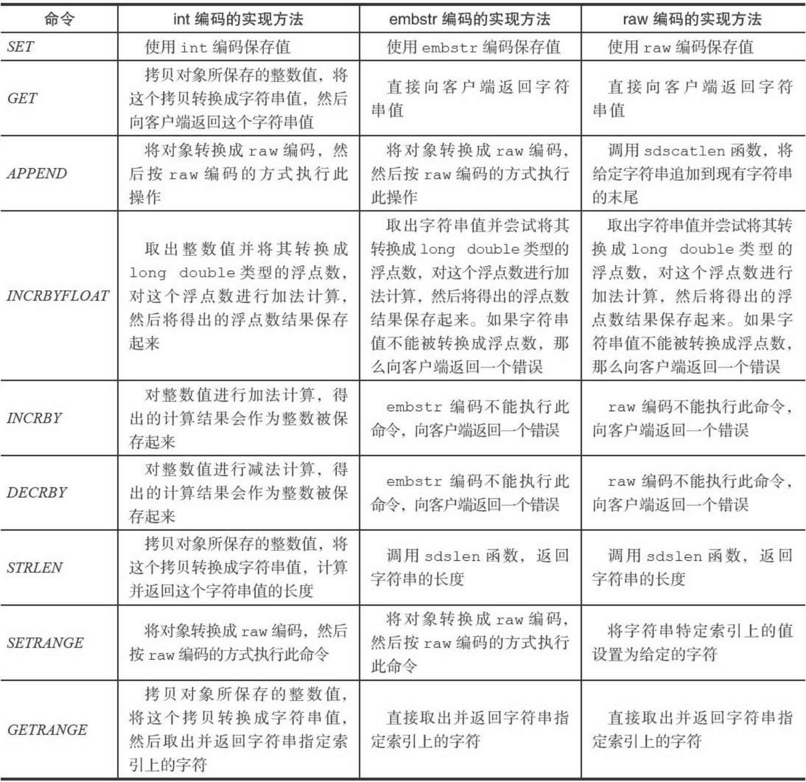
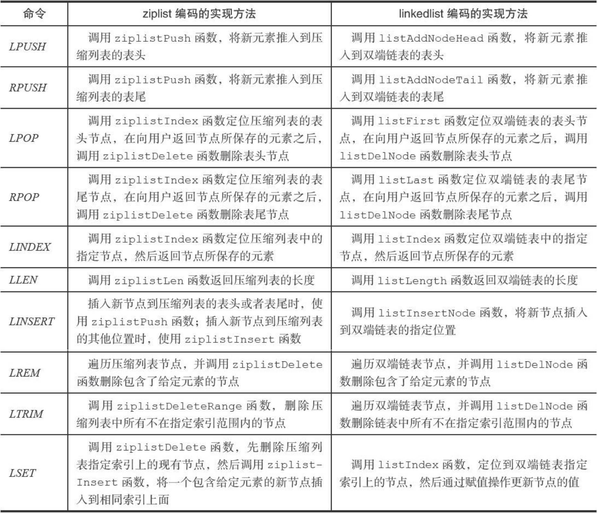
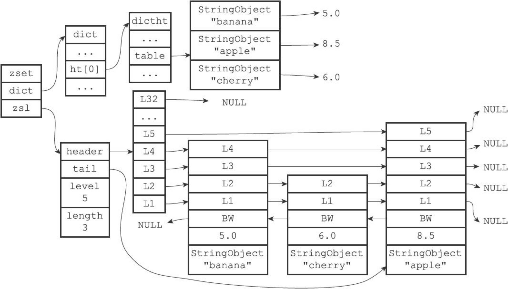

# 对象

之前的五种数据结构创建了一个对象系统，生成了字符串对象，列表对象，哈希对象，集合对象，有序集合对象。

其中使用了基于引用计数的内存回收机制？

- 是否存在循环引用问题？

redis对象带有访问时间记录信息，计算数据库键的空转时长

## 对象类型与编码

创建一个键值对，需要两个对象：键对象和值对象

```sh
set msg "hello world"
```

键字符串对象是"msg"，值字符串对象是"msg"

```c
typedef struct redisObject
{
  unsigned type:4;
  unsigned encoding:4;
  void *ptr;
}robj;
```

### 对象的类型 type

`REDIS_STRING` 字符串对象：int，embstr，raw（

`REDIS_LIST` [列表对象](##列表对象)：ziplist或者linkedlist

`REDIS_HASH`[哈希对象](##哈希对象) ：ziplist或者hashtable

`REDIS_SET` [集合对象](##集合对象) ：intset或者hashtable

`REDIS_ZSET` [有序集合对象](##有序集合对象) ：ziplist或者skiplist

注意==键==总是 **字符串对象**

==值== 的对象有上面5种类型

- 字符串键，指的是数据库键对应的值是字符串对象
- 列表键，指的是键对象的值是列表类型

使用type也是一样的道理，实际显示的是值的对象

```sh
127.0.0.1:6379> type msg
string
127.0.0.1:6379> sadd set1 2 3 4 7 5 28 3
(integer) 6
127.0.0.1:6379> 
127.0.0.1:6379> type set1
set
127.0.0.1:6379> zadd sortset 97 jone 100 tom
(integer) 2
127.0.0.1:6379> type sortset
zset
127.0.0.1:6379> hset car color black
(integer) 1
127.0.0.1:6379> hset car price 10000

127.0.0.1:6379> hset car attention 99
127.0.0.1:6379> type car
```


### encoding编码和实现

encoding属性记录对象所使用的编码


## 字符串对象

字符串编码：int，raw，embstr

- int编码：字符串存的整数
- raw编码，使用简单动态字符串（SDS）
- embstr编码，类似于raw，（字符串值长度小于32字节）但是为了节约内存，是申请一块连续的内存，一次包含redisObject和sdshdr两个结构

embstr的优点：节约内存，小字符串适用


### 编码的转换

int编码和embstr编码的字符串在对象条件满足的情况下，会被转换为raw编码的字符串对象

例如 使用append命令，向int编码的字符串中追加"is a good number" 此时编码会变成raw

```sh
set number 10086
object encoding number
"int"
127.0.0.1:6379> append number "is a good number"
(integer) 21
127.0.0.1:6379> object encoding number
"raw"
```

embstr转raw的例子

```sh
127.0.0.1:6379> set msg "hello world"
OK
127.0.0.1:6379> object encoding msg
"embstr"
127.0.0.1:6379> append msg "aggin !"
(integer) 18
127.0.0.1:6379> object encoding msg
"raw"
```


### 字符串命令的实现



`set`

`get`

`append`

`incrbyfloat`

`incrby`

`decrby`

`strlen`

`setrange:`取给定下标的值

`getrange`


## 列表对象

3.2版本之前链表对象编码：ziplist或者linkedlist

```sh
root@d0f97d4060ce:~# redis-cli
127.0.0.1:6379> rpush numbers 1 "three" 5
(integer) 3
```

ziplist：每一个结点包含三个部分（显式链表）


linkedlist编码底层是双端链表，中每一个结点是一个字符串对象，而每一个字符串对象保存了一个列表元素。

###编码转换

什么时候用ziplist或linkedlist？

同时满足以下两个条件（上限可以在配置文件中修改），则使用ziplist

1. 保存的字符串元素的长度都小于64字节
2. 保存的元素数量小于512个

以上任意一个条件不满足，则会转换编码为linkedlist


### 列表命令

lpush,rpush,linsert,lset

lpop,rpop

lindex,llen

lrem,ltrim



## 哈希对象

哈希对象可以是ziplist和hashtable

ziplist如何实现？

- 键值紧紧挨在一起，键在前，值在后

- 表尾插入，所以说先添加的在前，后添加的在后

- 如何快速查找？

  

hashtable编码使用字典作为底层实现，字典如何实现？有几个部分

- hashht
  - `dictEntry **table`
  - `Size,size_mask`
  - `used`
- dictEntry实际是一个单向链表
- dict 多态字典
  - ht[2] 用于rehash
  - `rehashindex`用于渐进哈希
  - `dictType *type;`
  - `privadata`

键和值都是字符串对象存储在hashtable之中


### 编码转换

什么时候用ziplist或hashtable？

同时满足以下两个条件（上限可以在配置文件中修改），则使用ziplist

1. 保存的字符串元素的长度都小于64字节
2. 保存的元素数量小于512个

以上任意一个条件不满足，则会转换编码为hashtable编码


### 命令实现

## 集合对象

集合对象可以是`intset`（整数集合）或者`hashtable`

inset实现，整数集合实现


hashtable实现：跟哈希对象一样，只是将字典值设置为NULL，只保留键


### 编码转换

同时满足以下两个条件（第二个条件可以在配置文件中修改），则使用inset

1. 都是存的整数值
2. 保存的元素数量小于512个


## 有序集合对象

实现使用ziplist或者skiplist（跳跃表）

ziplist实现

skiplist实现：使用一个zset作为底层实现

- 什么是zset：一个字典和一个跳表
- 跳表和字典共享元素的成员和分值
  

```c
typedef zset
{
  zskiplist *zsl;
  dict *dict
}zset;
```

### 编码的转换

同时满足以下两个条件（上限可以在配置文件中修改），则使用ziplist

1. 保存的元素成员的长度都小于64字节
2. 保存的元素数量小于128个（键，值，分值）


## 类型检查和命令多态

del，expire，rename，type，object命令可以对任意类型的键

而有些命令只针对特定键类型

如何判断类型？RedisObject的type属性实现


## 内存回收

引用计数

```c
typedef struct redisObject
{
  //引用计数
  int refcount;
}robj
```

对象创建时 refcount=1，当有其他程序使用时，引用计数+1

当一个对象不再被使用时，引用计数-1

如果引用计数为0，此时会释放对象

## 对象共享

引用计数用于对象共享

只对整数对象共享(0-9999启动就会创建，供)

例如：键A创建一个整数值100字符串对象作为值对象，若B同样创建一个整数值100字符串对象，此时B不会重新创建一个对象， 而是让键A和键B共享同一个字符串对象

整数对象共享池与maxmemory和maxmemory-policy设置冲突，原因是：

- LRU算法需要获取对象最后被访问时间， 以便淘汰最长未访问数据， 每个对象最后访问时间存储在redisObject对象的lru字段。 对象共享意味着多个引用共享同一个redisObject， 这时lru字段也会被共享， 导致无法获取每个对象的最后访问时间
- 如果没有设置maxmemory，那么服务器内存耗尽时都不会驱逐键，一般会报oom的错误，所以对象共享池能正常工作

## 对象空转时长（闲置时间）

Type,encoding,ptr,refcount四个属性之外，还有一个lru属性

什么是空转时长：即不活跃的时间！

空转时长object idletime=当前时间减去值对象lru时间计算（最后一次访问时间）得到空转时长

空转时长过长（maxmemory设置的上限值）会销毁对象

读取一个键后会更新键的LRU时间，若过期会删掉过期键
