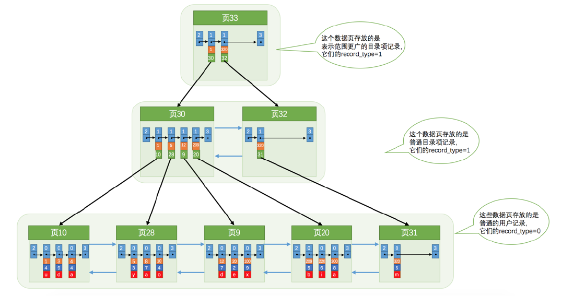

## 回顾

数据页之间的联系---双向链表

页中每个记录直接的联系---单链表，但是找很慢怎么办？

- 每个页，生成了一个页目录，页目录里面的entry（槽）存着每个分组里面最大主键值（具体细节，例如每个组中有多少个元素，其实最大key值那个记录中会记录（我称他为组长吧）
- 利用二分查找即可

## 没有索引的查找-远古时期

### 在一个页中查找

- 主键为搜索条件 有buff（页目录）
- 非主键为搜索条件 无buff 只能硬着头皮遍历所有记录

### 在多个页中查找

先定位记录所在页 ---如何定位？

在找对应页中的对应记录--- 这个参照上面

- 由于没有索引 只能一个页一个页的遍历（在双向链表中）

- 在页中又按上面方法查找对应记录看能不能找的到

  即：遍历所有页，遍历页中的记录（真慢，如果要找的在最后一个页的最后）

就跟查没有索引表的字典一样 ：先看第一页，然后看第一页有没有对应的字，如果没有再翻第二页......这得翻到猴年马月。

## 索引

页目录项需要什么条件？

维持这个条件需要做什么？

### 上古时期---一个简单的索引方案

类似于页目录存储最大key值记录，我们也可以每一个页对应一个目录项存储：主键值和页号，存在一个连续的空间之中（例如数组）

1. 每一个结构项存储了每一个页中最小的主键和页号

2. 然后按照二分法查找对应的结构中的页号，找到对应的页号

   

实现索引，发现普通索引目录会出问题：

- 随着记录越来越多，连续空间要求越来越多

### 现代----INnoDB的索引方案

后面发现，这玩意和记录一样呀，完全也可以用页来存储（有点操作系统分页，页目录那味了）

用页专门存储目录记录项（目录记录项存的是key和页号）

record_type 为1 表示专门存目录记录项的页

1. 链表组织
2. 更高级的组织
   1. bst平衡二叉树
   2. b+树（树更矮）

我们发现非叶子节点的数据页是放目录项记录的，并不含真实数据

而叶子节点的数据页全部是放的数据！

- 如果说一个页结点可以放100个记录，而一个页存放目录项记录的内节点可以存放1000条。
- 

#### 聚簇索引

数据即索引！叶子节点存储全部记录

INnoDB引擎默认生成聚簇索引。

聚簇索引两个特点：

- 记录主键值大小进行记录和页排序
  - ==页内的记录==按照主键大小顺序排列，成一个单向链表（还记得页目录吗，槽，组长，二分）
  - 存放用户记录的==页==也是根据用户记录的主键排序成一个双向链表。（页之间）
  - 存放目录项记录的页也分为不同层次，在同一层次中也是根据页中目录项记录的主键大小排序

- B+树叶子节点存储的是完整用户记录

但是问题来了，我查找的不是主键呢？也得全表遍历呀？

#### 非聚簇索引（没有唯一性）

假设c2 列设为 非聚簇索引

- 记录列c2大小进行记录和页排序
  - 页内的记录按照列（index）值大小顺序排列，成一个单向链表（为了快速查找记录）
  - 存放用户记录的==页==也是根据用户记录的列（index）排序成一个双向链表。（页之间）
  - 存放目录项记录的页也分为不同层次，在同一层次中也是根据页中目录项记录的列（index）大小排序

- B+树叶子节点存储的是列值(index)+主键值

  

原始的模仿聚簇索引：只放页号+列号（index） 行吗？注意列index的值不唯一，比如列c2中有多个值为4的记录，那么我们该怎么找？

因为叶子节点不是存的完整用户记录，只有列c和主键列的记录，如果要查找其他列记录，我们需要回表，根据主键（去聚簇索引）再查找一遍

为什么不像聚簇索引中叶结点放完整用户记录？太浪费空间了，所有记录都要拷贝一遍

### 联合索引（覆盖索引）

单个非聚簇索引其实就是联合索引（c2,c),即非聚集+主键的联合索引

那么联合索引一样的是(c3,c2,c)。多个非聚集索引+主键

### INnoDB的b+树索引注意

#### 根页面万年不动

从建表就会分配一个根页面，最开始是没有数据页和记录目录项的页的。

当根页面存的数据超过了页的大小，此时页就会分裂，就会出现叶结点数据页和记录目录项的页

#### 内节点目录项记录的唯一性

因此需要在二级索引（非聚簇索引）上面加上主键

- 索引列的值
- 主键值
- 页号

#### 一个页面最少存储两个记录

很好理解，不然的话怎么会有树呢，一个记录一条单链表拉到底

如果一个大目录只放一个小目录，N层目录也只能放一条用户记录

### 创建和删除索引

