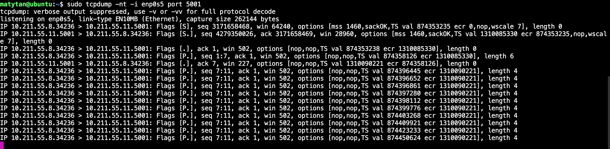
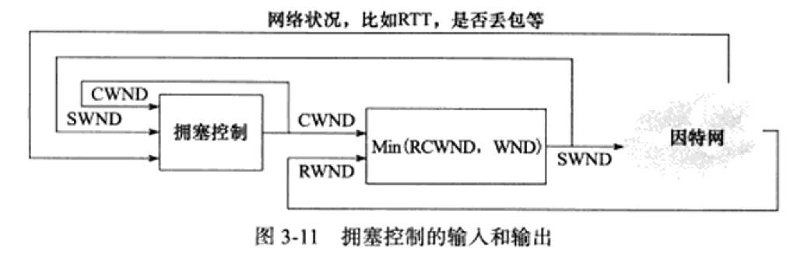

# TCP 协议详解

## TCP服务的特点


特点

1. 面向连接

2. 字节流

   - 字节流的概念？

   - 数据报的概念？
   - 字节流和数据报的区别？

3. 可靠传输

### TCP的连接建立

- 面向连接

  连接的建立

  

  断开连接

  半关闭状态

  

- 连接超时
  - 


### TCP状态转移

TCP状态转移总图：

- 注意：==线上== 是当前状态收到指令/或报文 ，==线下是发送==


客户端的状态转移

- 程序主动打开连接到SYN_SENT，并发送SYN
- 收到服务器的SYN和ACK ，发送ACK进入ESTABLISHED连接已建立状态（注意这时客户端已经建立，但是服务器还没有）
- 发送数据
- 关闭程序 发送FIN，进入FIN_WAIT_1
- 收到ACK 进入FIN_WAIT_2 ，如何直接进入TIME_WAIT或者CLOSE？
- 进入TIME_WAIT
- 进入close（关闭）
- TIME_WAIT状态


TIME_WAIT 状态：

- TCP 连接中，主动关闭连接的一方出现的状态;(==收到 FIN 命令 （但是ack还没到对端）==，进入 TIME_WAIT 状态，并返回 ACK 命令)
- 保持 2 个 MSL 时间，即，4 分钟;(MSL 为 2 分钟)

服务器的状态转换：


- SYN RECV转态：注意半连接队列和accept队列

- backlog只代表accept队列，也就是 ESTABLISHED 状态的连接（注意如果accept队列满了这时是进不去队列的，所以还是RECV状态）

  - 如果 accept 队列满，client 发来 syn ack，连接从 syn 队列移到 accept 队列的时候会发生什么呢？

    - 如果 /proc/sys/net/ipv4/tcp_abort_on_overflow 为1，会发送 RST；如果为0，则「什么都不做」，也就是「忽略」。

      ```sh
      matytan@ubuntu:~/shell$ cat /proc/sys/net/ipv4/tcp_abort_on_overflow
      0
      ```

    - 忽略之后，仍然可以收到客户端的ack。但是，即使被忽略，对于 SYN RECEIVED 状态， 会有重试，重试次数定义在 /proc/sys/net/ipv4/tcp_synack_retries(重试时间有个算法)。
    - client 在收到 server 发来的重试 synack 之后，它认为之前发给 server 的 ack 丢失，会重发，此时如果 server 的 accept 队列有「空位」，会把连接移到 accpet 队列，并把 SYN RECEIVED 改成 ESTABLISHED。
    - 从另一个角度看， 即使 client 发的 ack 被忽略。因为 client 已经收到了 syn+ack，client 认为连接已经建立。它可能会直接发送数据(ack 和 数据一起发送)，这部分数据也会被忽略，客户端会重传，幸好有「慢」启动机制保证重传的数据不会太多（进入拥塞避免）。
    - 如果 client 先等待 server 发来的数据，在 client 端连接是 ESTABLISHED，server 认为连接是 CLOSED，这会造成「半关闭连接」。
    - 事实上，如果 accept 队列满了，内核会限制 syn 包的进入速度，如果太快，有些包会被丢弃。

拥塞避免

- 慢启动和拥塞避免
  - 慢启动：拥塞窗口指数增长，直到到门限值才线性增加
- 快重传和快速恢复
  - 真正拥塞时


## 复位报文段rst

### 访问不存在的端口

- 访问不存在的端口
- 访问被TIME_WAIT阶段占用的


### 异常终止连接


### 半打开连接

什么是半打开连接？

- 即有一方打开，一方关闭

- 例如，服务端退出，客户端没有服务端的FIN报文。客户端此时并不知道服务器要关闭连接

  

实验：

```sh
vir(10.211.55.8)上面运行服务器 nc -l 1234
vir开启监听端口1234，利用tcpdump：sudo tcpdump -nt -i enp0s5 port 1234
vir32(10.211.55.11) 运行客户端telnet  telent 10.211.55.8 1234

三次握手：
IP 10.211.55.11.33852 > 10.211.55.8.1234: Flags [S], seq 900357173, win 29200, options [mss 1460,sackOK,TS val 1280881049 ecr 0,nop,wscale 7], length 0

IP 10.211.55.8.1234 > 10.211.55.11.33852: Flags [S.], seq 4194477994, ack 900357174, win 65160, options [mss 1460,sackOK,TS val 4096527449 ecr 1280881049,nop,wscale 7], length 0

IP 10.211.55.11.33852 > 10.211.55.8.1234: Flags [.], ack 1, win 229, options [nop,nop,TS val 1280881049 ecr 4096527449], length 0


断开vir32网线，使之无法接收vir的结束(FIN)报文。
关闭vir中的服务器程序。
重新连接网线vir32，发送字符给服务器。
服务器发送R报文，客户端关闭
IP 10.211.55.8.1234 > 10.211.55.11.33854: Flags [R], seq 2681711653, win 0, length 0
```

## TCP交互数据

- TCP交互数据 ：包含很少的字节，对实时性要求高的可以用

- TCP成块数据：报文段允许的最大长度

- 延迟确认

  实验：使用telnet

## TCP成块数据

实验：执行ftp,发送文件

`scp apue.pdf matytan@vir:/home/matytan`

- 连续发送
  - 能发多少呢？由接收通告窗口（还有拥塞窗口）
- 延迟确认（累积确认）

## 带外数据OOB

什么是带外数据？（out of Band）

- 带外数据有更高优先级。不管缓冲区是否有排队等待发送的普通数据，带外数据可以使用一条独立的传输层连接，也可以映射到普通连接中。
- 很少见，常用于远程非活跃程序


带外数据如何实现

- udp没有实现（因为udp没有发送缓冲区，不存在排队），TCP也没有真正的带外数据，TCP利用头部信息URG标志和紧急指针实现

  

带外数据发送过程：

- 待发送TCP报文段的头部被设置URG标志，紧急指针指向最后一个OOB的下一字节
- OOB中一次只能有一个字符，比如abc被设置成了OOB，但是TCP只将c当作带外数据，ab作为普通数据


带外数据接收：

- 一个特殊的1字节缓冲区专门接收，可能被覆盖。称为带外缓存
- 设置SO_OOBINLINE选项之后，带外数据与普通数据一起存入tcp接收缓冲区
  - 这时读取与普通数据相同
  - 使用系统调用接口识别带外数据


## TCP超时重传

异常网络下：

如何保证其可靠服务？

1. 为每个TCP报文维护一个重传定时器

2. 重传策略，最少重传次数（实验）

3. 确认机制

   `sudo tcpdump -nt -i enp0s5 port 5001`



- 一般默认值15 对应13-30min
- 每次重传时间间隔增加1倍（类似重连策略）
- 失败后底层IP和ARP开始接管

1. 拥塞过程中，其实还有一种叫快速重传的机制。

想一个问题 应该超时多久呢？

怎么计算超时呢？

### 超时时间的计算

RTT是什么？

RTO是什么

​	RTO（Retransmission TimeOut）即重传超时时间。

RTT的特点？

- 动态
- 不是一个准确值，而是一个“平均值”

RTT如何计算

- 算术平均？肯定不行呀，why？
- 考虑延迟和瞬间抖动
  - 例子：两次测量一次为98，一次为2 显然算术平均不合理，对于两次的时间都不合理
- 如何计算？除了多次测量的偏差，应该还考虑网络的变化率
- 加入变化率，两种计算方式
  - 如果变化率过大，则通过以变化率为自变量的函数为主计算RTT(如果陡然增大，则取值为比较大的正数，如果陡然减小，则取值为比较小的负数，然后和平均值加权求和)。
  - 反之如果变化率很小，则取测量平均值。这是不言而喻的，这个算法至今仍然工作的很好。（表示没有多大的变化）
  - ​     RTTVAR = (1 - beta)*RTTVAR + beta*|SRTT - R'|    *计算平滑RTT和真实RTT的差距，切记这个地方的SRTT是上一次的SRTT*

RTO如何计算？

\1.  SRTT = R

\2.  RTTVAR = R/2

\3.  RTO = SRTT + max(G, K*RTTVAR) , K = 4


### 计时器的管理- 每连接单一计时器

每一个TCP分段带一个计时器

- 开销巨大
- 不实际

因此是每个连接单一计时器，RFC2988定时器规则

 设计单一计时器有两个原则：

1.每一个报文在长期收不到确认都必须可以超时；

2.这个长期收不到中长期不能和测量的RTT相隔太远。

因此设计了 **四个规则**

a.发送TCP分段时，如果还没有重传定时器开启，那么开启它。

b.发送TCP分段时，如果已经有重传定时器开启，不再开启它。

==c.== :star:收到一个非冗余ACK时，如果有数据在传输中，重新开启重传定时器。（定时器重置）

d.收到一个非冗余ACK时，如果没有数据在传输中，则关闭重传定时器。

对于ab规则的理解：

- 没有重传定时器时，发送TCP分段需要开启。可以保证原则1 总会被超时
- 有了，发送分段时则不重开（不然怎么给之前的分段超时，按规则c，即之前的分段确认之后我才会重开，重新计时）

为什么需要c呢？ a能够保证超时呀，为什么要收到ack重新开定时器。

- 首先，如果没有c这个规则 假设我先发报文段1，再发2。收到1定时器没有重开，仍然是1的定时器。则可能收到1刚好到了超时时间，2还没来得及确认，就马上重传2，想想就可怕呀！！！

- 防止过早重传
- 防止重传过多，导致网络拥塞
  - 设置规则c的结果可以缓解过多的重传，毕竟将启动定时器之后发送的数据的重传超时时间拉长了最多一倍左右。最多一倍左右的超时偏差做到了原则2
  - 一个ACK到来了，说明后续的ACK很可能会依次到来。
  - 就算真的丢包，也会在最多2倍定时器超时时间的范围内被重传

d的作用呢？

- 说明是最后一个数据了，可以关闭了。

### 何时测量RTT

TCP实现了时间戳，发送分段时在头部字段加上时间戳，收到的ack取出，做计算差

- 目前很多TCP实现了时间戳，这样就方便多了，发送端再也不需要保存发送分段的时间了，只需要将其放入协议头的时间戳字段，然后接收端将其回显在ACK即可，然后发送端收到ACK后，取出时间戳，和当前时间做算术差，即可完成一次RTT的测量。

## 数据顺序性

### **确认号和超时重传**

确认号是什么？

- 确认号是接收端发送的序号，表明确认号之前的数据都被接收。哪怕前面某个确认号丢失。
  - 这句话的意思 a收到b发送的确认号ack=17，但是没有收到15。这时a也认为b已经收到了17之前的所有数据。
  - 这时合理的。因为确认号是接收端发出的，接收端只确认按序到达的最后一个TCP分段。

发送端的确认号

- 发送端重发了一个TCP报文并且接收到该TCP分段的确认号，并不能说明是这个重发的报文被接收了，也可能是数据早就被接收了，只是由于其ACK丢失或者其ACK延迟到达导致了超时。值得说明的是，接收端会丢弃任何重复的数据，即使丢弃了重复的数据，其ACK还是会照发不误的。


怎么根据确认号联系超时重传

- 重传风暴是什么？
  - 早期是丢失报文段a，那么a之后的报文段都要重传，导致大量不必要重传，引起重传风暴
  - 这种重传风暴是没有必要的，因为大多数的TCP实现中，接收端已经缓存了乱序的分段，这些被重传的丢失分段后面的分段到达接收端之后，很大的可能性是被丢弃。（相当于白重传了呀）
  - 关于这一点在拥塞控制被引入之后还会提及(问题先述为快：本来报文丢失导致超时就说明网络很可能已然拥塞，重传风暴只能加重其拥塞程度)。

### 选择确认避免重传风暴

- TCP是保证数据顺序的，但是并不意味着它总是会丢弃乱序的TCP分段，具体会不会丢弃是和具体实现相关的，

- RFC建议如果内存允许，缓存乱序分段，然后实现一种机制等到可以拼接成一个按序序列的时候将缓存的分段拼接，

- 这就类似于IP协议中的分片一样，但是由于IP数据报是不确认的，因此IP协议的实现必须缓存收到的任何分片而不能将其丢弃，因为丢弃了一个IP分片，它就再也不会到来了。

-    现在，TCP实现了一种称为选择确认的方式，接收端会显式告诉发送端需要重传哪些分段而不需要重传哪些分段。这无疑避免重传风暴。

  - 什么是选择确认---快重传 seg2丢失，客户端会一直发送ack1，表明想要seg2，一旦服务器收到3次连续ack1 此时就会重传seg2

  - 然后客户端直接发送ack4，表明前4个数据已收到！ 牛逼

    

### 序列号回绕

什么是序列号回绕？ 即发送了序号15342之后，又发送序号133，导致接收端乱序

- 为啥会产生这种情况？
  - 因为序号随机产生，且所有序号用完了，又重新产生了一遍。导致多了一圈

- 比如序列号为s的分段发出之后，m秒后，序列号比s小的序列号为J的分段发出，只不过此时的J比上一个s多了一圈（意思是新的序列号），这就是回绕问题

 有个细节误会：那就是TCP的窗口大小空间是序列号空间的一半，这样恰好在满载情况下，数据能填满发送窗口和接收窗口，序列号空间正好够用。

然而事实上，TCP的初始序列号并不是从0开始的，而是==随机产生== 的(当然要辅助一些更精妙的算法)，**因此如果初始序列号比较接近2的32次方，那么很快就会回绕**


## **流量控制**

端到端：TCP只能看到两点，就是对方和自己。

- 滑动窗口协议原理

  端到端的流量控制使用滑动窗口来实现。滑动窗口的原理非常简单，基本就是一个生产者/消费者模型

滑动窗口的局限性：

- 网络利用率
  - 滑动窗口只是限制了最大发送的数据，却没有限制最小发送的数据
  - 也就导致了小包问题

三个问题

- **问题1描述：接收端处理慢，导致接收窗口被填满**：糊涂窗口综合症
  - 接收方处理太慢，每次腾出一个字节	，马上发一个分段。然后又发了一个字节填满
    - 这个问题极大的浪费了网络带宽，降低了网络利用率。好比从大同拉100吨煤到北京需要一辆车，拉1Kg煤到北京也需要一辆车(超级夸张的一个例子，请不要相信)，但是一辆车开到北京的开销是一定的...

- **问题2描述：发送端持续发送小包，导致窗口闲置**
- **问题3.确认号(ACK)本身就是不含数据的分段，因此大量的确认号消耗了大量的带宽**（本质和问题2一同

解决：

- 问题1解决：窗口通告，限制窗口通告时机，解决糊涂窗口综合症

  我们没有办法限制发送端不发送小分段，但是却可以限制接收端通告小窗口（即不让通告小窗口，让发送端以为放不下）

  


- 问题2 解决 ：nagle算法（合并分段，所谓“粘包

  - 如果网络中没有未确认的数据，立即发送
  - 如果网络中有未确认的数据，等待确认之后发送
  - 如果网络中有未确认的数据，等待数据累积到MSS大小发送

  ```markdown
  IF 数据的大小和窗口的大小都超过了MSS
      Then 发送数据分段
  ELSE
      IF 还有发出的TCP分段的确认没有到来
          Then 积累数据到发送队列的末尾的TCP分段
      ELSE
          发送数据分段
      EndIF
  EndIF
    
   
  可是后来，这个算法变了，变得更加灵活了，其中的：
      IF 还有发出的TCP分段的确认没有到来
  变成了
      IF 还有发出的不足MSS大小的TCP分段的确认没有到来
  ```


问题3解决：延迟ack，延迟确认。

等到数据一起确认


#### “粘包问题”

[(22条消息) TCP粘包问题分析和解决（全）_彼岸花-CSDN博客](https://blog.csdn.net/tiandijun/article/details/41961785)

tcp传输是流传输

1.由Nagle算法造成的发送端的粘包:Nagle算法是一种改善网络传输效率的算法.简单的说,当我们提交一段数据给TCP发送时,TCP并不立刻发送此段数据,而是等待一小段时间,看看在等待期间是否还有要发送的数据,若有则会一次把这两段数据发送出去.这是对Nagle算法一个简单的解释,详细的请看相关书籍. C和D的情况就有可能是Nagle算法造成的.

2.接收端接收不及时造成的接收端粘包:TCP会把接收到的数据存在自己的缓冲区中,然后通知应用层取数据.当应用层由于某些原因不能及时的把TCP的数据取出来,就会造成TCP缓冲区中存放了几段数据.


如何解决？

1. 控制发送间隔（效率）
2. 封包和拆包（tcp属于流传输）

- 封包

拆包的

（1）动态缓冲区暂存方式。之所以说缓冲区是动态的是因为当需要缓冲的数据长度超出缓冲区的长度时会增大缓冲区长度。

大概过程描述如下:

A,为每一个连接动态分配一个缓冲区,同时把此缓冲区和SOCKET关联,常用的是通过结构体关联.

B,当接收到数据时首先把此段数据存放在缓冲区中.

C,判断缓存区中的数据长度是否够一个包头的长度,如不够,则不进行拆包操作.

D,根据包头数据解析出里面代表包体长度的变量.

E,判断缓存区中除包头外的数据长度是否够一个包体的长度,如不够,则不进行拆包操作.

F,取出整个数据包.这里的"取"的意思是不光从缓冲区中拷贝出数据包,而且要把此数据包从缓存区中删除掉.删除的办法就是把此包后面的数据移动到缓冲区的起始地址.

（2）利用底层的缓冲区来进行拆包

由于TCP也维护了一个缓冲区,所以我们完全可以利用TCP的缓冲区来缓存我们的数据，这样一来就不需要为每一个连接分配一个缓冲区了。另一方面我们知道recv或者wsarecv都有一个参数,用来表示我们要接收多长长度的数据。利用这两个条件我们就可以对第一种方法进行优化。


#### 延迟ACK 和nagle算法冲突

实例：客户端发送3个请求，服务端write 3次，而每一个write都没有达到MSS

第一个write由于网络没有待确认的，会直接发送，后面的2个write的数据会保存在发送缓冲区等待（此时没有write）不够一个MSS

而客户端收到一个数据，此时开启了延迟ACK（40ms），客户端心想等一会儿吧等数据多了再一起确认。

然后客户端等啊等 等了40ms也没来，因此发送ack

现在服务端都到ack，才发送缓冲区的数据。


我们发现一个问题，如果每次发送的数据较少，很有可能客户端都要等40ms才发ack，而服务端也在等待

#### **到底何时可以发送数据**？

到底何时才能发送数据呢？如果单从Nagle算法上看，很简单，然而事实证明，情况还要更复杂些。

如果发送端已经排列了3个TCP分段，分段1，分段2，分段3依次被排入，三个分段都是小分段(不符合Nagle算法中立即发送的标准)，此时已经有一个分段被发出了，且其确认还没有到来，请问此时能发送分段1和2吗？如果按照Nagle算法，是不能发送的，但实际上它们是可以发送的，因为这两个分段已经没有任何机会再积累新的数据了，新的数据肯定都积累在分段3上了。问题在于，分段还没有积累到一定大小时，怎么还可以产生新的分段？这是可能的，但这是另一个问题，在此不谈。

```markd
IF (没有超过拥塞窗口大小的数据分段未确认 || 数据分段中包含FIN ) &&

    数据分段没有超越窗口边界

    Then

    IF 分段在中间(上述例子中的分段1和2) ||

           分段是紧急模式            ||

       通过上述的Nagle算法(改进后的Nagle算法)

        Then 发送分段

    EndIF

EndIF
```

*~~~~~~~~~~~~~~~~~~~~*

*承上启下*

*又到了该承上启下，到此为止，我们叙述的TCP还都是简单的TCP，就算是简单的TCP，也存在上述的诸多问题，就更别提继续增加TCP的复杂性了。到此为止，我们的TCP都是端到端意义上的，然而实际上TCP要跑在IP网络之上的，而IP网络的问题是很多的，是一个很拥堵网络。不幸的是，TCP的有些关于确认和可靠性的机制还会加重IP网络的拥堵。*

*~~~~~~~~~~~~~~~~~~~~*

## **IP网络之上的TCP**拥塞控制


以上都是端到端的控制，而现在面对的是整个网络的控制

**端到端**：TCP只能看到两个节点，那就是自己和对方，它们是看不到任何中间的路径的。


**5.1端到端的TCP协议和IP协议之间的矛盾**

端到端的连接只能看到对方的接收空间，但是它并不管网络中是否拥堵，也就是网络路径中是否有这么大的容量，因此只有滑动窗口流量控制运行并不是很理想

因此必须要拥塞控制机制，反应网络拥塞情况

### **拥塞控制的本质**

网络什么时候可能会拥塞

- 两个及以上的连接（其中一个一定是tcp）经过同一条链路或经过同一个路由器
- 只有一个tcp，然而它已经经过了路由器时

本质上，拥塞的原因就是大家都想独享全部带宽资源，结果导致拥塞，这也是合理的，毕竟TCP看不到网络的状态，同时这也决定了TCP的拥塞控制必须采用试探性的方式，最终到达一个足以引起其“反应”的“刺激点”。

### 拥塞控制目标

任务：1.公平性；2.拥塞之后退出拥塞状态。即

- 保证网络资源对每条数据流公平性
- 提高网络利用率，减少丢包率

### 影响拥塞的因素

1. 重传频率（太快很有可能导致拥塞）
2. 路由器占用总带宽（分段排队和处理时延）
3. 丢包的延后性（即通过了n-1个路由器，在最后一个路由器


### 拥塞控制的策略

什么是拥塞窗口

拥塞窗口（CWND）控制发送窗口大小

拥塞窗口和通告窗口（接收窗口）区别？不能

- 前者是体现网络中的拥塞情况
- 后者代表流量控制能够接收

因此发送的大小应该是他俩取小

SWND = min(RWND,CWND)

最终受控变量是`发送端`向网络的一次连续写入（收到其中第一个数据确认前）的数据量。即`SWND发送窗口`，为了进一步控制发送数据，加入了拥塞窗口（CWND）控制发送窗口大小

`接收端`有通知窗口（RWND）

SWND = min(RWND,CWND)



- 通告窗口RWND? 流量控制
- 拥塞窗口CWND? 拥塞控制


什么是拥塞？怎么判断

- 传输超时（超时重传）严重
  - 超时怎么判断？有个超时时间，不同的报文次数不定
- 接收到3个重复ack（快速重传）轻微

如何实现拥塞控制？分为两类，一类是试探性的拥塞探测，另一类则是拥塞避免(注意，不是常规意义上的拥塞避免)。

试探性：

- 慢启动
- 拥塞避免 线性（避免不了拥塞）

拥塞避免（不是常规拥塞避免，拥塞控制旨在还没有发生拥塞的时候就先提醒发送端，这样就可以快速重传/快速恢复或者显式的减小拥塞窗口，）

**快重传和快速恢复**

### 慢启动和拥塞避免

- 这个算法控制的是哪个窗口？
  - 最终控制都落到发送窗口SWND

- 这个算法以哪个窗口为观察？维持哪些变量
  - CWND拥塞窗口
  - 门限值

慢启动阶段：

- 指数增加拥塞窗口cwnd+=min(N,SMSS)

- N是此次确认中，包含之前未被确认的字节数

拥塞避免阶段：（超时或者收到连续三个ack

- 线性增加拥塞窗口 cwnd+=SMSS*SMSS/cwnd
- 设置新门限值
  - ssthresh = max(FlightSize/2,2*SMSS)
  - cwnd<=SMSS
- 拥塞控制再次进入慢启动

### 快速重传和快速恢复

一旦收到3个冗余ACK，不必进入慢启动

而是将拥塞窗口缩小为当前阀值的一半加上3，然后如果继续收到冗余ACK，则将拥塞窗口加1个MSS，

直到收到一个新的数据ACK，将窗口设置成正常的阀值，开始加性增加的阶段。

即

- 连续收到3个冗余ack，立即重传 重新计算门限值（即按照拥塞避免计算ssthresh/）
- 如果收到一个1个冗余ack，这时线性增加cwnd，可以发送新的tcp报文段
- 当收到新数据确认，设置cwnd = ssthresh  ssthresh是新的慢启动门限值（第一步计算），进入拥塞避免阶段

问题1.为啥要加3？很有深意啊

包守恒，既然已经收到了3个冗余ACK，说明有三个数据分段已经到达了接收端，既然三个分段已经离开了网络，那么就是说可以再发送3个分段了，只要再收到一个冗余ACK，这也说明1个分段已经离开了网络，因此就将拥塞窗口加1个MSS。


问题2.超时重传和冗余ack重传的区别

- 超时重传是比较严重的拥塞

  超时重传一般是因为网络出现了严重拥塞(没有一个分段到达，如果有的话，肯定会有ACK的，若是正常ACK，则重置重传定时器，若是冗余ACK，则可能是个别报文丢失或者被重排序，若连续3个冗余ACK，则很有可能是个别分段丢失)，此时需要更加严厉的缩小拥塞窗口，因此此时进入慢启动阶段。

- 冗余ack可能是稍微轻微的，因为后面的分段确实是到了

  收到3个冗余ACK后说明确实有中间的分段丢失，然而后面的分段确实到达了接收端，这因为这样才会发送冗余ACK，这一般是路由器故障或者轻度拥塞或者其它不太严重的原因引起的，因此此时拥塞窗口缩小的幅度就不能太大，此时进入==快速重传/快速恢复阶段==


问题3.为啥要收到3个ack重传？

- 一种权衡，减少不必要的重传

### TCP三次握手的第三个ack丢了会怎样

[(19条消息) TCP三次握手的第三个ack丢了会怎样_zerooffdate的专栏-CSDN博客](https://blog.csdn.net/zerooffdate/article/details/79359726?spm=1001.2014.3001.5501)

1. 服务器重传syn（此时处于SYN_RECV)

2. 客户端自以为建立连接（因此会发送数据，此时会发送确认）

### [(19条消息) TCP层性能优化：nagles算法与延迟ack共同工作导致的一次性能下降_zerooffdate的专栏-CSDN博客](https://blog.csdn.net/zerooffdate/article/details/78761177?spm=1001.2014.3001.5501)


- 延迟确认 ac
- nalge算法：
  - 如果网络中没有未确认的数据，立即发送
  - 如果网络中有未确认的数据，等待确认之后发送
  - 如果网络中有未确认的数据，等待数据累积到MSS大小发送
- 粘包：调了三个write API，但是只有两个tcp包被观察到。第一个包包含了第一个write的内容，第二个包包含了第二，三个write调用的内容，即粘包（因为会缓存起来）。
  - 为啥分成了两个？第一个待确认的包，TCP立即发送。
  - 第2，3个write则会放到缓冲区等待


- 当nagle遇到延迟ack
  - 客户端发送3个请求数据
  - 服务器调用一次write，返回一个数据，并且等待ack（nagle算法）
  - 客户端收到数据，但是由于延迟确认，小于40ms，等待对方数据一起确认（延迟确认）
  - 双方互等
  - 40ms后 客户端延迟ack超时，发送ack
  - 服务端收到ack，发剩下的数据
  - 客户端认为三个请求用了40ms，继续下一轮请求

