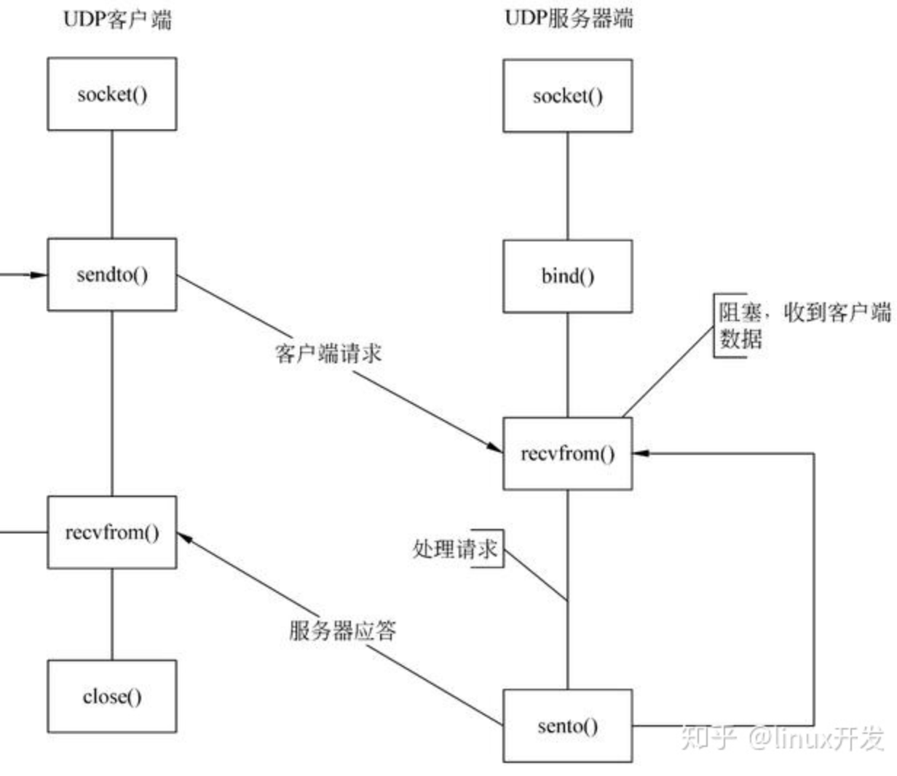

### 第二章 应用层

- 因特网协议网络层次：应用层，传输层，网络层，链路层，物理层
  - 应用层的的信息分组称之为报文
  - 传输层：在应用程序端点之间传送应用层报文
- 网络体系结构

-OSI模型
#### 2.1 应用层协议原理

##### 2.1.1 网络应用的体系结构
- cs结构 客户-服务端
- p2p结构
#####  2.1.2 进程通信
- 在不同端系统上的进程间的通信
  - 客户和服务器进程
  - 套接字（socket）的软件接口向网络发送报文和从网络接收报文。
    - socket是同一主机 应用层与传输层之间的接口 API
    - 开发者可以控制套接字在应用层的一切，而没有套接字的传输层的控制权
##### 2.1.4 因特网提供的运输服务

1. TCP
   1. 面向链接服务：三次握手后，在两个进程的套接字直接建立了一条TCP链接，结束报文发送时，需要拆除链接（四次挥手）
   2. 可靠传输服务：无差错，按适当顺序交付所有发送数据
   3. TCP安全：安全套接字层 Secure Sockets Layer（SSL)，SSL是对TCP的强化，是在应用层上实现的。
   4. 
2. UDP
   1. 无连接 最小服务
   2. 不可靠，不提供拥塞控制
#### 2.2 HTTP和Web（之前的笔记）

##### 2.2.1 HTTP概括
- HTTP 无状态协议 不保存客户的任何信息
  - 持续性链接
  - 非持续链接：每一个请求对象都需要建立一次链接
##### 2.2.3 HTTP报文格式
- 请求报文
- 响应报文
  - 状态码
- 
##### 2.2.4 与用户的交互，cookie

##### 2.2.5 Web缓存
- 即代理服务器：一定概率命中 已经存储的内容可以直接获取

##### 2.2.6 条件GET方法
- 代理服务器可能存的副本是比较旧的，这时需要使用条件GET
- 代理服务器的请求报文中If-Modified-Since 'data'
- 如果没被修改 直接返回空的实体
- 


##### 2.3 文件传输协议FTP
- 使用了两个并行的TCP链接 ：一个控制连接 端口21，一个数据链接 端口20
  - 控制连接是持久连接：贯穿整个用户会话期间
  - 数据连接是非持久连接


##### 2.4 邮件
- SMTP：报文首部：From，To，Subject
- POP3 用户代理四个命令list retr dele quit
- IMAP
##### 2.5 DNS 因特网的目录服务
- DNS 是一个由分层的DNS服务器实现的分布式服务器；同时是主机能够查询分布式数据库的服务器
- 既使用域名又使用IP地址
  - 人类容易记住域名，而路由器更喜欢IP地址
- 使用UDP 53端口

- DNS报文

##### 2.6 P2P文件分发

1. P2P的体系结构扩展性
2. BTtorrent
3. 分布式散列表


##### 2.7 TCP套接字编程
1. UDP套接字编程
   1. 客户端
      1. 创建套接字clientSocket
         1. `clientSocket = socket(AF_INET,SOCK_DGRAM); //创建socket` 
         2. AF_INET 地址 指示使用IPV4，SOCK_DGRAM指示是一个UDP。SOCK_STREAM为TCP
         3. 
      2. 创建有目的IP和端口的数据报，经clientSocket发送
         1. ` int sendto(int sockfd, const void *data, int data_len, unsigned int flags, struct sockaddr *remaddr,sock_lenremaddr_len)`
      3. 从clientSocket读取服务器发送的数据报 
         1. `int recvfrom(int sockfd, void *buf,int buf_len,unsigned int flags,struct sockaddr *from,sock_len *fromlen);`
      4. 关闭
   2. 服务器
      1. 创建套接字severSocket，端口port=x
      2. 从severSocket中读取UDP报文段
      3. 向serverSocket写响应报文，指定客户端地址，端口号
      4. 
```md
UDP协议的客户端流程分为套接字建立、设置目的地址和端口、向服务器发送数据、从服务器接收数据、关闭套接字等5个部分。
流程如下：
(1)建立套接字文件描述符，socket()；
(2)设置服务器地址和端口，struct sockaddr；
(3)向服务器发送数据，sendto()；
(4)接收服务器的数据，recvfrom()；
(5)关闭套接字，close()。
```



```cpp
//udp client.c
#include<sys/socket.h>
#include<string>
string severName = 'hostname';
string port = 12000;
clientSocket = socket(AF_INET,SOCK_DGRAM); //创建socket udp
string message;
getline(cin,message);
//发送给服务器
if((sendbytes = sendto(clientSocket,severName,message,strlen(message),0))==-1){
    perror("fail to send");
    exit(1);
}
//接收消息
recvform(clientSocket,buf,100,0);//若返回-1则接收失败,否则返回buf
cout<<buf;
//关闭
clientSocket.close;


//udpserver.c
#include<sys/socket.h>
#include<string>
int main(){
string port = 12000;
serverSocket = socket(AF_INET,SOCK_DGRAM); //创建socket udp

bind(serverSocket,''，0);//返回若为-1则失败 第二个参数是IP地址，第三个是IP地址长度
while(true){
    //因为是udp所以不用建立连接 不用accept()
    if(recvbytes = recvform(serverSocket,clientfd, buf, 255, 0)) <= 0){ //接收失败
        printf("fail to recv");
        close(clientfd);
        raise(SIGKILL);
        exit(1);
    }
    buf.toupper();
    send(clientfd,buf,strlen(buf),0);
   }

}

```

1. TCP套接字编程
   1. 客户端
      1. 创建连接到服务器的clientSocket = socket();//AF_INET, SOCK_STREAM,
      2. 连接建立成功，使用clientSocket发送请求 connection()
      3. 从clientSocket读取响应 
      4. 关闭clientSocket
   2. 服务器端
      1. 对到来的请求创建套接字 serverSocket = socket();、、
      2. listen()服务器监听 ？
      3. 等待连接请求，connectionSocket = accept();
      4. 从connectionSocket读取请求
      5. 向connectionSocket写响应
      6. 关闭
   
   3. SOCK_STREAM 表明是TCP类型，SOCK_DGRAM指示是一个UDP
   ```cpp
   #include<sys/socket>
   #include <stdio.h>
   #include <netinet/in.h> //定义数据结构sockaddr_in
   #include <sys/socket.h> //定义socket函数以及数据结构
   #include <string.h>
   int main(int argc, char *argv[]){ //输入IP 端口

   struct sockaddr_in clientaddr; //定义地址结构
   struct hostent *host; //主机信息数据结构
   host = gethostbyname(argv[1]);
   int clientsocket;
   //创建socket
   if((clientsocket=socket(AF_INET,SOCK_STREAM,0))==-1){
      perror("fail to creat socket");
      exit(1);
   }

   //htonl()--"Host to Network Long"
   //ntohl()--"Network to Host Long"
   //htons()--"Host to Network Short"
   //ntohs()--"Network to Host Short"    
   bzero(&clientaddr, sizeof(clientaddr));//清空结构体

   clientaddr.sin_family = AF_INET; //协议簇IPv4
   clientaddr.sin_port = htons((uint16_t)atoi(argv[2])); //主机字符顺序转换成网络字符顺序
   clientaddr.sin_addr = *((struct in_addr *)host->h_addr); //ip地址


   //连接 connection
   if(connect(clientsocket,(struct sockaddr *)&clientaddr, sizeof(struct sockaddr))==-1)
   {
      perror("fail to connection);
      exit(1);
   }

   string message = gets();
   getchar();
   //发送消息

   send(clientsocket,message,strlen(message),0);

   //接收消息
   buf = (char *)malloc(120);
   memset(buf,0,120);
   recv(clientsocket,buf,100,0);

   clientsocket.close;
   }

```cpp
//TCP server
   #include<sys/socket>
   #include <stdio.h>
   #include <netinet/in.h> //定义数据结构sockaddr_in
   #include <sys/socket.h> //定义socket函数以及数据结构
   #include <string.h>
   BACKLOG = 10; //最大连接数量
   //c语言伪代码
   int main(){
      struct sockaddr_in their_addr; //定义地址结构
      struct hostent *host; //主机信息数据结构
      serverport = 12000;
      serversocket = socket(AF_INET,SOCK_STREAM,0);
      //绑定端口 监听
      bind(serversocket,(struct sockaddr*)&my_addr,sizeof(struct socketaddr)==-1){
         perror("fail to bind");
         exit(1);
      }
      //监听
      if (listen(serversocket, BACKLOG) == -1)
      {
        //在指定端口上监听
        perror("fail to listen");
        exit(1);
      }
      while(true){
         //接受一个客户端的连接请请求
        if ((clientfd = accept(serversocket, (struct sockaddr *)&their_addr, &sin_size)) == -1)
        {
            perror("fail to accept");
            exit(1);
        }
        string ans;
        //接收消息
        if(recv(clientfd,ans,255,0)<=0){
           perror("fail to recv");
           close(clientfd);
           raise(SIGKILL);
           exit(1);

        }
        ans.toupper();
        send(client_fd,ans,strlen(ans),0);
        serversocket.close();

      }

   }

   ```
- 课后实验 写c++版本

### 第二章
