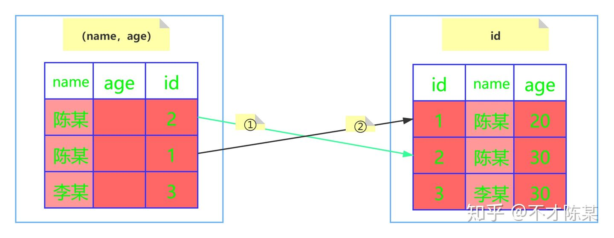
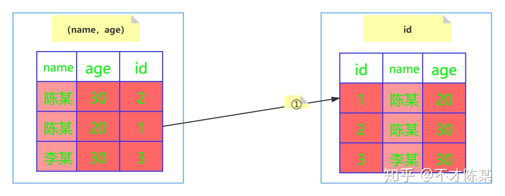
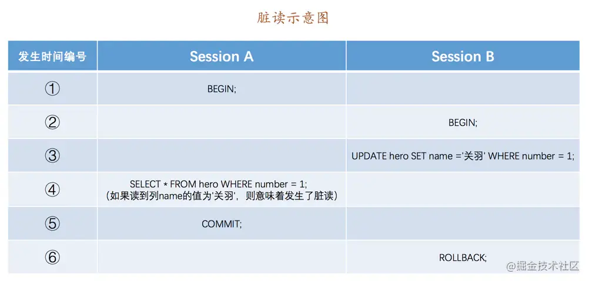
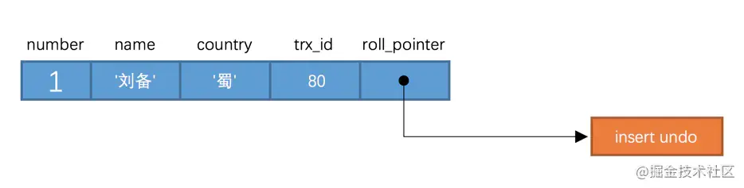

# 数据库

### 索引相关

最左匹配

如果没有索引下推：组合索引满足最左匹配，但是遇到非等值判断时匹配停止。即name like '' 表示非等值，停止匹配，即用不上age

- 找到两个符合的陈某，回表两次 找age=20



索引下推（优化）：不会停止匹配，会找到age列



```sql
SELECT * from user where  name like '陈%' and age=20
```


面试问题 where a=10 and b>0 order by c 怎么建立索引？

我觉得应该建立(a,b) 5.6版本后会有索引下推，a和b能用索引找到，c建不建立索引呢？按c排序，画个图分析下

c的顺序是基于b相等的情况下才有序，很有可能b不同值中，c的顺序根本不定，索引用不上索引。


## 几大日志

- **逻辑日志**： 可以简单理解为记录的就是sql语句 （做了什么修改）。
- **物理日志**： `mysql `数据最终是保存在数据页中的，物理日志记录的就是数据页变更 

### binlog 逻辑日志

存储方式什么？

存储在哪里？

怎么写入？

什么时候刷盘？

使用场景是什么？

binlog日志格式

- `STATMENT `： 基于` SQL `语句的复制( `statement-based replication, SBR `)，每一条会修改数据的sql语句会记录到 `binlog `中 。
- `ROW `： 基于行的复制(` row-based replication, RBR `)，不记录每条sql语句的上下文信息，仅需记录哪条数据被修改了 。
  - 优点： 不会出现某些特定情况下的存储过程、或function、或trigger的调用和触发无法被正确复制的问题 ；
  - 缺点： 会产生大量的日志，尤其是` alter table `的时候会让日志暴涨

- `MIXED `： 基于` STATMENT `和 `ROW `两种模式的混合复制( `mixed-based replication, MBR `)，一般的复制使用 `STATEMENT `模式保存 `binlog `，对于 `STATEMENT `模式无法复制的操作使用 `ROW `模式保存 `binlog`

### redo log

本质是记录修改的数据

我们都知道，事务的四大特性里面有一个是 **持久性** ，具体来说就是
**只要事务提交成功，那么对数据库做的修改就被永久保存下来了，不可能因为任何原因再回到原来的状态** 。那么 `mysql`是如何保证一致性的呢？

最简单是在每次事务提交，将该事务涉及修改的数据页全部刷新到磁盘中。

但是这么做会有严重的性能问题，主要体现在两个方面：

1. 因为 `Innodb `是以 `页 （16kb）`为单位进行磁盘交互的，而一个事务很可能只修改一个数据页里面的几个字节，这个时候将完整的数据页刷到磁盘的话，太浪费资源了！
2. 数据库繁忙时，写盘太浪费时间，降低了交互性
3. 一个事务可能涉及修改多个数据页，并且这些数据页在物理上并不连续，使用==随机IO==写入性能太差！

​		

- 什么是redo log？
- 为什么需要redo log？（想一想老板很忙，粉笔版的作用）
  - 解决写盘满交互性差（可以等空闲时写回磁盘）
  - 解决随机IO（一次性写）
  - 解决小数据（字节）修改，导致整个页刷回磁盘
- 存储的什么？
- 怎么写入？
- 记录方式有什么？
- 写入磁盘时机 


#### redo log基本概念

redo log 包括两部分：

- 一个是内存中的日志缓冲( redo log buffer )，

- 另一个是磁盘上的日志文件( redo logfile )。

数据库常用技术：WAL（writing ahead logging）**先写日志，再写磁盘** 


写回方式

| 参数值              | 含义                                                         |
| ------------------- | ------------------------------------------------------------ |
| 0（延迟写）         | 事务提交时不会将 `redo log buffer `中日志写入到 `os buffer `，而是每秒写入 `os buffer `并调用 `fsync() `写入到 `redo log file `中。也就是说设置为0时是(大约)每秒刷新写入到磁盘中的，当系统崩溃，会丢失1秒钟的数据。 |
| 1（实时写，实时刷） | 事务每次提交都会将 `redo log buffer `中的日志写入 `os buffer `并调用 `fsync() `刷到 `redo log file `中。这种方式即使系统崩溃也不会丢失任何数据，但是因为每次提交都写入磁盘，IO的性能较差。 |
| 2（实时写，延迟刷） | 每次提交都仅写入到 `os buffer `，然后是每秒调用 `fsync() `将 `os buffer `中的日志写入到 `redo log file `。 |

#### redo log记录形式

循环写入

在innodb中，既有` redo log `需要刷盘，还有 `数据页 `也需要刷盘， `redo log `存在的意义主要就是降低对 `数据页 `刷盘的要求 **。**

Write pos(LSN逻辑序列号记录在页文件头) 到 check point之间的为空的log，可以写入

write pos 和 checkpoint 之间的是“粉板”上还空着的部分，可以用来记录新的操作。如果 write pos 追上 checkpoint，表示“粉板”满了，这时候不能再执行新的更新，得停下来先擦掉一些记录，把 checkpoint 推进一下。


 `write pos `到 `check point `之间的部分是 `redo log `空着的部分，用于记录新的记录

` check point `到 `write pos `之间是 `redo log `待落盘的数据页更改记录。

当 `write pos `追上 `check point `时，会先推动 `check point `向前移动，空出位置再记录新的日志。（移动时会先落盘）


因为 `redo log `记录的是数据页的物理变化，因此恢复的时候速度比逻辑日志(如 `binlog `)要快很多。 

- 重启 `innodb `时，首先会检查磁盘中数据页的 `LSN `，如果数据页的 `LSN `小于日志中的 `LSN `，则会从 `checkpoint `开始恢复。 
- 


####  redo log和binlog之间的区别


| 文件大小 | `redo log `的大小是固定的。                                  | `binlog `可通过配置参数 `max_binlog_size `设置每个` binlog `文件的大小。 |
| -------- | ------------------------------------------------------------ | ------------------------------------------------------------ |
| 实现方式 | `redo log `是 `InnoDB `引擎层实现的，并不是所有引擎都有。    | `binlog `是 `Server` 层实现的，所有引擎都可以使用 `binlog `日志 |
| 记录方式 | redo log 采用循环写的方式记录，当写到结尾时，会回到开头循环写日志。 | binlog通过追加的方式记录，当文件大小大于给定值后，后续的日志会记录到新的文件上 |
| 适用场景 | `redo log `适用于崩溃恢复(crash-safe)                        | `binlog `适用于主从复制和数据恢复                            |


redolog和binlog的两阶段提交

由 `binlog `和 `redo log `的区别可知： `binlog `日志只用于归档，只依靠 `binlog `是没有 `
crash-safe `能力的。但只有 `redo log `也不行，因为 `redo log `是 `InnoDB `
特有的，且日志上的记录落盘后会被覆盖掉。因此需要 `binlog `和 `redo log`
二者同时记录，才能保证当数据库发生宕机重启时，数据不会丢失。


假如只有 binlog，有可能先提交事务再写 binlog，有可能事务提交数据更新之后数据库崩了，还没来得及写 binlog。我们都知道 binlog 一般用来做数据库的主从复制或恢复数据库，这样就导致主从数据库不一致或者无法恢复数据库了。

同样即使先写 binlog 再提交事务更新数据库，还是有可能写 binlog 成功之后数据库崩掉而导致数据库更新失败，这样也会导致主从数据库不一致或者无法恢复数据库。

所以只有 binlog 做不到 crash-safe。为了支持 crash-safe，需要 redolog，而且为了保证逻辑一致，事务提交需要两个阶段：prepare 阶段和 commit 阶段。

写 redolog **并落入磁盘**(prepare 状态)--> 写 binlog-->commit。commit 的时候是不会落盘的。


#### 7.为什么不删除 binlog 只保留 redolog？

- 一个原因是 redolog 是只用 InnoDB 引擎有，其他引擎不具有，所以必须保留 binlog。
- redolog 是循环写的，而 binlog 是追加写的，所以当 redolog 写满过后就只有将数据刷进磁盘，而这也就导致了它不能作为数据恢复的保障，相反由于 binlog 是追加写的而具有归档功能，我们就可以据此来做一些数据的恢复。


### undo log

数据库事务四大特性中有一个是 **原子性** ，具体来说就是 **原子性是指对数据库的一系列操作，要么全部成功，要么全部失败，不可能出现部分成功的情况**
。实际上， **原子性** 底层就是通过 `undo log `实现的。 `undo log `主要记录了数据的逻辑变化，比如一条 ` INSERT
`语句，对应一条 `DELETE `的 `undo log `，对于每个 `UPDATE `语句，对应一条相反的 `UPDATE `的`
undo log `，这样在发生错误时，就能回滚到事务之前的数据状态。

同时， `undo log `也是 `MVCC `(多版本并发控制)实现的关键


## 事务和锁 （MVCC）

[面试中的老大难-mysql事务和锁，一次性讲清楚！](https://juejin.cn/post/6855129007336521741)

什么是事务？

- **事务是数据库管理系统(DBMS)执行过程中的一个逻辑单位，由一个有限的数据库操作序列构成**。（redis是一个指令队列，也是一系列操作序列）

事务的四大特性：

- 原子性（Atomicity） **原子性是指对数据库的一系列操作，要么全部成功，要么全部失败，不可能出现部分成功的情况**。有rollback（注意redis没有rollback）
- 一致性（Consistency） **一致性是指数据库的==完整性约束== 没有被破坏，在事务执行前后都是合法的数据状态**。
- 隔离性（Isolation） **隔离性指的是多个事务彼此之间是完全隔离、互不干扰的**。隔离性的最终目的也是为了保证一致性。（隔离级别，怎么实现？）
- 持久性（Durability） **持久性是指只要事务提交成功，那么对数据库做的修改就被永久保存下来了，不可能因为任何原因再回到原来的状态**（redo log）

事务的状态：

部分提交是啥意思？

- 最后一个操作执行完 但是还没刷新到磁盘（脏数据）


### 隔离级别

一致性问题。脏写的问题太严重了，任何隔离级别都必须避免。其它无论是脏读，不可重复读，还是幻读，它们都属于数据库的读一致性的问题，都是在一个事务里面前后两次读取出现了不一致的情况。

​    |----|

- 脏写：a写b未提交的数据，如果b回滚a的数据将消失


- 脏读：事务a读b未提交的数据，b回滚，导致读了不存在的数据



- 不可重复读：事务a每次读取的都是b提交修改了的数据（每次都读到了新的），造成不能重复读（注意b开启了隐式事务提交）

  

- 幻读：**幻读是指的是在一个事务执行过程中，读取到了其他事务新==插入==数据，导致两次读取的结果不一致**。（不可重复读是删除和修改了数据）


#### 四种隔离级别

读未提交

读提交

可重复度：与读提交区别在于生成readview时机不同

串行化

| 隔离级别                     | 脏读   | 不可重复读 | 幻读                   |
| ---------------------------- | ------ | ---------- | ---------------------- |
| 未提交读（READ UNCOMMITTED） | 可能   | 可能       | 可能                   |
| 已提交读（READ COMMITTED）   | 不可能 | 可能       | 可能                   |
| 可重复读（REPEATABLE READ）  | 不可能 | 不可能     | 可能（对InnoDB不可能） |
| 串行化（SERIALIZABLE）       | 不可能 | 不可能     | 不可能                 |

`InnoDB`支持四个隔离级别（和`SQL`标准定义的基本一致）。隔离级别越高，事务的并发度就越低。唯一的区别就在于，**`InnoDB` 在`可重复读（REPEATABLE READ）`的级别就解决了幻读的问题**。这也是`InnoDB`使用`可重复读` 作为事务默认隔离级别的原因。

### MVCC

MVCC(Multi Version Concurrency Control)，中文名是多版本并发控制，简单来说就是通过维护数据历史版本，从而解决并发访问情况下的读一致性问题。

请你说说mvcc的实现原理

- 回滚日志 版本链
- Read-view
  -  read commit生成
  - repeatable read生成


什么是MVCC？

- 同一条记录在系统中可以存在多个版本，就是数据库的多版本并发控制（MVCC）
- 使用两种隔离级别 read commit和repeatable read的事务在执行普通select操作时访问记录版本链的过程
- 两种隔离级别，生成read view的时机不同


#### 版本链

还记得compact行格式吗？ 真实数据中两个隐藏行trx_id和roll_pointer

1. `trx_id`：事务id。每次修改某行记录时，都会把该事务的事务id赋值给`trx_id`隐藏列。
2. `roll_pointer`：回滚指针。每次修改某行记录时，都会把`undo`日志地址赋值给`roll_pointer`隐藏列。




这个操作的版本链如下：roll_pointer一直指向之前的一个版本

版本链：undo_log存的也是要一个一个页


#### readview 读视图

利用版本链undo log


- 如果数据库隔离级别是`读未提交（READ UNCOMMITTED）`，那么读取版本链中最新版本的记录即可。
- **`已提交读（READ COMMITTED）`或者`可重复读（REPEATABLE READ）`，就需要遍历版本链中的每一条记录，判断该条记录是否对当前事务可见，直到找到为止(遍历完还没找到就说明记录不存在)**。

具体实现？

`ReadView`中主要包含以下4个内容：

- `m_ids`：表示在生成`ReadView`时当前系统中活跃的读写事务的事务id列表。

- `min_trx_id`：表示在生成`ReadView`时当前系统中活跃的读写事务中最小的事务id，也就是`m_ids`中的最小值。

- `max_trx_id`：表示生成`ReadView`时系统中应该分配给**下一个事务的id值**。

- `creator_trx_id`：表示生成该`ReadView`事务的事务id。


判断过程：

1. 如果被访问版本的`trx_id`属性值与`ReadView`中的`creator_trx_id`值相同，意味着当前事务在访问它自己修改过的记录，所以该版本可以被当前事务访问。(表示是它创建的)

2. 如果被访问版本的`trx_id`属性值小于`ReadView`中的`min_trx_id`值，表明生成该版本的事务在当前事务生成`ReadView`前已经提交，所以该版本可以被当前事务访问。

3. 如果被访问版本的`trx_id`属性值大于或等于`ReadView`中的`max_trx_id`值，表明生成该版本的事务在当前事务生成`ReadView`后才开启，所以该版本不可以被当前事务访问。

4. 如果被访问版本的`trx_id`属性值在`ReadView`的`min_trx_id`和`max_trx_id`之间，那就需要判断一下`trx_id`属性值是不是在`m_ids`列表中，如果在，说明创建`ReadView`时生成该版本的事务还是活跃的，该版本不可以被访问；如果不在，说明创建`ReadView`时生成该版本的事务已经被提交，该版本可以被访问。


每一个事务对应一个readview

## 锁


锁的粒度：表锁和行锁

锁的分类：共享锁（s锁）和排他锁（x锁）

- 共享锁
- 排他锁
  - 自动加锁
  - 手动加锁 for update
- 意向锁
  - **`意向锁`可以认为是`S锁`和`X锁`在数据表上的标识，通过意向锁可以快速判断表中是否有记录被上锁，从而避免通过遍历的方式来查看表中有没有记录被上锁，提升加锁效率**。
  - 例如，我们要加表级别的`X锁`，这时候数据表里面如果存在行级别的`X锁`或者`S锁`的，加锁就会失败，此时直接根据`意向锁`就能知道这张表是否有行级别的`X锁`或者`S锁`。

### 表锁

`InnoDB`中的表级锁主要包括表级别的`意向共享锁(IS锁)`和`意向排他锁(IX锁)`以及`自增锁(AUTO-INC锁)`。其中`IS锁`和`IX锁`在前面已经介绍过了，这里不再赘述，我们接下来重点了解一下`AUTO-INC锁`。

- `AUTO_INCREMENT`自增属性 系统实现这种自动给`AUTO_INCREMENT`修饰的列递增赋值的原理主要是两个


### 行锁

**`InnoDB`的行锁，是通过锁住索引来实现的，如果加锁查询的时候没有使用过索引，会将整个聚簇索引都锁住，相当于锁表了**。

行锁可以使用`记录锁(Record Locks)`、`间隙锁(Gap Locks)`和`临键锁(Next-Key Locks)`的方式实现。

- 记录锁
  - 例如`select * from t where id =4 for update;`就会将`id=4`的记录锁定。
- 间隙锁
  - 
- 临键锁
  - 临键锁就是记录锁(Record Locks)和间隙锁(Gap Locks)的结合，即除了锁住记录本身，还要再锁住索引之间的间隙。