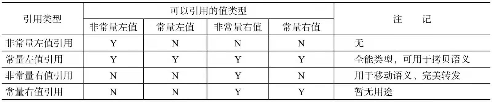

### 继承构造函数

- 子类如果有与父类同名的非虚成员函数，则会覆盖掉基类的版本。


### 委派构造函数

什么是委派构造函数？

- 委派构造函数将任务委派给目标构造函数来完成一种类构造


## 右值引用


### 指针成员和拷贝构造

- 默认构造函数，即我们自己不重写默认生成的拷贝构造是浅拷贝
- 自定义拷贝构造：在拷贝构造里面new一个对象，拷贝给当前对象。深拷贝
- 类中的指针成员最好用智能指针

```cpp
//浅拷贝
class A
{
 public:
  A():d(new int(0)){}
  ~A(){delete d;}
  
  //默认拷贝构造
  privte:
  	int *d;
}
//深拷贝
class A
{
 public:
  A():d(new int(0)){}
  ~A(){delete d;}
  
  A(const A &rhs):d(new int(rhs.d)) //拷贝构造
    
  privte:
  	int *d;
}
```


### 移动语义

为什么有移动语义？

刚刚上面那种情况指针成员的拷贝，如果我本身就不在需要另外那一个被拷贝的对象

这时我们确实不需要拷贝构造语义，这时可以使用移动语义

```cpp
class A
{
 public:
  A():d(new int(0)){}
  ~A(){delete d;}
  
  A(A &&rhs):d(move(rhs.d)) //移动语义 右值引用（不用const） move
  {
    rhs.d = nullptr;//必须要设置为nullptr
  }
  privte:
  	int *d;
}

//编译选项 g++ -std=c++11 a.cpp -fno-elide-constructors 
```

- 什么时候我们不需要拷贝？
  - 函数返回一个对象时，如获取对象的函数。特别是类中有指针指向非常大的堆内存数据时，拷贝过程就会非常昂贵
  
- 右值
  - 将亡值
    - 移位他用的对象，如std::move返回的值
  - 纯右值：用于辨识临时变量和不跟对象关联的值
    1. 非引用返回的函数返回的临时变量值或运算表达式（存寄存器）
    2. 字面量或类型转换函数的返回值或lambda表达式（这个竟然是右值？）
- 常量右值

### 左值引用和右值引用

左值引用和右值引用都是引用，都必须立即初始化

左值引用是==具名变量== 值的别名

右值引用是==匿名变量==的别名


- 常量右值引用
- 右值引用和左值应用
- 常量左值引用

-  例子

```cpp
T &&a = ReturnRvalue();
a救活了这个返回的右值~~~
```

函数一般返回的临时变量，在语句结束后生命期也就结束了（表达式生命期），而通过右值引用声明，这个右值获得了新生

a或者，右值临时量也会一直存活下去。因为是引用不存在调用拷贝构造

```cpp
T b = ReturnRvalue();
进行的是拷贝，临时量多一次构造和析构的开销
```


左值能绑定到右值引用吗？

ReturnRvalue()返回的是右值，因此可以绑定到右值引用。如果是任何左值（左值引用）则不能绑定到右值

```cpp
int c;
int &&d =c;//报错 左值不能绑定到右值引用
```


右值能绑定到左值引用吗？

常量左值引用：万能引用类型 ，同时也能够延长右值的声明期，且不能修改（余生只能只读）

非常量左值引用只能绑定到左值

```cpp
int i = 5;
int&ri = 1;//错误
int &ri = i;//正确
T &e = ReturnRvalue(); //报错 右值不能绑定到左值
const T &e = ReturnRvalue(); //常量左值引用是一个万能引用类型 
```


右值引用和常量左值引用都能够对右值续命

明白了为啥一般写成常量引用把~



### 移动构造


```cpp
Copyable(Copyable &&o){//实现移动语义}
```

- 左值可以变为右值吗？

  - `std::move`强制将左值变成右值

- 如果没有移动构造函数我们使用std::move会发生什么？

  会调用拷贝构造，移动不成，则来拷贝

  ```cp
  Copyable(const Copyable &o){//实现拷贝构造}
  
  Copyable new = std::move(s); //没有移动构造函数呀
  
  ```

  

- 判断类型是否是引用类型工具

  ```cpp
  #include <type_traits>
  三个模板类
  is_rvalue_reference，is_lvalue_reference,is_reference
  cout<<is_rvalue_reference<string &&>::value
  ```

  

### std::move强制转化为右值引用

move实际上不能移动任何东西！！！唯一功能只是**将左值强制转化为右值引用**！

类似于

```cpp
static_cast<T&&>(lvalue);
```

被std::move转化左值变量`lvaue`的生命期不会发生任何变化，`lvalue`不会被立即 析构

版本一：移动构造函数处理之后的没有设置为`nullptr`

```cpp
#include<iostream>
#include<utility>
using namespace std;
class movetest
{
private:
    /* data */
   
public:
    int *i;
    movetest():i(new int(3)){}
    ~movetest(){delete i;}

    movetest(const movetest &rhs):i(new int(*(rhs.i))){}
    movetest(movetest &&rhs):i(rhs.i){
        //rhs.i = nullptr;
    }

};
int main()
{
    movetest a;
    movetest c(move(a));
    cout<<a.i<<endl;
    cout<<c.i<<endl;
}

g++ -std=c++11 movetest.cc -fno-elide-constructors
matytan@ubuntu:~/study/C++/c++11$ ./a.out
0x55b371497eb0
0x55b371497eb0
  
free(): double free detected in tcache 2
Aborted (core dumped)
//表明同一个地址的对象 free了两次 因为我们没有将不使用设置空
 
 //
```

C++标准允许一种（编译器）实现省略创建一个只是为了初始化另一个同类型对象的临时对象。指定这个参数（-fno-elide-constructors）将关闭这种优化，强制G++在所有情况下调用拷贝构造函数。

版本二

```cpp
movetest(movetest &&rhs):i(rhs.i){
  rhs.i = nullptr;
}

matytan@ubuntu:~/study/C++/c++11$ g++ -std=c++11 movetest.cc -fno-elide-constructors
matytan@ubuntu:~/study/C++/c++11$ ./a.out 
0
0x55cd95716eb0
  
  using namespace std;
class HugeMem
{
public:
    int *c;
    int sz;
    HugeMem(int size):sz(size>0?size:1)
    {
        c = new int[size];
    }
    ~HugeMem()
    {
        delete []c;    
    }
    HugeMem(HugeMem &rhs):sz(rhs.sz),c(new int(*rhs.c)){
        cout<<"HugeMem copy"<<endl;
    }
    HugeMem(HugeMem &&rhs):sz(rhs.sz),c(rhs.c){
        //移动构造一定要把被移动的指针设置为null
        rhs.c = nullptr;
        cout<<"HugeMem move"<<endl;
    }

};
class movetest
{
private:
    /* data */
   
public:
    int *i;
    HugeMem h;
    movetest():i(new int(3)),h(1024){}
    ~movetest(){delete i;}

    //movetest(const movetest &rhs):i(new int(*(rhs.i))),h(rhs.h){} //h调用拷贝构造
    movetest(movetest &&rhs):i(rhs.i),h(move(rhs.h))
    {
        rhs.i = nullptr;
        //rhs.h.c = nullptr; //指针
    }

};
int main()
{
    movetest a;
    movetest c(move(a));
    cout<<a.i<<endl;
    cout<<c.i<<endl;
}

```


### 移动构造中的其他问题

- 注意排除不必要的const关键字。移动语义一定是要修改临时变量的值，如果我们将临时变量设置为常量右值。这时将无法实现移动语义，例如

  ```cpp
  //错误声明
  Moveable(const Moveable &&)
   
  //返回的右值被常量化，无法实现移动语义
  const Moveable ReturanVal();
  
  
  三个版本的拷贝/移动构造
  T Object(T &rhs);
  T Object(const T &rhs);
  T Object(T &&rhs);
  ```

- 拷贝构造/赋值和移动构造/赋值函数必须同时提供或同时不提供

  ```cpp
  
  Moveable& operator=(Moveabel &&rhs){} //移动语义的赋值运算符
  
  判断一个类型是否可以移动 使用is_move_constructiable<Type>::value
  cout<<is_move_constructiable<unknowType>::value
  ```

- 移动语义实现高性能swap

  ```cpp
  void swap(T &a,T &b)
  {
    T tmp(move(a));
    a = move(b); //T中必须重写赋值运算符 移动语义
    b = move(tmp);
  }
  ```

- 移动语义与异常

  - 移动构造中抛出异常很危险，因为这本身是没有副本的操作。为什么拷贝构造不怕异常？就是因为有副本。
  - 如果还没有移动完成抛出异常，很有可能导致一些指针变为空悬指针，资源泄漏
  - 可以添加`nonexcept`关键字
  - 使用`std::move_if_noexcept `代替`std::move`函数。该函数会判断移动构造是否有nonexcept关键字，如果有则使用移动构造，如果没有nonexcept关键字，则使用拷贝构造

  - RVO/NRVO优化，即返回值优化，使用`-fno-elide-constructors`选项关闭编译器优化

    - 如果开了优化就看不到拷贝和移动的效果了

      ```cpp
      A returnRvalue(){A a();return a;}
      A b = returnRvalue();
      ```

      b变量直接霸占了a变量

      但是有些情况下无可避免的需要构造，这时移动语义可以解决编译器优化无法解决的问题

    
  

总结：

1.移动构造函数中，被移动的对象内的指针，一定要设置为NULL，否则指向的地址相应的对象会被析构两次

2.也就是两个东西的地址是一样的，因此需要执NULL

3.move之后的对象还能使用，但是本身不应该使用

## 完美转发

什么是完美转发？

函数模板中，完全依照模板的参数类型，将参数传递给函数中调用的另一个函数

完美转发到底有什么用？

当我们需要包装函数时，且不想增加资源拷贝的消耗时，完美转发就非常有用

```cpp
template<typename T>
void IamForwarding(T t) //拷贝一次
{
  IrunCodeActually(t);//拷贝两次
}
```

以上  IrunCodeActually真正执行时，如果IamForwarding传入是左值对象就传入左值对象，如果是右值对象就传入右值对象。而不产生额外开销，就好像转发者不存在一样

- 左值引用，不会产生额外开销。同时使用const& 万能常量左值类型

  ```cpp
  template<typename T>
  IrunCodeActually(int t){}
  void IamForwarding(T& t) 
  {
    IrunCodeActually(t);
  }
  ```

  这个有什么问题呢？

  - 目标函数是非常量左值引用类型,无法接收常量左值引用。（常量引用无法赋给非常量引用！）

- 如果目标函数是右值引用呢？

  - 无法接受左值作为参数，无法使用移动语义


C++11引入==引用折叠== 实现完美转发

- 规则
  - 例如下面T的实际类型是` int& i` 这时 传入实际是 `int& && i` 这时通过引用折叠变成`int &` 
  - 如果T是` int &` 传入实际是`int i` 这时正常为&（左值引用）
  - 如果T是` int &&` 传入实际是`int i` 这时正常为&&
  - 如果T是` int &&` 传入实际是`int&& i` 这时为&&
- 总结：如果是&数量为奇数折叠为左值引用&，如果&数量为偶数，折叠为右值

```cpp
template<typename T>
void IamForwarding(T&& t) 
{
  IrunCodeActually(static_cast<T &&>(t)); //static_cast是留给右值的
}
//实际类型，折叠为左值
IamForwarding(X& && t);

折叠为
  IamForwarding(X& t);
  

IamForwarding(X&& && t)
{
  IrunCodeActually(static_cast<X&& &&>(t)); //static_cast
}
折叠为
  
IamForwarding(X&& t)
{
  IrunCodeActually(static_cast<X &&>(t)); //static_cast作用就出来了
}
```

static_cast作用在转发右值时显现出来了，因为我们的==右值引用是一个左值==，需要使用move，跟static_cast一样，更好看一点，标准库有个函数叫forward

```cpp
IamForwarding(T && t)
{
  IrunCodeActually(forward(t)); //static_cast作用就出来了
}
```


