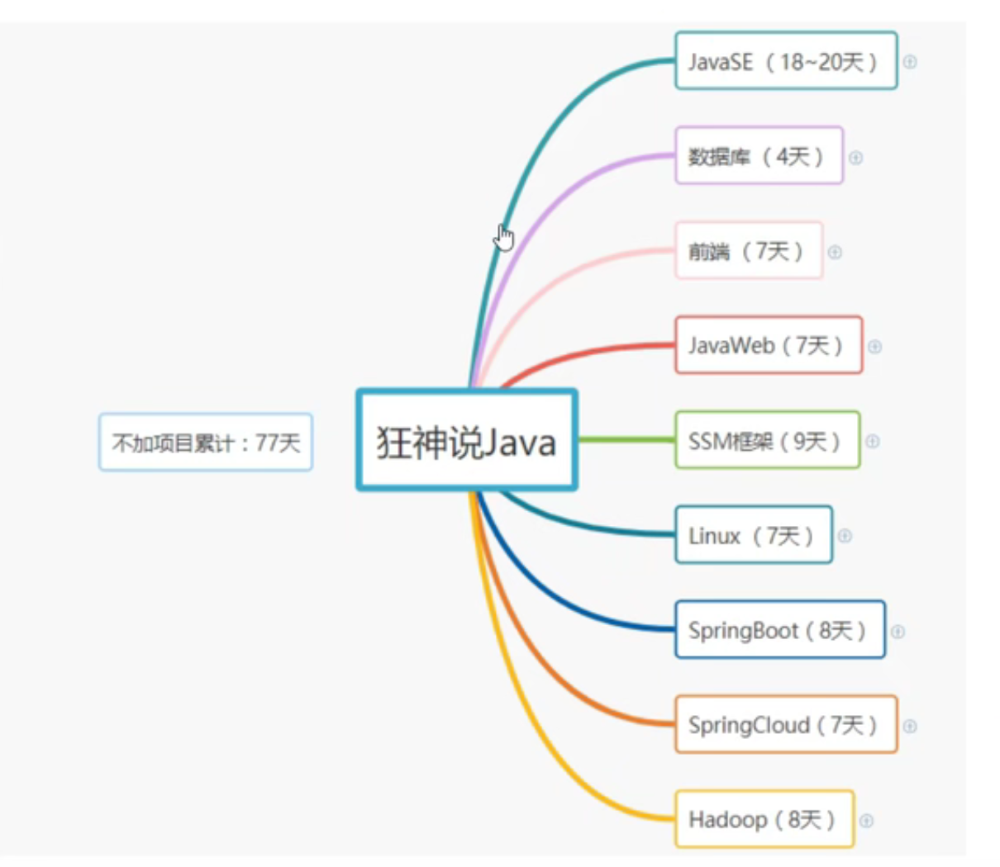
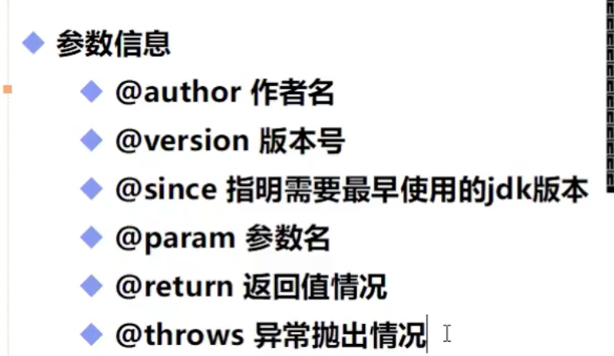
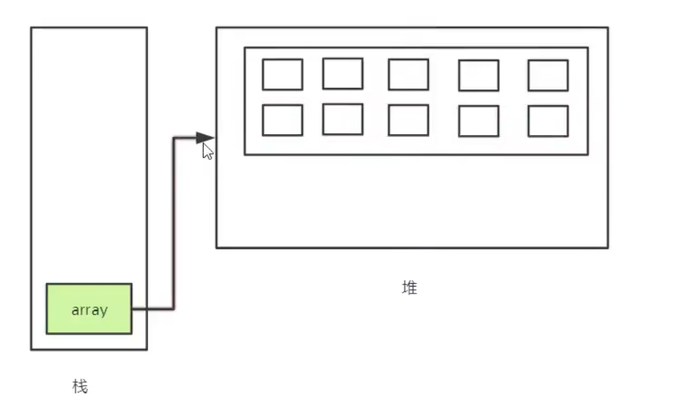

多写（代码） 多写（笔记） 多写（文章）

多练 （交流）多练（思维）多练（技能）

多分享 	多提问 	多思考

坚持


### 学习准备：博客

总结和思考：回头看看吧 啊sir

提升文笔组织能力

学习总结能力

思维逻辑能力

帮助他人 结交朋友

学习阶段才有时间写！


###  markdown语法

\#+标题 一级标题 

\##+标题 二级标题 


字体：

**Hello world!**

*Hello world!*

***Hello world!***

~~Hello world!~~


#### 引用：

>选择


#### 分割线 \---使用

---

#### 分割线 \***

***


#### 图片 \


#### 超链接

\[]()

[连接](www.baidu.com)


## 基础


### java关键字


### 数据类型

强类型语言

弱类型语言


String 不是一个关键字

- 两大类

  - 基本类型  

    - byte -128 — 127 （1字节 8位）
    - short
    - int
    - float   1.3F
    - double
    - long 3.0L
    - long long
    - char

    - unsigned
    - boolean

  - 引用类型

    - 类
    - 接口 `interface`
    - 数组

    ### 进制

    二进制0b开头

    八进制 0开头

    十六进制 0x卡头

    

### 类型扩展和转换

浮点数问题（精度问题）

```java
flaot f1 = 0.1F;
double d1 = 0.1;
//f1==d1? 不等
```

使用：`	BigDecimal`类

字符本质都是数字：整数

转义字符：

- `\t,\n`等等

布尔类型 if条件判断


> 类型转换：
>
> 低   																高
>
> `byte,short,char->int ->long->float->double`
>
> 强制类型转换 ：溢出问题


### 包机制

一般利用公司域名倒置作为包名 新建包

com.matytan.www


### java doc




```java
/** 回车 自动加

javadoc -encoding UTF-8 -charset UTF-8 doc.java
```


作用：

1. javadoc生成文档页面
2. ieda生成javaDoc文档

@author 作者
@version 版本号
@param 参数名 描述 方法的入参名及描述信息，如入参有特别要求，可在此注释。
@return 描述 对函数返回值的注释
@deprecated 过期文本 标识随着程序版本的提升，当前API已经过期，仅为了保证兼容性依然存在，以此告之开发者不应再用这个API。
@throws异常类名 构造函数或方法所会抛出的异常。
@exception 异常类名 同@throws。
@see 引用 查看相关内容，如类、方法、变量等。
@since 描述文本 API在什么程序的什么版本后开发支持。
{@link包.类#成员 标签} 链接到某个特定的成员对应的文档中。
{@value} 当对常量进行注释时，如果想将其值包含在文档中，则通过该标签来引用常量的值。


## java控制流程


### Scanner类

```java
next()
nextLine();
hasNext()
hasNextLine();
nextInt();
```

case穿透：不使用break

`int [] nums ={  } `

反编译

- 输出

  `System.out.println("和为"+switchDemo.add(1,2));` 加号连接字符串


## 方法

类中使用方法：

- static类型
- new一个对象

可变参数：在指定参数类型后加一个省略号(…)

- 必须放到最后

```java
print(double ...d)
{
  System.out.println(d[0]);
}
```


## 数组

> 基本类型 名字 = 值
>
> 数组类型 名字 = 值
>
> ```java
> int[] nums = {}
> int nums1[] = {}
> 
> int[] array = new int[size];
> //array变量存在栈中，new出来的数组开辟到了堆中
> 
> 
> 
> ```



> 静态初始化
>
> 动态初始化：使用new


> 普通循环
>
> for each循环

### 多维数组

```java
int[][] array = {{1,2},{2,4}}
```

### Array类

静态方法：static 可以直接调用


## 方法

参数传递

静态方法和非静态方法

值传递和引用传递


## 类和对象

### 类和对象的构造

```java
Student s = new Student;
```


### 构造器

- 类似构造函数

  - 方法与类名相同
  - 不能有返回值

- 生成构造器

  - Mac: alt + N
  - Windows：alt+ins

  ```java
  public class Student {
      String name;
      int age;
      public Student(String name_,int age_) {
          this.name = name_;
          this.age = age_;
      }
      public void say() {
          System.out.println(this.name + "说话了");
      }
  }
  
  public class Demo01 {
      public static void main(String[] args) {
          Student tom = new Student("tom",12);
          System.out.println(tom.name);
          tom.say();
      }
  }
  ```

  


## 封装

高内聚：类的内部数据操作细节自己完成，不允许外部操作（private）

低耦合： 仅暴露少量方法给外部使用

封装（数据的隐藏）：禁止直接访问数据（private)

属性私有，get，set

1. 提高用户安全性
2. 隐藏代码细节
3. 统一接口
4. 系统可维护性更好

## 继承

A继承B

A is  a B  （学生是人）

C is a B (老师是人)

```java
public class A extends B{
  
}
```


所有类间接或者直接继承Object类

## 多态

继承的基础之上

父类的引用指向子类

```java
Base b = new Deriver();
```


非静态函数：多态性质

静态函数


- 对象能执行哪些方法：主要看左边对象的类型，和右边关系不大

- 父类的引用可以指向子类，但是不能执行子类独有的方法。（只能调用重写的）

  ```java
  Student s1 = new Student();
  Preson s2  = new Student();
  ```

  

### 强制转换

`instanceof`关键字 判断类的关系

```java
Object ob  = new Student();

System.out.println(ob instanceof Student); //true
System.out.println(ob instanceof Person); // true
System.out.println(ob instanceof Object);//true
System.out.println(ob instanceof Teacher);//false
System.out.println(ob instanceof String); //false

高              低
Person obj = new Student()

(student)(obj).go();
```

1. 父类转为子类 高转低 

2. 子类转换为父类，可能会丢失子类自己方法—-向上转型

   

`static` 关键字

1. 静态方法:不能直接调用非静态方法

   ```java
   ```

   

2. 静态属性 （类变量，直接用类调用，对于该类而言内存中只存在一份，所有类共享这个变量）

3. 静态代码块—>匿名代码块->构造方法

   1. 静态代码块只加载一次（随着类加载，多个对象不会再加载）

   ```java
   
   public class Person {
       Person(){
           System.out.println("Person构造方法");
       }
   
       {
           System.out.println("匿名代码块");
       }
       static
       {
           System.out.println("static 代码块");
       }
       public static void main(String[] args) {
           Person p = new Person();
           System.out.println("==============");
           Person p1 = new Person();
       }
   }
   /*
   输出
   static 代码块
   匿名代码块
   Person构造方法
   ==============
   匿名代码块
   Person构造方法
   */
   ```


## 抽象类

抽象类：没有实例（和c++相同）不能new

抽象方法

有构造方法吗？

有什么意义？


```java
public abstract class Action
{
  
}
```


## 接口

### 接口的定义

只有规范！本质就是一个契约，自己无法写方法

可以多继承 抽象思维

接口中没有构造方法。。

```java
interface

//实现一个接口
public class UserServiceImpl implements UserService{
    @Override
    public void add(int i) {

    }
}

//类似于多几次
public class UserServiceImpl implements UserService,TimeService{
    @Override
    public void add(int i) {

    }

    @Override
    public void time() {
        
    }

    @Override
    public void count() {

    }
}
```

2. 接口中定义的一定是常量

   ```java
   public static final
   ```

   

## 内部类

内部类 ：一个类中定义一个类

> 1. 成员内部类
> 2. 静态内部类
> 3. 局部内部类
> 4. 匿名内部类

通过外部类的对象 new一个内部类

作用？

内部类获得外部类的私有属性

```java
Outer outer = new Outer;
Outer.Inner inner = outer.new Inner();
```


一个java文件中可以有多个class

但是public类只能有一个

```java
package com.matytan.base.OOP.demo09;

public class Outer {
    private int id = 10;

    public class Inner{
        public void getId()
        {
            System.out.println(id);
        }
    }
}
class test{
    
}
```


- 写到方法中的类 ：局部内部类

  ```java
  public class Outer {
      private int id = 10;
  
      public class Inner{
          public void getId()
          {
              System.out.println(id);
          }
      }
  
  
  }
  class test{
      public static void main(String[] args) {
          Outer outer = new Outer();
          Outer.Inner inner = outer.new Inner();
          inner.getId();
  
          new Apple().eat(); //匿名内部类
          //内部接口实现
          new UserService(){
              @Override
              public void add() {
                  System.out.println("add");
              }
          };
      }
  }
  class Apple{
      public void eat()
      {
          System.out.println("eat");
      }
  }
  interface UserService{
      public void add();
  }
  ```

  


## 异常

`Exception`

`try,catch,finally,throw,throws`

```java
public class Exce {
    public static void main(String[] args) {
        int a = 1;
        int b = 0;
        try{

        }catch (Throwable e){ //参数类型

        }finally {
            
        }

    }
}
```

、

