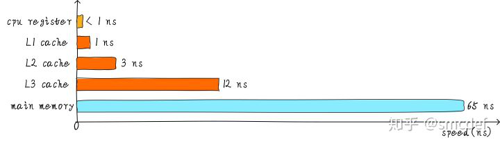
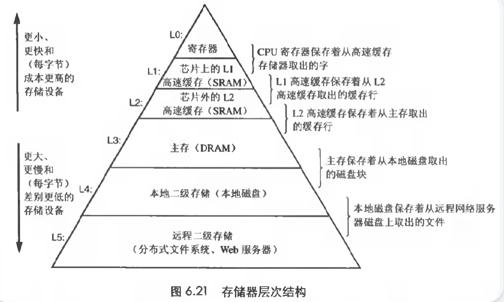
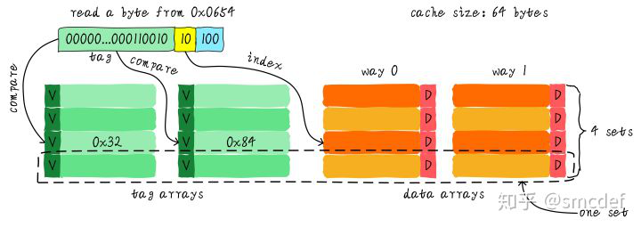
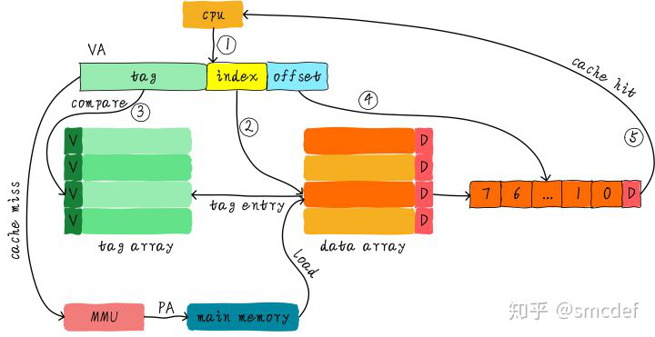

## 局部性原理

## Cache的基本知识

- 不同等级cache速度

  - L0：寄存器 <1ns

  - L1：一级缓存

  - L2：二级缓存

  - L3：三级缓存（老电脑没有）

  - 

  - 下图是年代比较久远了，没有三级缓存

    

    

- **Cache和CPU的关系**

  - 每个CPU的HT(Hyper-threading)共享L1和L2缓存。
  - L1分为instruction cache和data cache（Dcache）
  - 不同物理CPU的L1和L2 cache独立
  - 每个**socket有自己的L3 cache（也叫LLC），即同socket上的所有CPU共享LLC**。

### **Cache映射关系**

#### 直接映射

如何判断命中？

**现在硬件采取的做法是对地址进行散列（可以理解成地址取模操作）**。我们接下来看看是如何做到的？

直接映射的优缺点：

优点

- 简单，成本低

缺点：

- 容易造成cache颠簸

  - 什么是cache颠簸？

    如果一个程序试图依次访问地址0x00、0x40、0x80，cache中的数据会怎么样？（也就是我们的列优先）,我们发现地址的index都相同，说明指向cache的同一行

    - 0x00 cache line1不命中，拷贝进数据到0x00 (0x00000000)
    - 访问0x40 cache line1不命中，换出数据，换进新数据 (0x01000000)
    - 访问0x80 cache line1不命中，换出数据，换进新数据(0x10000000)

  - 访问0x40就会把0x00地址缓存的数据替换，访问0x80就会把0x40地址缓存的数据替换，称为cache颠簸

### 两路组相连映射

### 全相连映射cache

## 虚拟高速缓存（VIVT）

虚拟高速缓存，简称VIVT(Virtually Indexed Virtually Tagged)

### **歧义(ambiguity)**

**歧义是指不同的数据在cache中具有相同的tag和index。cache控制器判断是否命中cache的依据就是tag和index，因此这种情况下，cache控制器根本没办法区分不同的数据。**

虚拟地址完全一样，当然无法区分

- 相同的虚拟地址映射了不同的物理地址
  - 不同进程可能出现这种情况（他们共享cache）
  - 例子：假设A进程虚拟地址0x4000映射物理地址0x2000。B进程虚拟地址0x4000映射物理地址0x3000。当A进程运行时，访问0x4000地址会将物理地址0x2000的数据加载到cacheline中。当A进程切换到B进程的时候，B进程访问0x4000会怎样？当然是会cache hit，此时B进程就访问了错误的数据，B进程本来想得到物理地址0x3000对应的数据，但是却由于cache hit得到了物理地址0x2000的数据。
  - 解决：切换进程之前，flush所有的cache
    -  使主存储器有效。针对write back高速缓存，首先应该使主存储器有效，保证已经修改数据的cacheline写回主存储器，避免修改的数据丢失。
    -  使高速缓存无效。保证切换后的进程不会错误的命中上一个进程的缓存数据。

因此这是VIVT问题之一

### 别名

**当不同的虚拟地址映射相同的物理地址，而这些虚拟地址的index不同，此时就发生了别名现象(多个虚拟地址被称为别名)**

也就是说同一个物理地址加载到了不同的cache line

## 物理高速缓存（PIPT）

PIPT(Physically Indexed Physically Tagged)

##  **物理标记的虚拟高速缓存(VIPT)**

## 总结

**现在使用的方式是PIPT或者VIPT。如果多路组相连高速缓存的一路的大小小于等于4KB，一般硬件采用VIPT方式，因为这样相当于PIPT，岂不美哉**

