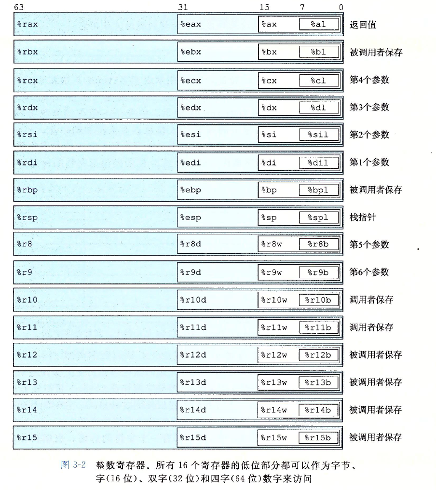
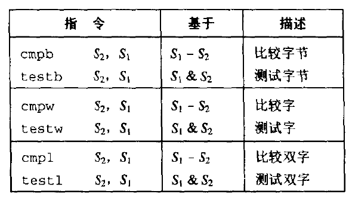
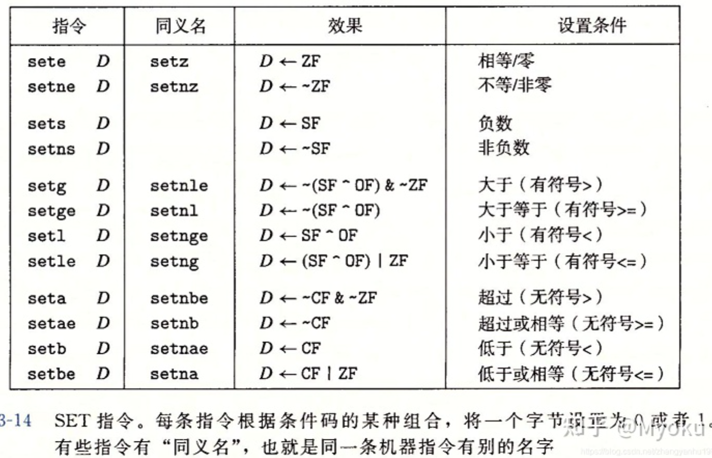
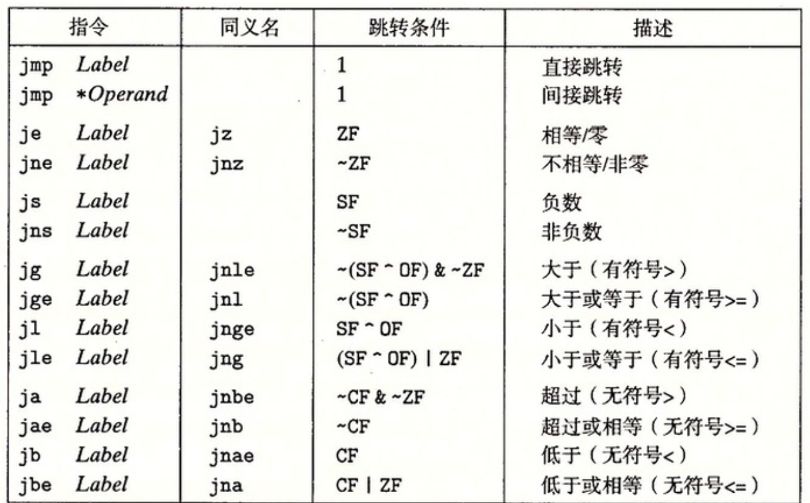
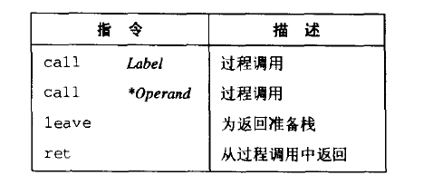

#第三章 程序的机器级表示

## 3.2 程序编码

`.c文件 经过预处理器扩展与头文件代码合并 -> 经过编译器产生汇编代码->经过汇编器产生目标二进制文件.o->经过链接器 使多个目标文件与库函数代码合并，生成可执行文件`
### 机器级编码 汇编语言

- 程序计数器 %eip 表示将要执行的下一条指令在存储器中的地址
- 整数寄存器：包含8个被命名的位置，存32位的值，可以存地址（指针），可以存整数数据。有的存程序状态，有的存临时数据
- 条件码寄存器：保存最近执行的 算术指令的状态信息。用来实现控制流的条件变化 if while
- 浮点寄存器包含8个位置，存浮点数据
- 程序存储器：包含目标代码，和系统需要的信息：管理过程调用和返回的栈；用户分配的内存块（malloc）；用来虚拟地址寻址
- gcc -o2 -S 322s 3_22.c 产生汇编代码
- 反汇编 objdump -d code.o
- GAS（GNU汇编器，Gnu ASsembler）


## 3.3 数据格式

在16位系统中：
- 1字 = 2个字节=16位
- 指令movb(传送字节)
- 指令movw(传送字)
- 指令movl(传送双字)
- movq传送四字
- 64位叫四字
|  c声明   |  大小（字节）  | Intel类型
|----|----|----|
|  char  |   1  | 字节|
|  short  |   2 | 字|
|  int  |  4    | 双字|
|  unsign |  4  | 双字|
|  long int |  4  | 双字|
|  long unsign  |  4  | 双字|
|  char *  |  4  | 双字|
|  float |  4  | 单精度|
|  double |  8  | 双精度|
|   long double |  10/12  | 扩展精度|

- 32位系统中：
  - 1字 = 4字节 = 32位

#### 3.4 访问信息
- 8086 8个16位，即%ax---%bp

- IA32中央处理器 cpu包含一组8个32位值的寄存器 %e开头 前6个为通用寄存器

  

###  操作数指示符

- 大多数指令有一个或者多个操作数，指示出一个操作中要引用的源数据值，以及结果放置的目的位置。
- 源数据值都可以以常数形式给出，或者从寄存器和存储器读出
- 操作数格式 p114
  - $为立即数 
  - （）为内存寻址 内存
  - %寄存器寻址
- 操作数被分为三种类型
  - 立即数：常数值 $后面跟常数值
  - 寄存器：表示某个寄存器的内容，双字%eax，单字%al ,$E_a$表示任意寄存器a，用引用$R[E_a]$表示他的值
  - 存储器引用：根据有效地址访问存储器某个位置 M[Addr]

|  指令  |  效果  |  描述  |    |
|----|----|----|----|
|  movl<br>movw  |  S,D<br>S,D  |   |    |
|  movb  |  S,D  |    |    |
|  movsbl  |  S,D  |  D<-符号扩展（S）  |    |
|  movzbl  |  S,D  |  D<-0扩展（S）  |    |
|  pushl  |  S  |  R[%esp]<-R[%esp]-4<br>M[R[%esp]]<-S  |    |
|  popl  |  D |  D<-M[R[%esp]]<br>R[%esp]<-R[%esp]+4   |    |

<center>
  
</center>


- 数据传送示例 p119
```c

```
#### 3.5 算术和逻辑操作
- lael指令（加载有效地址） 指令形式是从存储器读取数据到寄存器，但是它并未引用存储器！！！
- 加(addl) 减(subl) 乘(imul) 移位 xorl andl orl 加1 减1
- 左移 sall和shll 算术右移 ssrl 逻辑右移 sshl
- 特殊算术 全64位乘积%edx为高位，%eax为低位


#### 3.6 控制
- 条件码寄存器
  - CF进位标志 检查无符号的溢出
  - ZF 零标志
  - SF 符号标志 得到一个负数
  - OF 溢出标志，二进制补码溢出 最近的操作导致一个补码溢出
  
- 访问条件码


- 跳转指令

- 程序计数器的值是跳转指令后面的那条指令的地址
- 目标编码+下一条指令的地址 等于跳转目标地址 
- 翻译条件分支
  - coml b,a 对应于a：b
  - 先比较或者test
- 循环：汇编使用条件测试和跳转组合实现循环，其他循环都要转换成do while
```c
loop:
  body-statement
  t = test-expr;
  if(t):
    goto loop;
```

- while循环 先用if判断条件是否成立 不成立直接goto done，成立继续do while
```c、
if(!test-expr)
  goto done;
loop:
  body-statement
  t = test-expr;
  if(t):
    goto loop;
done:
```
- for循环 先转换成while，更新循环变量在内部  然后do while 
- switch语句

## 过程

### 栈帧结构


### 寄存器使用惯例
- 调用者保存寄存器:%eax,%edx,%ecx 
- 
- 被调用者保存寄存器 %ebx,%esi,%edi

为什么叫做被调用者保存和调用者保存？


  - **函数调用**
  <center>
    
    <br>
    <div style="color:orange; border-bottom: 1px solid #d9d9d9;
    display: inline-block;
    color: #999;
    padding: 2px;"></div>
  </center>

  - 栈用来传递过程参数，储存返回信息，保存寄存器以供恢复之用，以及用于本地存储
  - 栈帧结构：%ebp为帧指针，%esp为栈指针
  - 
  - 调用者过程p调用过程Q，Q的参数放在p的栈帧中，，同时在调用时，p中的返回地址会压入栈中
- 转移控制
  - 
  - call：将返回地址入栈，并跳转到被调用过程的起始处
  - 寄存器使用惯例： 调用者保存与被调用者保存
    - 调用者保存的 %eax,%edx,%ecx
    - 被调用

- 递归过程
<center>
    
    <br>
    <div style="color:orange; border-bottom: 1px solid #d9d9d9;
    display: inline-block;
    color: #999;
    padding: 2px;">fib递归调用过程</div>
  </center>

- 数组的分配和访问
  - 存放地址$x_A+L_i$
  - 二维数组：$x_D+L_i(C*i+j)$
  <center>
    
    <br>
    <div style="color:orange; border-bottom: 1px solid #d9d9d9;
    display: inline-block;
    color: #999;
    padding: 2px;">二维数组的存储</div>
  </center>
  
  - 固定大小的数组：优化 直接计算地址 移位+加法
  - 动态分配的数组
- 异类的数据结构：结构和联合
  - 结构：类似于数组实现，所有组成部分存放在存储器的连续区域内，指向结构的指针是结构第一个字节的地址
  <center>
    
    <br>
    <div style="color:orange; border-bottom: 1px solid #d9d9d9;
    display: inline-block;
    color: #999;
    padding: 2px;"></div>
  </center>

    - 编译器代码会偏移  如将r->i拷贝到r->j
      ```c
      movl (%edx),%eax;
      movl %eax,4(%edx);
      ```
- 联合
  - 引用同一个内存块 ，联合的总大小等于他最大域的大小
  <center>
    
    <br>
    <div style="color:orange; border-bottom: 1px solid #d9d9d9;
    display: inline-block;
    color: #999;
    padding: 2px;">联合</div>
  </center>
- 对齐alignment
  - Linux中 2字节的数据类型（如short）必须是2的倍数，较大的（int,double,float, int*)则是4的倍数
  - 微软中 任何k字节的对象地址都必须是k的倍数
  - .align 4 就能保证它后面的数据从4倍数地址开始
  <center>
    
    <br>
    <div style="color:orange; border-bottom: 1px solid #d9d9d9;
    display: inline-block;
    color: #999;
    padding: 2px;">对齐</div>
  </center>

- 理解指针
  - 指针即地址 4字节（32位）
- 使用GDB调试器 （vscode安装后面好好学习下调试）
  - 断点可以设置在函数入口后面 或是设置在一个程序地址处
- 内存越界引用或缓冲区溢出
  <center>
    
    <br>
    <div style="color:orange; border-bottom: 1px solid #d9d9d9;
    display: inline-block;
    color: #999;
    padding: 2px;">越界覆盖</div>
  </center>
  
  - 缓冲区溢出就让返回值覆盖为需要返回的exploit code 返回指令就会跳转到该代码
- 浮点代码
  -  