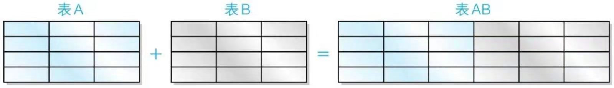

## 表的加减法

- 将其他表的行添加过来 `union`

  ```sql
  select product_id,product_name
  from product
  union
  select product_id,product_name
  from product2
  
  取全部行（包含重复行）
  select product_id,product_name
  from product
  union all
  select product_id,product_name
  from product2
  ```

  注意点：

  - 记录列数必须相同
  - 运算对象列类型必须一致
  - 可以使用任何select语句，orderby最后使用一次

- 取两个表的公共部分 `intersect`

- 去除其他表的内容 `except`之后的剩余部分


## 联结

union作为行的加法，列数不会发生变化，且要求保持一致

什么是联结？

- 按照条件将其他表的列添加过来，即“添加列”的操作



什么是内联结？` Inner join`

- 

什么是外联结？


### 内联结

内联结条件：有公共列作为桥梁，将另外表中满足条件的列汇集到同一结果之中


```sql
select sp.shop_id,sp.shop_name,sp.product_id,p.product_name,p.sale_price
from shopproduct as sp inner join product as p
on sp.product_id=p.product_id;
```

内联结：`inner join`

注意点：

- from子句中有两张表，使用`inner join`联结。即from子句中使用多张表
- `on`子句，`on`之后指定两张表联结所使用的列==（联结键）== 。注意，`on`必须写在`from`和`where`之间
- 联结条件不止是=，也可以用其他谓词，例如`between and`
- select中指定的列，由于是多表，因此用<表名>.<列名>的方式标记
- 联结结果可以使用`where，group by ，having,order by`等都正常使用


内联结和where

```sql
select sp.shop_id,sp.shop_name,sp.product_id,p.product_name,p.sale_price
from shopproduct as sp inner join product as p
on sp.product_id=p.product_id
where sp.shop_id='000A';

//创建视图
create view viewshop
as 
select sp.shop_id,sp.shop_name,sp.product_id,p.product_name,p.sale_price
from shopproduct as sp inner join product as p
on sp.product_id=p.product_id
where sp.shop_id='000A';
```


函数：

```sql
coalesce(sp.shop_id,'不确定') as shop_id,
coalesce(sp.shop_name,'不确定') as shop_name,
```


### 外联结

外联结:结果中包含原表中不存在（在原表之外的）信息。

`right outer join:`以右表（product）做基础。就是把右边表的数据全部取出来，而左边表的数据有相等的，显示出来，如果没有，显示NULL


` left outer join:` 以左表(shopproduct)当做基础

```sql
right outer join 因为右边表shopproduct数据全部取出来了（13行）

select sp.shop_id,sp.shop_name,sp.product_id,p.product_name,p.sale_price
from shopproduct as sp right outer join product as p
on sp.product_id=p.product_id;

left outer join：因为左边表shopproduct数据全部取出来了（9行），而对应的product表中需要取对应的。因此最多9行（等于inner join）

select sp.shop_id,sp.shop_name,sp.product_id,p.product_name,p.sale_price
from shopproduct as sp left outer join product as p
on sp.product_id=p.product_id;

```

- 外联会选出单张表中的全部信息
- 每张表都是主表吗？用left和right指定主表


### 多张表的内联结

如果多个表条件一样相当于组合取交集
另一种情况：联结完一张表之后，转而联结另一张表


### 交叉联结

cross join

使用的是笛卡尔积。对所有记录交叉组合


内联结可以看做是包含在交叉联结结果中的一部分

外联结可以看做是包含在交叉联结结果之外的一部分


## 练习

外联结 修改NULL

```sql
select 
coalesce(sp.shop_id,'不确定') as shop_id,
coalesce(sp.shop_name,'不确定') as shop_name,
sp.shop_id,sp.shop_name,sp.product_id,p.product_name,p.sale_price
from shopproduct as sp right outer join product as p
on sp.product_id=p.product_id;
```

