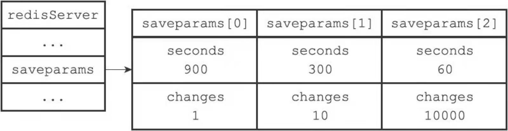
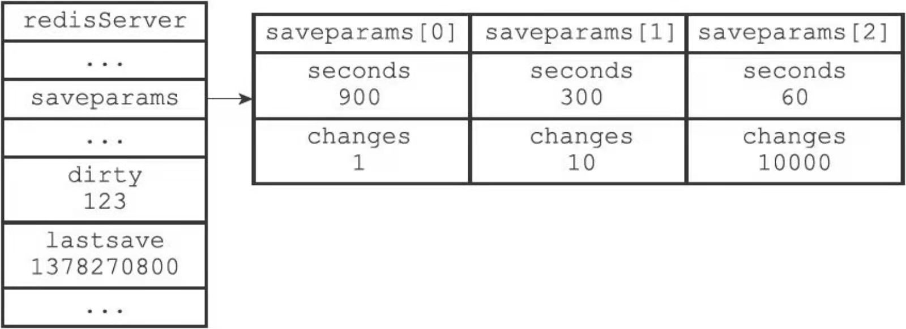
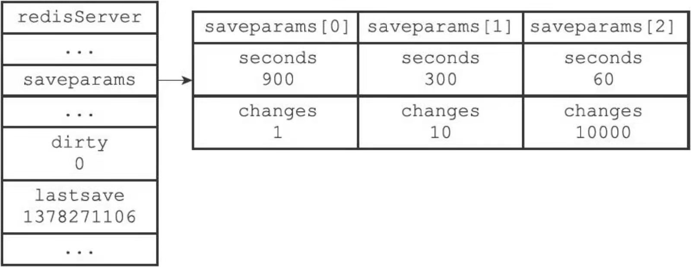

## RDB持久化

问题：

- rdb即==redis database==

- 为什么需要rdb？
- rdb的文件格式

- RDB靠谱吗？

- 性能如何？
- 如何实现？


## RDB文件的创建和载入

save命令：主线程同步保存，会阻塞到文件创建完毕（期间不能处理其他任何命令）

bgsave命令：fork一个子进程保存文件（注意写时拷贝，此时rehash的条件会变大）

写时拷贝是触发修改就会子父进程就会拷贝。因此在bgsave期间，尽量不要rehash，否则会导致内存的浪费（因为子进程在rdb过程中本身不需要修改任何东西，也就是不需要任何拷贝，而rehash则会触发修改导致拷贝）

```python
def save()
  rdbsave();
def bgsave()
  pid = fork();
	if pid = 0:
		rdbsave();
		#完成发送信息给父进程
    signalparent;
  else if pid > 0:
    	handle_request_and wait_signal()
  else 
  	handle_fork_error();
```


AOF比RDB备份频率高，因此一般优先加载AOF

- 若开启aof持久化，优先使用aof文件还原
- aof关闭的状态下，才使用rdb文件来还原


### bgsave命令执行时的服务器状态

执行bgsave期间

- 客户端的save和bgsave命令会被拒绝，防止竞争条件
- bgrewriteaof和bgsave命令不能同时执行
  - 如果正在执行bgsave，那么bgrewriteaof会被延后
  - bgrewriteaof正在执行，那么bgsave会被拒绝

## 自动间隔性保存

bgsave不会导致服务器阻塞，因此可以每隔一段时间自动保存

假设这么设置配置文件，满足以下条件之1就会执行bgsave

```sh
save 900 1 //900s内至少一次修改
save 300 10 //300s内至少10次修改
save 60 10000 //60s内至少10000次修改
```

我们发现至少要保存两个东西：开始时间和修改次数

用一个数据结构把~，同时要保存多个这种结构，因此使用数组



### 设置自动时间

如何实现？

```c
struct redisServer
{
  struct saveparam *saveparams;
}
struct saveparam
{
  time_t seconds;
  int changes;
}
```

`saveparams`结构的数组中保存了条件

以上三个条件即：

```c
save 900 1 //900s内至少一次修改
save 300 10 //300s内至少10次修改
save 60 10000 //60s内至少10000次修改
  
saveparams[0] = {900,1}
saveparams[1] = {300,10}
saveparams[2] = {60,10000}
```

实现了保存设置而已，如果记录次数和时间更新从而和保存的时间次数进行对比呢？

因此需要使用下面的dirty计数器和lastsave

### dirty计数器和lastsave属性

除了saveparams，服务器状态还有一个dirty计数器和lastsave属性

有什么用呢？

`dirty计数器`：记录脏数据（即还没被持久化的数据）的数量。如何体现？

- 距离上一次成功save或者bgsave之后，服务器对所有数据库修改的次数即是脏数据数量（写入，删除，更新）
- 每次对数据库修改，都应该更新dirty计数器，bgsave操作成功dirty计数器应该为0
- 如何知道上一次成功bgsave或save的时间呢？

`lastsave`:保存上一次成功bgsave或save的unix时间戳

通过这两个属性：我们就能获得服务器对数据库的==修改次数==以及 ==设定的时间==

如果现在的时间-lastsave超过设置的时间，并且修改次数大于设置的修改次数，则触发save



```c
struct redisServer
{
  struct saveparam *saveparams; //saveparam结构 seconds和changes
  
  long long dirty; //计算是否在设置的时间之内有这么多次数
  time_t lastsave; //计算是否超过设置的时间
}


```

### 检查条件是否满足

刚刚有了两个属性记录那么我们怎么检查？设定检查时隔？

redis周期函数出场，serverCron()函数 ，这个函数100ms就会执行一次

其中就包括检查save条件是否满足，满足的话就执行bgsave

```python
def serverCron()
{
  for saveparam in server.saveparams:
  	save_interal = unixtime_now - server.lastsave #过了多久的时间
  # 如果时间超过设置的时间，且修改次数也超过了设置的次数，则会执行 bgsave
 	if save_interal>=saveparam.seconds and dirty>=saveparam.changes:
  	bgsave()
}
```


save完成之后（开始save就应该清零dirty）：




dirty计数的更新时间？

- 如果是save成功更新dirty为0，那么如果save期间有了修改怎么办？dirty还是0吗？
- 还是执行save时，dirty更新为0，然后创建子进程。然后若数据有修改，dirty在父进程更新（因为copy on write，此时会有拷贝操作，且子进程是拷贝不到修改的数据的）
  - 这时应该先保存dirty值，然后在fork之前就清零，若fork失败或者save失败可恢复dirty
  - 那如果是有了修改，且失败了？dirty_old应该加上新的修改数


## RDB文件结构

rdb是一个二进制文件

`REDIS`:5个字符，表示是RDB文件

`db_version`：使用的版本号0006

`database`：零个或多个数据库

- 服务器数据库状态为空（数据库为空），这部分为空，0字节
- 数据库状态非空，这个部分非空，根据数据库保存的键值对数量，类型，内容不同，长度不同

`EOF`：正文内容结束 0x377常量

`check_sum`：8字节整数，保存校验和


### database部分

`SELECTDB`：常量1字节  常量376

`db_number`：1，2，5字节，表示数据库编号

`key_value_pair`：带有一个key-value对，key是一个字符串对象，value可能是其他5种对象


### key_value_pair部分

不带过期时间的键：

TYPE：记录了value的类型，长度1字节

key：字符串对象

value类型：


带过期时间键:前面多几个字段

- EXPIRETIME_MS

- ms

- TYPE：记录了value的类型，长度1字节

- key：字符串对象

- value类型

  

value类型：

0. REDIS_RDB_TYPE_STRING(key也是这个类型)

1. REDIS_RDB_TYPE_LIST

2. REDIS_RDB_TYPE_SET

3. REDIS_RDB_TYPE_ZSET

4. REDIS_RDB_TYPE_HASH

   上面种是基本方式

5. REDIS_RDB_TYPE_LIST_ZIPLIST

6. REDIS_RDB_TYPE_SET_INTSET

7. REDIS_RDB_TYPE_ZSET_ZIPLIST

8. REDIS_RDB_TYPE_HASH_ZIPLIST

9种方式

### value编码

1. 字符串对象

   - 存储编码有两种方式REDIS_ENCODING_INT,REDIS_ENCODING_RAW，如果字符串是不超过32位的整数，就用REDIS_RDB_ENC_INT8或16或32编码存储，即
   - 压缩或不压缩字符串保存
     - 小于等于20字节不压缩 直接是 len  + string
     - 大于20字节，被压缩再保存

   

2. 列表对象

   直接使用 ：length + item保存

   

3. 集合对象

   

4. 有序集合对象

   Zset_size+elements

   注意：elements由member+score组成

   

5. 哈希对象

   Hashsize + key_value对...

6. 整数集合intset

   先将整数集合转换成字符串对象，然后保存。恢复时根据TYPE恢复

7. ziplist

   同样将ziplist先转换为字符串对象，然后保存

   恢复的时候根据TYPE的标志，恢复成原来的压缩列表（并设置压缩列表对象的类型）

   比如为REDIS_RDB_TYPE_LIST_ZIPLIST，压缩列表就是列表对象，REDIS_RDB_TYPE_LIST_HASH，压缩列表就是哈希对象

   REDIS_RDB_TYPE_LIST_ZSET，压缩列表就是有序集合对象

## 分析RDB

设置过期时间：

setex

expire