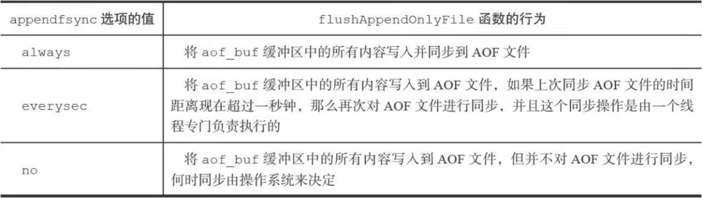

# AOF持久化

append only file持久化 如何实现？

与RDB有何不同？

- RDB是保存所有键值，而AOF是保存redis的写指令记录数据库状态


AOF的逻辑记录类似于binlog？可以追加，并且是保存的逻辑变化，binlog就是保存的原始逻辑语句（二进制）

而redo-log直接保存对数据页做的修改，可以崩溃恢复（因为有数据页的记录），物理记录（类似于RDB）

AOF不同点是可以崩溃恢复？


RDB和AOF如何保存下面语句

```sh
set msg "hello"
sadd fruits "apple","banana","cherry"
rpush numbers 12 23 12
```

RDB会保存键空间的键值对，其值为三个对象，字符串对象，集合对象以及列表对象

而AOF则会保存3个命令 set sadd rpush

若开启了AOF优先使用AOF


## AOF的实现

3个方面实现aof

- `命令追加`
- `文件写入`
- `文件同步（sync）`


### 命令追加

执行的命令会追加到服务器状态的`aof_buf`的尾部

注意 `aof_buf`是一个简单动态字符串类型

```c
struct redisServer
{
  sds aof_buf;
}
```

```sh
set key value
#此时会在aof_buf中添加 *3\r\n$3\r\nSET\r\n$3\r\nKEY\r\n$5\r\nvalue\r\n\

RPUSH NUMBERS ONE TWO THREE
#此时会在aof_buf中添加 *5\r\n$5\r\nRPUSH\r\n$7\r\nNUMBERS\r\n$3\r\nONE\r\n\$3\r\nTWO\r\n$5\r\nTHREE\r\n
```

即追加到`aof_buf`中

### aof写入和同步

redis服务器是一个事件循环（EventLoop）文件事件负责接收客户端命令，以及回复，时间事件负责执行像serverCron函数这样的定时运行的函数。（Reactor模式？）


Redis 是基于 Reactor 单线程模式来实现的。Redis6 版本中引入了多线程，Redis 在设计上采用将网络数据读写和协议解析通过多线程的方式来处理，对于命令执行来说，仍然使用单线程操作。


```python
def eventloop():
  while true
  {
    #处理文件事件，接收命令，发送命令
    #可能会有新内容添加到aof_buf
    processFileEvents();
    processTimeEvents();//处理时间事件
    
    //是否写入和保存到aof文件中
    flushAppendOnlyFile();
  
  }
```

flushAppendOnlyFile()由服务器参数appendfsync

==注意： ==

写入（调用write，仅仅只是写入了内核缓冲区）：此时只是将aof_buf中数据写入到了系统缓冲区（仍然有可能丢失）

文件同步（保存）：将数据从系统缓冲区写入到磁盘




fsync和fdatasync 强制操作系统立即将缓冲区内容写入磁盘，保证安全


always：最安全，但是效率最慢（因为每次都要立即将内核缓冲区同步到磁盘）

everysec：有可能丢失1s钟的命令数据

Appendfsync：为no，每个事件循环都需要将aof_buf写入内核缓冲区，但是什么时候同步到磁盘，由操作系统做主。因为每次不需要同步到磁盘，因此它写aof文件是最快的，但是需要在内核缓冲区累积一段时间，因此也可能丢失命令

### aof载入

1. 创建伪客客户端
2. 从aof文件分析并读出写命令
3. 使用伪客户端执行命令
4. 重复上面3步，直到所有的命令执行完毕

### aof重写

为什么需要重写呢？

因为在数据库运行一段时间后，有些数据已经修改和删除，但是aof仍然有记录，加载时我们并不需要历史状态，只需要最新的状态，也就是一致状态命令，因此需要重新整理aof


### aof文件重写实现

新aof文件替换旧的aof文件，因为分析原文件太过于费事。不需要对现有aof文件进行读取，分析或者写入。而是通过当前数据库状态来生成一个新的aof文件。


根据当前数据库状态进行重写，将数据库状态中的所有键值对（对象）进行重写整理

比如之前的所有集合对象的list键中执行了四次rpush list，都写为RPHSH list a b c d;


### 后台重写

为什么不用子线程，而用子进程？

