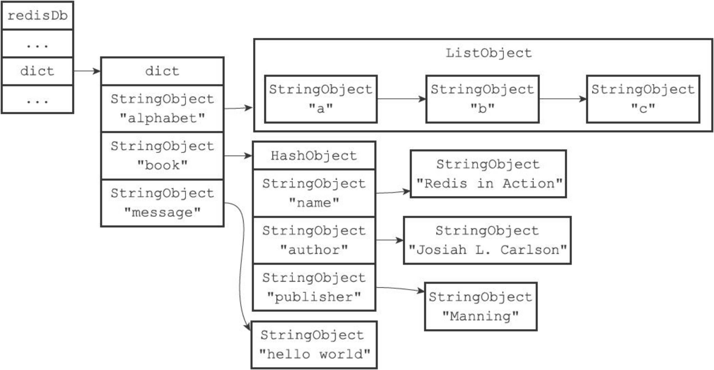

## 服务器中的数据库

```c
typedef struct redisServer
{
  redisDb *db;
  ...
    int dbnum; //数据库数量
}redisServer;
```


## 切换数据库

默认数据库数量为16

select命令可以切换数据库

```c
typedef struct redisClient
{
  redisDb *Db;
}redisClient;
```


## 数据库键空间

什么是键空间：redisDb结构的==dict== 字典保存了数据库中所有的键值对，将这个键称之为键空间

```c
typedef struct redisDb
{
  dict *dict; //键空间 就是字典数组
    dict *expires;
}redisDb;
```


这个字典的键：始终是一个字符串对象

而字典的值：可以是其他集中类型



对数据库的操作都是对键空间的字典进行操作


### 添加新键

实际上是添加新的字典key-value

key为字符串对象

value为其他5种对象

### 删除键

### 更新键

### 获取键

### 其他键空间操作

flushdb 清除数据库

randomkey


### 读写键时的维护操作

- 更新命中hit或键空间不命中miss次数
- 更新LRU时间
- 删除过期键（惰性删除
- 被watch的键同时被修改 标记为dirty
- 修改键时，脏键计数器+1，计数器会触发持久化及复制操作
- 发送通知

## 设置键的生存时间或过期时间

生存时间：expire

过期时间：setex 设置过期时间（原理和expire相同）

设置过期时间

Expire key <ttl>

pexpire <key> <ttl>

expireat<key><timestamp> 设置过期时间为timestamp指定的时间 秒

pexpireat<key><timestamp>  设置过期时间为timestamp指定的时间 毫秒


### 保存过期时间

如何保存要过期的键呢？

有点类似定时器链表，把要过期的键保存另外一个字典键空间中，而值就是过期时间（long long），即过期字典

redisDb中expires字典保存了数据库中所有键的过期时间，毫秒精度的unix时间戳


```c
typedef redisDb
{
  ...
  dict *expires;
}redisDb;

def pexpireat(key,expire_time_in_ms)
{
  if(key not in redisDb.dict) return 0;
  
  redisDb.expires[key] = expire_time_in_ms;
  return 1;//设置成功
}
```


### 移除过期时间


persist命令移除过期时间

```python
def persist(key)
{
  if(key not in redisDb.dict) return 0;
  
  redisDb.expires.remove(key);
  return 1;//设置成功
}
```


###  计算并返回剩余生成时间

pttl是微秒返回，ttl是秒返回

expires中值保存的是过期时间的时间戳

即用过期的时间戳-now即可得到剩余生成时间 

```c
pttl = expires[key] - now_ms;

ttl  = (expires[key] - now_ms) / 1000;
ttl = ms_to_sec(pttl);
```


### 过期键判定

1. 先检查键是否存在在expires中，不存在返回false
2. 存在检查键的过期时间和当前unix毫秒时间戳，若当前时间戳大于过期时间，则键过期

## 过期键删除策略

什么时候删除？（必定会循环检测是否时期到期呀，或者给键设置回调函数，到期自动通知调用删除？）

或者说每次用的时候检查（有点类似乐观锁），浪费内存

1. 定时删除，创建一个定时器timer，到期立即删除
2. 惰性删除，先不管过期键，每次获取从键键空间获取键时，先检查键是否过期。若过期则删除，没有过期返回该键。
3. 定期删除，定期检查数据库


### 定时删除

- 对内存友好，对cpu不友好

定时器到期自动删除键，若过期键比较多，此时系统要分配大量cpu时间去执行删除操作，可能使得服务器的响应时间和吞吐量受到影响。


### 惰性删除

- 对cpu友好，对内存不友好

如果说过期键较多，且不可能被访问到时（也就不会删除)，此时会积累大量的过期键，而导致内存占用过大。类似于内存泄漏。

例如与时间有关的数据，比如日志，在某个时间点之后基本不会再访问（或访问会减少很多）。


### 定期删除

两者的折中

- 每隔一段时间执行一次删除操作，并且限制删除操作的==时长和频率==减少对cpu时间的影响

定期的时间的把握：

- 删除太频繁（或时间太长）删除会退化为定时删除。
- 删除操作太少，执行时间太短。又会导致在内存中滞留，导致内存浪费

### redis的过期键删除策略

实际使用惰性删除和定期删除结合（和我想的一样）

利用两者的优点

定期删除可以删除访问不到的数据

- 惰性删除+定期删除 平衡cpu占用和内存

## AOF，RDB和复制对过期键的处理

### 生成rdb文件

save和bgsave创建新的rdb文件时，会检查过期键，已过期的键不会保存在rdb文件中

- 即过期键不保存

### 载入rdb文件

1. 主服务器模式运行，载入rdb时会检查键是否过期，若过期则不会载入
2. 如果是从服务器模式运行，载入rdb时不论键是否过期，都会载入。因为在同步时还会检查键是否过期，因此没有影响
   - 主服务器过期键忽略
   - 从服务器过期键不忽略

### aof文件写入

如果某个键已经过期，但是还没被惰性删除或者定时删除，此时不会对aof有影响

如果执行了删除操作，aof会写入一条del命令，显式记录键被删除

- 记录键，显式删除键

### 复制


从服务器只会接收到主服务器del命令才会删除过期键

同时如果客户端获取从服务器的过期键，从服务器返回NULL（3.2以上），但不会删除过期键


## 数据库通知

订阅给定的频道或者模式，获取数据库键的变化以及数据库命令执行情况

```sh
subscribe _ _keyspace@0_ _:message

subscribe _ _keyevent@0_ _:del
```

- 键空间通知（key-space-notification)

- 键事件通知（key-event-notification):关注命令被什么键执行了

  

