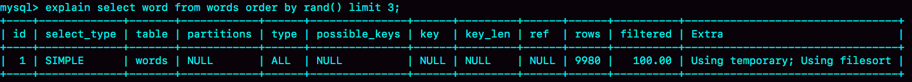

随机显示

```sql

mysql> CREATE TABLE `words` (
  `id` int(11) NOT NULL AUTO_INCREMENT,
  `word` varchar(64) DEFAULT NULL,
  PRIMARY KEY (`id`)
) ENGINE=InnoDB;

#创建存储过程
delimiter ;;
create procedure idata()
begin
  declare i int;
  set i=0;
  while i<10000 do
    insert into words(word) values(concat(char(97+(i div 1000)), char(97+(i % 1000 div 100)), char(97+(i % 100 div 10)), char(97+(i % 10))));
    set i=i+1;
  end while;
end;;
delimiter ;

call idata();
```


```sql
select word from words order by rand() limit 3; #随机排序 取前三个
```



Extra 字段显示 Using temporary，表示的是需要使用临时表；Using filesort，表示的是需要执行排序操作。

因此这个 Extra 的意思就是，需要临时表，并且需要在临时表上排序。


- 全字段排序

  

- rowid排序

  


order by rand() 使用了内存临时表，内存临时表排序的时候使用了 rowid 排序方法。


### 优先队列排序（堆排序）


- 数量为k的大顶堆可以保持取n个数的前k个大小的值

