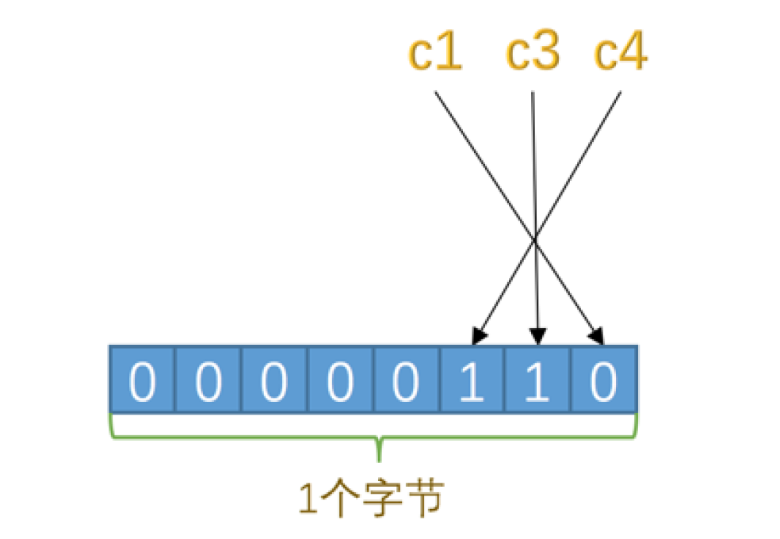
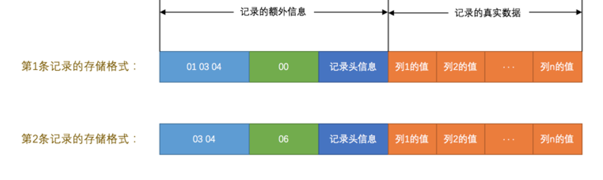
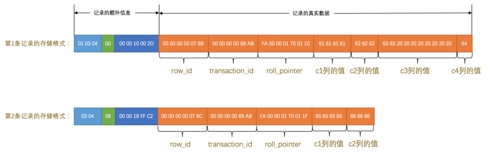

重点：

compact行记录

dynamic行记录

行溢出

列的限制

## INnoDB简介

- Innodb优点是什么？
- 什么是页
- 为什么需要页？
- 页的大小

## 行格式

4种行格式

compact（默认）

### 指定行格式

```sql
create table record_format_demo(
	c1 varchar(10)
  c2 varchar(10) not null
  c3 char(10)
  c4 varchar(10)
)

插入两行

```


### compact行格式

行格式示意图（注意这个每个行即记录的格式！）：


变长字段长度列表和null值列表都没有严格表明是哪一列呀 ？

#### 变长字段长度列表

为什么需要变长字段长度列表？


变长字段长度列表 是只有varchar才用吗？

- no，实际上不是ascii码字符集（定长字符集）的变长字符集（gbk）都会加入变长列表

怎么存储每个记录的变长字段列表？

- 注意是==逆序==存放，跟列反着的！！
- 例如列1 'aaaa'长度为04 列2 'bbb'长度为03 列3 'd' 长度为01
  - 即变长列表应该是 01 03 04 逆序存放


需要多大的空间？ 列数*一个字符用的字节数


#### NULL值列表

记录null值的列表：节省记录真实数据的空间，所以说为啥不能比较，是不是因为这个？


如c1 c3 c4是允许null的因此他们会在null值列表内

怎么存储呢？

- 每个允许null值的列对应一个二进制位，二进制位按照列的顺序 逆序排列

  - 为什么逆序呢？

- null值列表按字节对齐，即如果只有3列即占3位仍然需要1字节

  

- 二进制位为1时表示该列的值为null，为0时表示该列的值不为null，因此第二条记录为0x06

  


什么情况下不能为NULL

- 主键
- Not null 修饰

null值列表有什么好处？

- 不需要真正的存储

  

#### 记录头信息

记录哪些内容？

固定5字节 40个二进制位

记录哪些属性？


#### 记录的真实数据

mysql默认添加的列（隐藏列）

- row_id(只有没有设置主键也没有unique键才会默认添加这个列) 可选
  - 优先使用设置的主键作为主键（聚集索引）
  - 没有设置主键，使用unique键作为主键
  - unique也没有那只能row_id了
- transaction_id 事务id（属于哪个事务）默认添加
- Roll_pointer回滚指针 默认添加


数据列




- ascii码存储 'aaaa'就是0x61616161 'bbb'就是0x626262
- 列3列4为null，存在了null值列表中节约了空间
- 注意第一列的c3 虽然是'cc' 即真实应该是0x6363 但是是定长的char(10)，因此至少需要10字节，后面的全部是==空格字符==填充，因此我们发现char定长如果用不完就是浪费空间呀

#### char(M)列的存储格式

char类型，大小固定，且定义时是多少，哪怕没用那么多也会至少占那么多

使用utf-8的字符集char(10) 该列存储范围为10-30个字节（utf-8一个字符需要1~4个字节）

ascii码一个字符1字节


### Redundant行格式


### 行溢出

varchar(M)类型的列 需要三部分

- 真实数据
- 真实数据占用字节的长度（变长记录长度列表）
- null标识（null值列表）

varchar 最多能存储的数据

- 对于ascii码varchar列最多可以占用65535(包括额外信息的列)

  - 即null值列 如果没有not null或不是主键 则null值列表占1字节
  - 真实信息长度列表占2字节
  - 因此最多存65532(允许null) 如果不允许null，则最多65533

  实验

  ```sql
  create table testlimit(
  	c varchar(65535) #报错
  )；
  
  create table testlimit(
  	d varchar(65533) not null
  );
  
  create table testlimit(
  	e varchar(65533) #报错 
  );
  create table testlimit(
  	f varchar(65532) #可以
  );
  ```


什么是行溢出？ varchar text blob类型都可能会溢出

​	即一行中真实数据处只会存储该列前n个字节的数据和一个指向其他页的指针，把剩下数据存在其他页这叫行溢出，超过n字节的叫溢出页

例子：比如刚刚一个允许null值的列e可以存65532字节，而一个页为16kb=16384字节，显然一页存不下，导致一个页放不下一个记录的尴尬局面

compact对于列比较大的数据会保留真实数据的一部分(768字节？)后面20字节放其他页的地址


#### 行溢出的临界点

列存储多少会行溢出呢？

- 一页中至少放两行记录（那记录大了放不下咋办）
- 因此只能主动降级，比如只放列中的一部分，后面跟个地址连接到其他页

因此我们行中存储了很大数据时，可能会发生行溢出

### dynamic和compressed

类似于compact，处理行溢出方式不同

不会放真实数据的前n个字节数据，而是将整个数据放到溢出页


