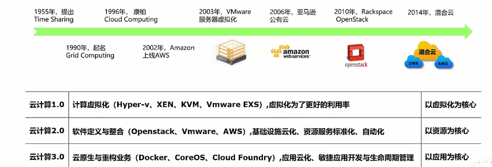
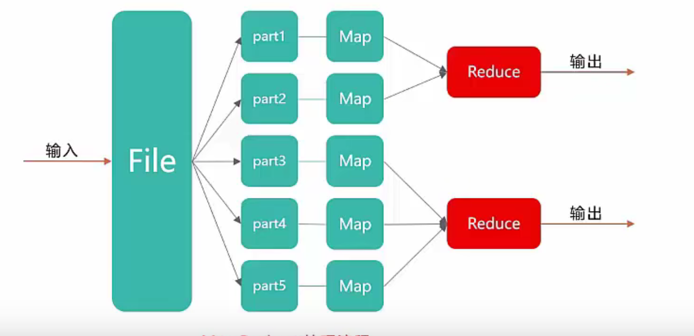
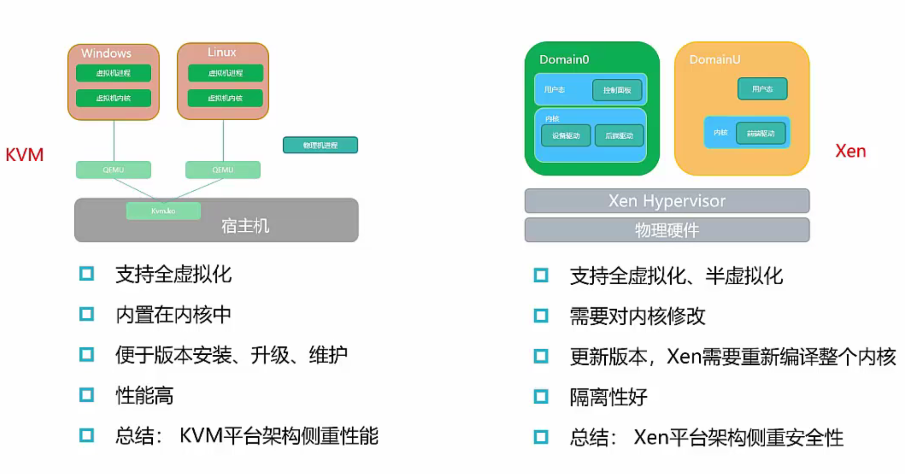
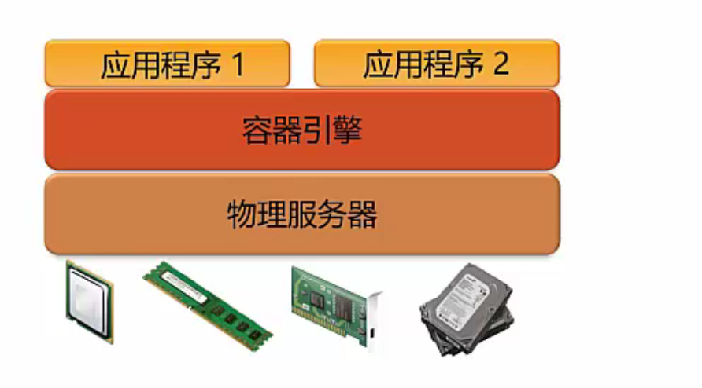
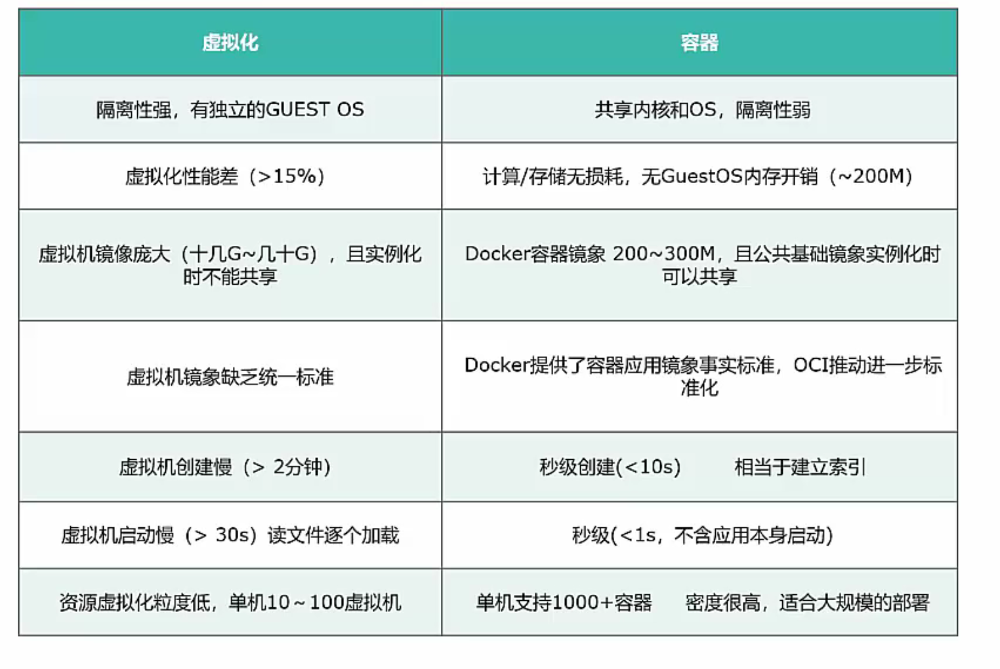
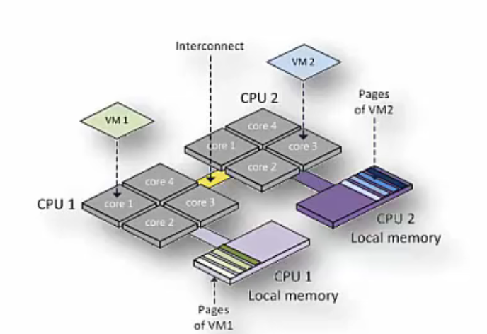

#

## 云计算

什么是云计算？

- 云计算是一种特殊的网络服务

云计算发展

- time sharing 分时系统 1955
- Grid computing 网格计算 1990
- cloud computing 康柏 1996
- VMware虚拟化 2003
- 亚马逊 公有云
- rackspace openstack 2010
- 混合云 2014

> 云计算1.0：
>
> 运距算2.0
>
> 

### 传统和云计算

IOE架构

### 云计算特点

- 虚拟化技术
- 动态可扩展性
- 按需部署
- 灵活性高
- 可靠性高：冗余备份
- 性价比高
- 地理分布
- 先进安全技术

### 云计算优势

- 按需自助
- 广泛网络接入
- 资源池化
- 快速弹性伸缩
- 可计量服务

总结： 省时 省地 省电 省人

## 云计算服务类型

### 基础设施即服务laaS

`Infrastructure as a Service`

### 平台即服务

Paas （Platform as a Service）

服务商提供一套可编程可开发的云环境

### 软件即服务SaaS

- Software as a Service(Saas) 提供一套应用程序

### 关键技术

虚拟化技术：虚拟层—物理设备抽象为多个逻辑设备

分布式数据存储技术：提高利用率，提高冗余能力

数据中心联网：东西向流量增长，并行计算业务（搜索） 服务器集群之间协同运算 产生大量横向交互流量，虚拟机的自由部署和动态迁移 ，虚拟机之间的实时同步大量数据

并行编程技术：并发处理，容错，数据分布，负载均衡抽象到一个函数库中

 MapReduce

体系架构：

- 用户界面
- 服务目录
- 管理系统
- 部署工具
- 监控
- 服务器集群

自动化部署

## 虚拟化

### 什么是虚拟化

### 虚拟化特点

### 虚拟化类型

### 虚拟化架构

- 全虚拟化（混合虚拟化）：KVM，内核中插入一个Hypervisor内核进行

  - 性能高
  - 更新方便

- 半虚拟化（裸金属虚拟化）：修改内核，直接将一个轻量级Hypervisor运行在硬件之上

  - 需要Domain0

  

对比：

## 容器

保证或者装载物品的贮存器，利用开源的应用容器引擎 开发者可以打包应用和依赖环境生成一个镜像，然后发布	

容器实现虚拟化:

- 秒开（不要向虚拟机一样开机）
- 移植（镜像只需要包含应用程序就行，因此只需要移植应用程序那一层）

### docker

- docker组成：
  - 客户端
  - 守护进程
  - 引擎
  - 镜像
  - 容器
  - 仓库

- 容器特点：轻量级虚拟化，无需打包底层操作系统
  - 

- docker用途：
  - 一次性环境
  - 弹性云服务
  - 微服务架构：多个容器一个机器跑多个服务，本机模拟微服务架构

## 计算虚拟化

- cpu虚拟化
- 内存虚拟化
- io虚拟化

### openStack Nova

### cpu虚拟化

在物理机中通过线程或者进程这种软件方式模拟出的假的cpu，通过cpu虚拟化可以将一个物理cpu发给不同的虚拟机使用

> 虚拟化的cpu实际上就是一个线程或者进程，所以物理cpu核数最好是要大于虚拟cpu总核数

计算公式：总资源=cpu个数 x 单个cpu核数x线程数（超线程为2，单线程为1）

#### CPU QoS 服务质量

- 资源限额：资源使用上限
- 资源份额：按比例分配资源
- 预留资源：多台虚拟机竞争物理cpu时，每台虚拟机最低分配的计算资源

#### NUMA非统一内存访问体系结构

- Non-uniform Memory Access Architecture
- 将物理服务器的CPU和内存资源分到多个node上，node内的内存效率访问最高
- NUMA保证一个VM的VCPU尽量分配到同一个node的物理cpu，如果一台VM的VCPU跨node访问内存的话，访问延时肯定增加

### 内存虚拟化

虚拟内存——每个进程都有自己的连续的，大容量的地址空间

- 全虚拟化
- 半虚拟化
- 硬件辅助

#### 内存复用技术

- 内存气泡
- 内存交换：外部存储器作为内存
- 内存共享：写时拷贝

#### 内存复用 QoS

- 内存预留
- 内存份额

### IO虚拟化

#### IO虚拟化类型

全虚拟化

半虚拟化

直通方式：

#### IO环适配功能

非密集IO：一秒钟读的次数少

密集IO：一秒钟内完成了多次读，每次读取内容少量

IO环适配功能：主要用来提升大块（44k以上） 多队列（32队列深度以上）类型的IO密集型业务的IO性能

## 集群

### 虚拟机HA

- 高可用性 high

### 动态资源调度

- 负载均衡，消峰填谷

### 分布式电源管理

DPM

### 常见存储类型

- 本地磁盘
- DAS 直连式存储：一个存储设备与使用存储空间的服务器
- NAS网络附加存储
- SAN 存储区域网络

## 存储虚拟化

存储虚拟化：

- 硬盘，RAID组成一个存储池统一管理，将多个存储设备统一管理起来，为用户

提供大容量，高数据传输性能的存储系统

## 存储模式

### 非虚拟化存储

### 虚拟化存储

### 裸设备映射

直接访问磁盘，不需要创建卷，中间不需要任何干涉

### 基于主机存储的虚拟化

单个主机访问多个磁盘阵列

### 基于存储设备的虚拟化

多个主机访问同一个磁盘阵列

### 基于网络的存储虚拟化

## 网络虚拟化

