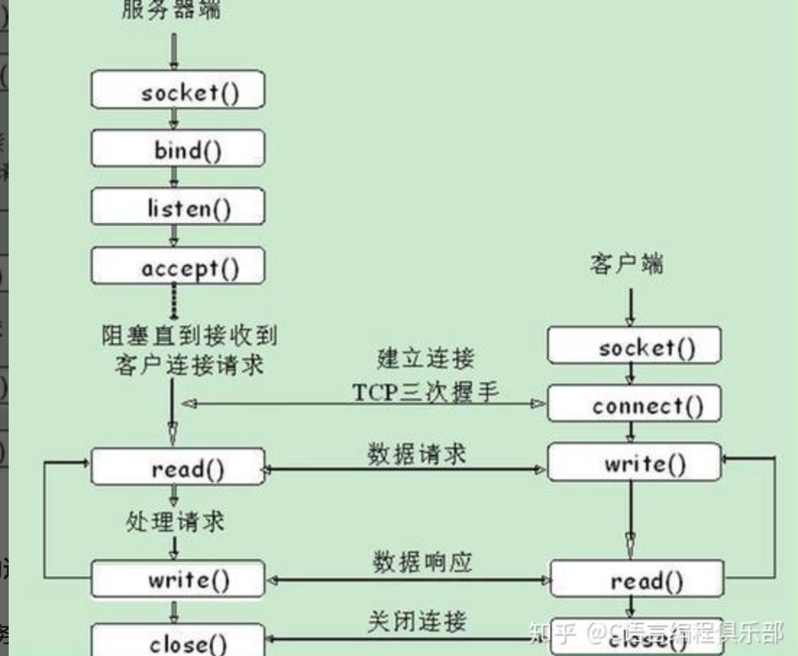

### 第3章


#### 多路复用，多路分解
- 多个网络进程运行时，如果把接收到的数据定向到某个进程？
- 多路分解：将运输层中的报文段中的数据交付到正确的套接字
- 多路复用：从源主机的不同套接字中收集数据块，并为数据块生成首部信息，生成报文段，然后传递到网络层 
- UDP的多路分解与多路复用：通过目的端口和源端口实现

- UDP相关函数
  - `int socket(AF_INET, SOCK_DGRAM, 0)`;创建udp socket，返回套接字描述符，UDP协议建立套接字的方式同TCP方式一样，使用socket()函数，只不过协议的类型使用SOCK_DGRAM，而不是SOCK_STREAM。
  -  `int sendto(int sockfd, const void *data, int data_len, unsigned int flags, struct sockaddr *remaddr,sock_lenremaddr_len)` 功能：基于UDP发送数据报，返回实际发送的数据长度，出错时返回－1参数说明：sockfd:套接字描述符data:指向要发送数据的指针data_len:数据长度flags:通常为0remaddr:远端地址：IP地址和端口号remaddr_len:地址长度
  -  `int recvfrom(int sockfd, void *buf,int buf_len,unsigned int flags,struct sockaddr *from,sock_len *fromlen);`功能：从UDP接收数据，返回实际接收的字节数，失败时返回－1参数说明：Sockfd:套接字描述符buf:指向内存块的指针buf_len:内存块大小，以字节为单位flags:一般为0from:远端的地址，IP地址和端口号fromlen:远端地址长度
  - `ssize_t recv(int s, void*buf,size_t len, int flags);`连接的UDP可调用recv从服务器读取数据。
  - s`size_t send(int s, const void*buf, size_t len, int flags);`连接的UDP可调用send向服务器发送数据。


```cpp

#include<sys/socket>
int main(){
    int clientsocket = socket(AF_INET,SOCKET_DGRAM，0); //自动分配端口号


}
// server
#include<sys/socket>
int main(){
    int serversocket = socket(AF_INET,SOCKET_DGRAM，0); //自动分配端口号
    struct sockaddr_in clent_addr;  

    int count = recvform(serversocket,buf,255,0, (struct sockaddr*) &clent_addr,len );// 接收到clientfd 客户端源端口 IP
    if(count==-1){
        perror();
        exit(1);
    }
    sendto(serversocket,data,strlen(data),0,(struct sockaddr*) &from,sock_len fromlen);


}
```
- TCP的多路分解与多路复用
- tcp套接字是一个四元组（源IP，源端口，目的IP，目的端口）
- `ssize_t recv(int s, void*buf,size_t len, int flags);`连接的tcp可调用recv从服务器读取数据。
- s`size_t send(int s, const void*buf, size_t len, int flags);`连接的tcp可调用send向服务器发送数据。


```cpp

#include<sys/socket>
void main(){
    struct sockaddr_in myaddr; //创建“我的地址”结构体 
    memset(&myaddr, 0, sizeof(myaddr)); //对内存清零（保险起见） 
    myaddr.sin_family       = AF_INET; //选择IPV4地址类型 
    myaddr.sin_port         = htons(8888); //选择端口号 
    myaddr.sin_addr.s_addr  = inet_addr("192.168.3.169"); //选择IP地址

    int clientsocket = socket(AF_INET,SOCK_STREAM);
    clientsocket.connect(serverName,12000);//建立连接

    close(clientsocket)

}
//server
int main(){
    int seversocket = socket(AF_INET,SOCK_STREAM);
    struct sockaddr_in my_addr;//需要定义一个结构体地址，以便于将port的主机字节序转化成网络字节序
    bind(seversocket,(struct sockaddr*)&my_addr,sizeof(struct sockaddr));//将服务器端口和IP绑定套接字
    listen(seversocket,len)//监听  len是队列长度
    int connectionsocket=accept(sockfd,NULL，NULL);  //这边采用默认参数

    close(seversocket);
}
```

#### UDP
- UDP报文结构
- UDP校验和：求反码

#### 可靠传输原理 p142 状态机表示 rdt
- 可靠信道，信道100%不出错
- 具有比特差错信道的可靠传输
  - 自动重传请求ARQ
    - 差错检测
    - 接收方反馈
    - 重传
    - 序号
  
  `书中用的表示方法：有限状态机：引起变迁的的事件显示在表示变迁的横线上方，事件发生时所采取的动作显示在横线下方。若没有事件发生或者没有动作则用符号^`
- 停等协议：等ACK，但是没有考虑到ACK出错的问题 
  - 使用序号 01 
  - 去除NAK
  - 检测丢包 rdt3.0 但信道利用率太低，每次只能发送一个分组
- 流水线方式
  - 增加序号范围 -每个分组都有唯一的编号，存在多个编号未确认的情况
  - 发送方和接收方都必须缓存多个分组；发送方最低限度应该要缓存已发送但未确认的分组，接收方缓存正确接收的分组
  - 处理丢失，损坏及延时大的分组，差错恢复两种基本方法 回退N步，选择重传
1. 回退N步 GBN协议= 滑动窗口协议
    - 分为 已经发送已经确认，已经发送未确认，下一个发送的分组，未发送的分组
    - 发送方：窗口大小为N,也就是最多N个已发送未确认的分组，如果窗口未满，则产生一个分组发送
    - 接收方：累计确认，ACK为n表示n以内包括n的分组收到。如果收到失序分组，则全部丢弃
2. 选择重传 SR
   1. 窗口大小必须小于等于序号空间的一半，不然会无法分请是重传还是新的序号
   2. 
|  机制  |    |
|----|----|
|  校验和  |    |
|  序号  |    |
|  确认  |    |
|  否定确认  |    |
|  窗口，流水线  |    |
1. 
   GBN协议的缺点在于 一个分组的丢失或者出错会导致大量分组被重传
   1. 通过让发送方仅重传SR协议怀疑在接收方出错的分组，避免不必要的重传

#### TCP
- 面向连接
- 序号和确认号
- 估计往返时间：RTT
- 超时管理 timeoutInteral = EStimatedRT+4*DevRTT
- 可靠数据传输
  - 第一个事件 从上层应用程序接收数据，如果计时器没有启动，就启动计时器
  - 超时事件，
  - 接收到ACK事件
- 超时间加倍：每次重传后将超时时间加倍
- 快速重传：冗余ack，
- TCP是回退N步（GBN）和SR选择重传的混合
- 流量控制：
  - 流量控制和拥塞控制的区别
  - rwnd接收窗口


- TCP连接管理
  - 建立连接 3次握手
  - 关闭连接 4次挥手
  - -

- 拥塞控制
  - 拥塞的代价
  - 方法
    - 端到端拥塞控制
    - 网络辅助的拥塞控制
    - 