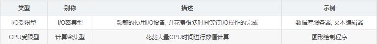
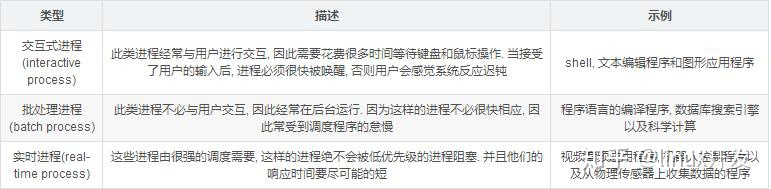

1面 8.17 15：00 - 5：10

## 三道题

1. 重排链表:快慢指针找中点，反转中点，切断链表，合并两条链表

   ```cpp
   ```

   

   ### 旋转数组 target问题

   

- 旋转数组找最小数

  ```cpp
  class Solution {
  public:
      int minArray(vector<int>& numbers) {
          int left = 0;
          int right = numbers.size() - 1;
          while(left<=right)
          {
              //右有序数组里面所有数小于左有序数组
              //最小的就是右有序第一个元素
              int mid = left + (right - left) / 2;
              if(numbers[mid]>numbers[right])
              {
                  //(mid,right] mid已经比最右边大了
                  //即 mid在左排序数组中,因此left直接到右排序数组中 left = mid + 1
                  left = mid + 1;
              }
              //mid一定在右排序数组中，所以左边应该是右排序数组，在左边找
              //[left,mid] 闭区间
              else if(numbers[mid]<numbers[right])
              {
                  right = mid; //能取到mid 因为你想呀mid以
              }
              else //重复 有可能是左排序数组大，可能是右排序数组大
              {
                  right--;
              }
          }
          return numbers[left];
      }
  };
  ```

- 旋转数组找Target

  ```cpp
  ```

   

二叉树所有路径和（[1 2 3] = 25）

//复盘

- 方法1 ： 回溯，字符串转数字， 前序遍历，尾部判断
- 方法2 ： sum = sum * 10 + root->val 累积和 同样是前序

```cpp
class Solution {
public:
    int sum = 0;
    int sumNumbers(TreeNode* root) {
        // write code here
        //回溯存储
        string path;
        helper(root,path);
        return sum;
        
    }
    void helper(TreeNode* root,string& path)
    {
        //到了叶结点
        if(!root) return;
        path.push_back(root->val + '0');
        helper(root->left,path);
        helper(root->right,path);
        if(!root->left&&!root->right)
        {
            sum += stoi(path);
        }
        path.pop_back();
       
        return;
    }
  
```


## 面试问题

redis 过期时间设置，过期时间底层，过期时间有几种策略

mysql存储引擎介绍

c++ 打开文件方式

linux awk命令

shmget函数，共享内存有哪些方法？

tcpdump使用 有什么参数？

- -i
- -X
- -n
- port


用过gdb吗？用过什么功能，用来干啥？

linux查看进程占用，如何看cpu核心数

####进程调度，cpu调度方法

调度策略：

目标是：进程响应时间尽可能快，后台作业吞吐率高，避免饥饿，低优先级和高优先级之间的平衡

传统操作系统的调度基于分时(time sharing)技术: 多个进程以”时间多路复用”方式运行, 因为CPU的时间被分成”片(slice)”, 给每个可运行进程分配一片CPU时间片, 当然单处理器在任何给定的时刻只能运行一个进程.

Linux通过将进程和线程调度视为一个，同时包含二者。进程可以看做是单个线程，但是进程可以包含共享一定资源（代码和/或数据）的多个线程。因此进程调度也包含了线程调度的功能.（本身线程和进程的创建是相同的，无非是共享资源的不同）

**非抢占式调度算法**

- 先来先服务
- 最短时间优先（饥饿）
- 

**抢占式调度算法**：

- 最短剩余时间优先
- 优先级调度
- 多级反馈队列调度算法

根据进程的不同分类Linux采用不同的调度策略





- 实时进程： 基于优先级，高优先级先执行，调度器在每次调度时, 总选择优先级最高的进程开始执行. 低优先级不可能抢占高优先级, 因此FIFO或者Round Robin的调度策略即可满足实时进程调度的需求。
  - 此外如何进程中如果存在实时进程, 则实时进程总是在普通进程之前被调度

普通进程不能简单的只看优先级, 必须公平的占有CPU, 否则很容易出现进程饥饿, 这种情况下用户会感觉操作系统很卡, 响应总是很慢.

- 普通进程中的交互进程（优先级高）
  - **轮转调度**
  - **优先级调度**
  - **多级队列**（移动到低时间片）
  - **公平分享调度**
- 普通进程中的批处理进程：不需要抢占，使用FIFO或者最短作业优先

#### hash和map的区别


## 二面

### c++

c++多态实现：虚函数，虚指针虚表

构造函数能够是虚函数吗？

析构函数呢？


c++vector内存分配

c++ vector删除元素注意点（迭代器失效）

- 对于序列式容器(如vector,deque)，删除当前的iterator会使后面所有元素的iterator都失效。这是因为vetor,deque使用了连续分配的内存，删除一个元素导致后面所有的元素会向前移动一个位置。还好erase方法可以返回下一个有效的iterator。

  

- 对于关联容器(如map, set, multimap,multiset)，删除当前的iterator，仅仅会使当前的iterator失效，只要在erase时，递增当前iterator即可。这是因为map之类的容器，使用了红黑树来实现，插入、删除一个结点不会对其他结点造成影响。

### linux

linux命令：

- 抓包命令

- 查看网络状态

- 查看cpu相关

协程和线程


### 网络

- TIME_WAIT在哪个状态（怎么工作，作用）
- 负载均衡了解吗？（没了解）


### 数据库

mysql大数据怎么优化增删改查

- 索引

锁的粒度

乐观锁和悲观锁

