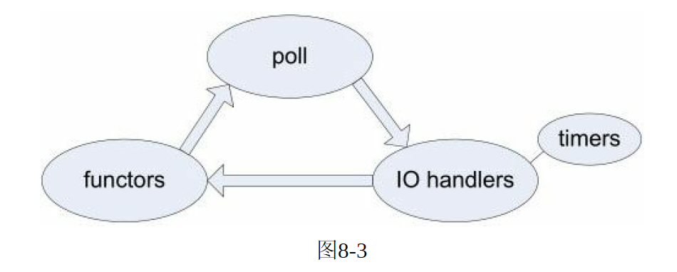

poll(2)阻塞称为事件循环




poll中调用IO处理类（利用channel处理）

timer和IO处理等同之（利用timefd）一起处理，而不是循环中单独的一步。（目前timer还没做完）


### Socket类

- 创建fd socket() //构造函数
- 绑定fd bind()
- 监听fd listen()
- 返回创建的fd。设置地址复用和非阻塞

### Acceptor

用于接受新连接，作为内部类供Server使用

`class Acceptor:Utils::noncopyable` 默认私有继承。需要注意的是，继承用 private 而不是 public，这样可以阻止public继承时，下列的代码：（内存泄漏，因为通过基类的指针删除派生类对象，基类必须是 virtual 虚函数，否则内存泄漏）

- 成员
  - Socket
  - Channel用于处理新连接
  - Channel的回调函数

- 成员函数
  - listen函数调用listen


### TCPConnection


### TCPConnection 断开连接

只有被动断开 ，对方先关闭，本地read返回0

关闭链接比新建关闭复杂


Channel中有可读事件，TCPConnection回调函数读取到n==0

接着会调用handleClose(),其中会调用TcpServer设置的回调函数removeConnection()

removeConnection() 移除map的连接,同时调用

  `loop_->queueInLoop( boost::bind(&TcpConnection::connectDestroyed, *conn*));	`

`TcpConnection::connectDestroyed`中最后调用

```cpp
  loop_->queueInLoop(
      boost::bind(&TcpConnection::connectDestroyed, conn));
```


接着调用


### BUFFER


水平触发

LT的处理过程：
. accept一个连接，添加到epoll中监听EPOLLIN事件
. 当EPOLLIN事件到达时，read fd中的数据并处理
. 当需要写出数据时，把数据write到fd中；如果数据较大，无法一次性写出，那么在epoll中监听EPOLLOUT事件
. 当EPOLLOUT事件到达时，继续把数据write到fd中；如果数据写出完毕，那么在epoll中关闭EPOLLOUT事件（需要关闭！！）

边沿触发：

- 为什么会多一次系统调用？

ET的处理过程：
. accept一个连接，添加到epoll中监听EPOLLIN|EPOLLOUT事件
. 当EPOLLIN事件到达时，read fd中的数据并处理，read需要一直读，直到返回EAGAIN为止
. 当需要写出数据时，把数据write到fd中，直到数据全部写完，或者write返回EAGAIN
. 当EPOLLOUT事件到达时，继续把数据write到fd中，直到数据全部写完，或者write返回EAGAIN

从ET的处理过程中可以看到，ET的要求是需要一直读写，直到返回EAGAIN，否则就会遗漏事件。而LT的处理过程中，直到返回EAGAIN不是硬性要求，但通常的处理过程都会读写直到返回EAGAIN，但LT比ET多了一个开关EPOLLOUT事件的步骤


## 多线程

### EventLoopThread

EventLoopThread 事件循环线程->创建线程池用

数据成员：

- mutex和condition 主要避免返回空loop的，避免创建线程函数还没执行可能就返回了

成员函数：

- 无参构造函数
- EventLoopThread::startLoop()，从线程函数中得到该线程的&loop并返回loop的指针
  - 想想main函数 调用其他函数都是需要这个loop哦
  - 其实这里返回了是给线程池中loops_
- void threadFunc(); 线程的任务函数：创建一个loop

```cpp
//外部调用

EventLoop* EventLoopThread::startLoop()
{
  assert(!thread_.started());
  thread_.start();

  {
    MutexLockGuard lock(mutex_);
    while (loop_ == NULL)
    {
      cond_.wait();
    }
  }

  return loop_;
}

void EventLoopThread::threadFunc()
{
  EventLoop loop;

  {
    MutexLockGuard lock(mutex_);
    loop_ = &loop;
    cond_.notify();
  }

  loop.loop();
  //assert(exiting_);
}
```


### EventLoopThreadPool


EventLoopThreadPool 事件循环线程池  TCP server用

重要数据成员：

  boost::ptr_vector<EventLoopThread> threads_;

  std::vector<EventLoop*> loops_;


成员函数

- start()函数 根据设置的线程数量创建线程池，注意线程池类型`unique_ptr<vector<EventLoopThread>>`

  ```cpp
  void EventLoopThreadPool::start()
  {
    assert(!started_);
    baseLoop_->assertInLoopThread();
  
    started_ = true;
  
    for (int i = 0; i < numThreads_; ++i)
    {
      EventLoopThread* t = new EventLoopThread;
      threads_.push_back(t);
      loops_.push_back(t->startLoop()); //启动loop加入线程池
    }
  }
  ```

  

- getNextLoop() 使用轮转法选取子线程，即按序选择选完继续从0

  ```cpp
  EventLoop* EventLoopThreadPool::getNextLoop()
  {
    baseLoop_->assertInLoopThread();
    EventLoop* loop = baseLoop_;
  
    if (!loops_.empty())
    {
      // round-robin
      loop = loops_[next_];
      ++next_;
      if (static_cast<size_t>(next_) >= loops_.size())
      {
        next_ = 0;
      }
    }
    return loop;
  }
  ```

  

- 构造函数需要baseloop_参数 why？

  - 因为io线程在执行时实际要判断是否在主线程？

  

### 关闭链接

需要修改TcpConnection中的removeConnection()

